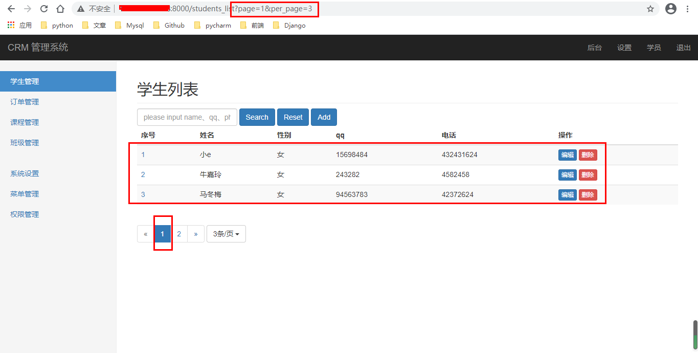

# Djnago——分页功能

[TOC]

本文接上文

分页功能是每个网站的必选，为什么要有分页？因为后台的数据是非常大量的，如果一次性就给前台，先不说带宽问题导致的传送时间问题，且说用户是否会有这个耐心全看完？如果看到第一个就不看了，后面的都是一些无用的数据即浪费服务器资源也增长了用户等待的时间，缺少用户体验。因此分页功能能很好解决这个问题，通过分页，我们可以确定一个页面有多少数据，然后更具总数据就可以知道一共有几页，用户就可以根据页面去查找。

## 四、准备工作

首先，要实现分页功能，那就必须要具备如下三个要素：

-   数据总量
-   每页数据条数
-   当前页数

django有自带的分页器:[官方文档](https://docs.djangoproject.com/zh-hans/3.1/topics/pagination/)

```python
In [1]: from django.core.paginator import Paginator as P

In [2]: from Students.models import Student as S

In [3]: p = P(S.objects.all().order_by("-c_time"),3)

In [4]: p.count  # 查看总数目
Out[4]: 12

In [5]: p.num_pages  # 查看页面数量
Out[5]: 4

In [6]: p.page_range  # 查看页面范围
Out[6]: range(1, 5)

In [7]: p.page(1)
Out[7]: <Page 1 of 4>

In [8]: p1 = p.page(1)  # 获取第一页

In [9]: p1.object_list  # 查看内容
Out[9]: <QuerySet [<Student: 小e-18>, <Student: 牛嘉玲-40>, <Student: 马冬梅-12>]>

In [11]: p1.has_previous()  # 该页是否有上一页
Out[11]: False

In [12]: p1.has_next()  # 该页是否有下一页
Out[12]: True

In [13]: sts = p.get_page(1)  # 获取第一个的内容

In [14]: for stu in sts:  # 循环打印输出
    ...:     print(stu)
    ...: 
小e-18
牛嘉玲-40
马冬梅-12

In [15]: p1.next_page_number()  # 获取下一页的页码
Out[15]: 2
```

## 五、 自写分页功能

### 1. 通过视图实现分页功能

首先我们之前已经实现了获取所有的学生信息，我们就可以再次基础上进行操作：

-   获取总条数、每页数据条数和当前页码

    ```python
    # 数据总量
    total_num = stu.count()
    # 每页数据，如果没有数据，就使用默认值为10
    per_page = request.GET.get("per_page", 10)
    # 当前页码
    page = request.GET.get("page", 1)
    ```

-   接下来，我们需要导入这个函数，然后进行获取当前页的数据操作：

    ```python
    paginator = Paginator(stu, per_page)
    sts = paginator.get_page(page)
    ```

-   就可以启动django查看是否显示了第一页的10条数据。当然，你也可以再url上使用带参数访问，这样也可以查看。

### 2. 实现分页模板

*student_list.html*(基础版)

```html
<nav aria-label="Page navigation">
    <ul class="pagination">
        <li>
            <a href="#" aria-label="Previous">
                <span aria-hidden="true">&laquo;</span>
            </a>
        </li>
        <li><a href="#">1</a></li>
        <li><a href="#">2</a></li>
        <li><a href="#">3</a></li>
        <li><a href="#">4</a></li>
        <li><a href="#">5</a></li>
        <li>
            <a href="#" aria-label="Next">
                <span aria-hidden="true">&raquo;</span>
            </a>
        </li>
    </ul>
</nav>
```

小小升级：

```html
{# 页码部分 #}
<div class="btn-group">
    <nav aria-label="Page navigation">
        <ul class="pagination">
            <li>
                <a href="#" aria-label="Previous">
                    <span aria-hidden="true">&laquo;</span>
                </a>
            </li>
            <li><a href="#">1</a></li>
            <li><a href="#">2</a></li>
            <li><a href="#">3</a></li>
            <li>
                <a href="#" aria-label="Next">
                    <span aria-hidden="true">&raquo;</span>
                </a>
            </li>
        </ul>
    </nav>
</div>
{# 下拉列表框，确定可以每页展示几条 #}
<div class="btn-group" style="margin-top: -5px">
    <button type="button" class="btn btn-default dropdown-toggle" data-toggle="dropdown" aria-haspopup="true" aria-expanded="false">
        {{ per_page }}条/页 <span class="caret"></span>
    </button>
    <ul class="dropdown-menu">
        <li><a href="{{ request.path }}?per_page=3">3条/页</a></li>
        <li><a href="{{ request.path }}?per_page=5">5条/页</a></li>
        <li><a href="{{ request.path }}?per_page=10">10条/页</a></li>
        <li><a href="{{ request.path }}?per_page=20">20条/页</a></li>
    </ul>
</div>
```

上面的部分，可以实现每页条数的数量，但是还是没有将页码部分实现，下面就继续来将他实现。

### 3. 实现页码部分

页码部分，我们需要确定一下格式：

-   当前页码处于最中间的状态，
-   最左和最右是上一页和下一页按钮
-   当前页左边和右边分别多出2-3个页码供选择

因此，我们就需要知道：总共的页数(total_page)、当前页码左右各几页(num)。并且这里需要注意一个当前页码更具数量变动时，显示的内容问题。

为此，我们需要使用自定义标签，首席先将模板抽取出来，然后再自定义标签文件中创建相应的函数：

*pagintion.html*

```html
<ul class="pagination">
    <li class="disabled"  >
        <a 
            
                href="{{ request.path }}?page={{ page|add:"-1" }}&per_page={{ per_page }}"
              aria-label="Previous">
        <span aria-hidden="true">&laquo;</span>
        </a>
    </li>
    
        <li class="active" >
            <a href="{{ request.path }}?page={{ page_num }}&per_page={{ per_page }}">{{ page_num }}</a>
        </li>
    
    <li 
        
            class="disabled" 
         >
        <a 
            href="{{ request.path }}?page={{ page|add:"+1" }}&per_page={{ per_page }}"
         aria-label="Next">
        <span aria-hidden="true">&raquo;</span>
        </a>
    </li>
</ul>
```

*templatetags.py*

```python
@register.inclusion_tag("Students/pagination.html", takes_context=True)
def pagination_html(context):
	total_page = context["total_page"]  # 页码总数
	per_page = context["per_page"]  # 每页的数量
	page = int(context["page"])  # 当前页
	num = 1  # 当前页左右各显示几页
	
	page_list = list()
	# 第一部分：左边和当前页
	# 不显示或不能完全显示:范围（1-当前页）
	if page - num <= 0:
		for i in range(1, page+1):
			page_list.append(i)
	else:
		# 能完全显示
		for i in range(page-num, page+1):
			page_list.append(i)
	
	# 第二部分：右边部分
	# 不显示或不能完全显示：范围（当前页 + 1,total_page）
	if page + num >= total_page:
		for i in range(page + 1, total_page+1):
			page_list.append(i)
	else:
		for i in range(page+1, page + num + 1):
			page_list.append(i)
	return {
		"page_list": page_list,
		"page": page,
		"per_page": per_page,
		"total_page": total_page,
	}
```

注意。如果想使用上下文，首先在注册时需要添加`take_contexxt`，然后传入的参数第一个必须为context。

*student_list.html*

```python




    Django_demo


    {{ section }}


    <form class="form-inline">
        <div class="form-group">
            <input type="text" class="form-control"placeholder="please input name、qq、phone to find" name="search" value="{{ search }}">
        </div>
        <button type="submit" class="btn btn-primary">Search</button>
        <a href=""><button type="reset" class="btn btn-primary">Reset</button></a>
        <a href="" class="btn btn-primary">Add</a>
    </form>
    <div class="table-responsive">
        <table class="table table-striped">
            <thead>
                <tr>
                    <th>序号</th>
                    <th>姓名</th>
                    <th>性别</th>
                    <th>qq</th>
                    <th>电话</th>
                    <th>操作</th>
                </tr>
            </thead>
            <tbody>
            
                <tr>
                    <td><a href="">{{ forloop.counter }}</a></td>
                    <td>{{ student.name }}</td>
                    <td>{{ student.sex|to_male }}</td>
                    <td>{{ student.qq }}</td>
                    <td>{{ student.phone }}</td>
                    <td>
                        <a href="" ><button type="button" class="btn btn-primary btn-xs">编辑</button></a>
                        <a href=""><button type="button" class="btn btn-danger btn-xs">删除</button></a>
                    </td>
                </tr>
            
            </tbody>
        </table>
    </div>
    <div class="btn-group">
        <nav aria-label="Page navigation">
            
        </nav>
    </div>
    <div class="btn-group" style="margin-top: -5px">
        <button type="button" class="btn btn-default dropdown-toggle" data-toggle="dropdown" aria-haspopup="true" aria-expanded="false">
        {{ per_page }}条/页 <span class="caret"></span>
        </button>
        <ul class="dropdown-menu">
        <li><a href="{{ request.path }}?per_page=3">3条/页</a></li>
        <li><a href="{{ request.path }}?per_page=5">5条/页</a></li>
        <li><a href="{{ request.path }}?per_page=10">10条/页</a></li>
        <li><a href="{{ request.path }}?per_page=20">20条/页</a></li>
        </ul>
    </div>

```

*页面展示*

