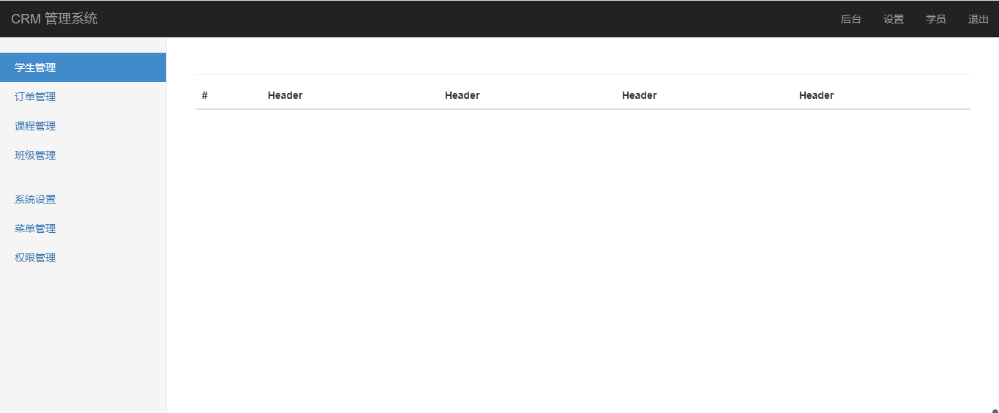
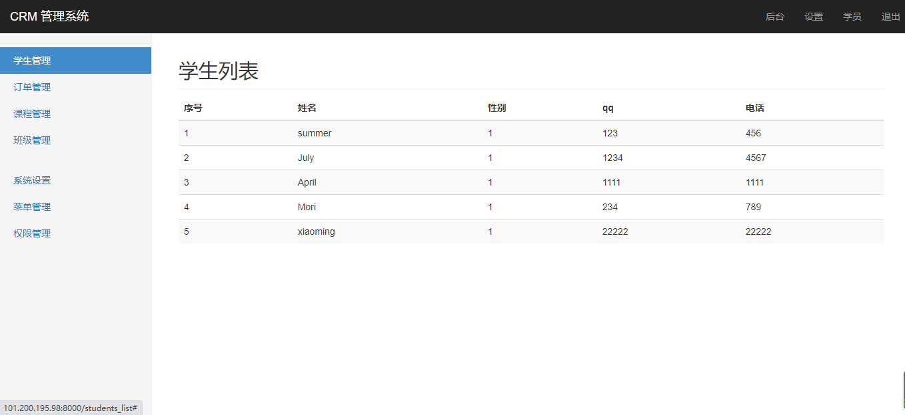
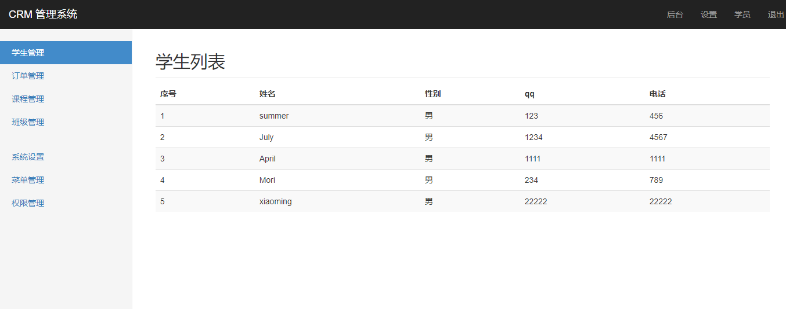
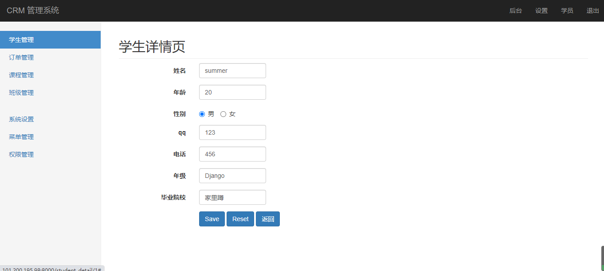
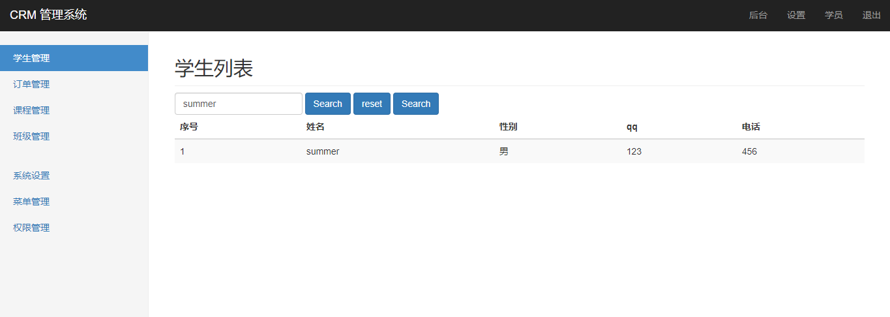
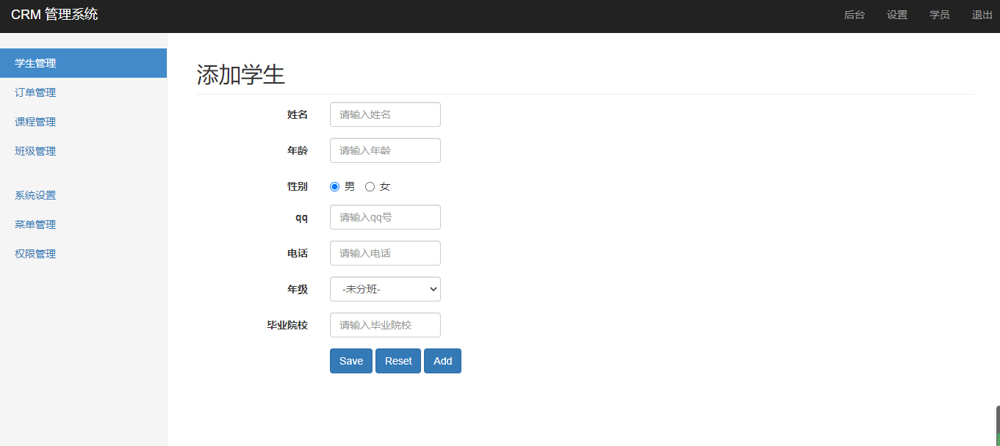
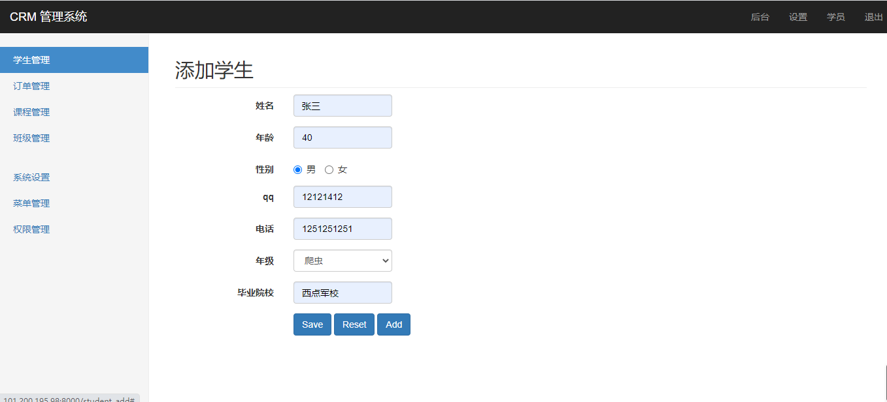
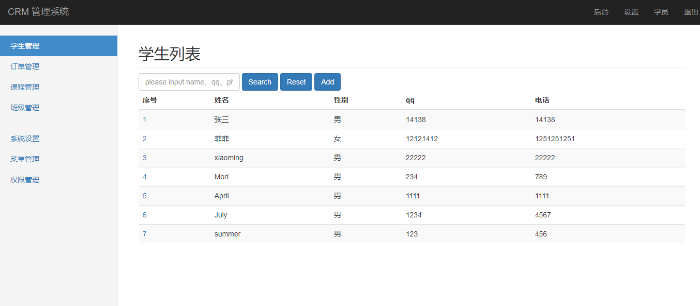
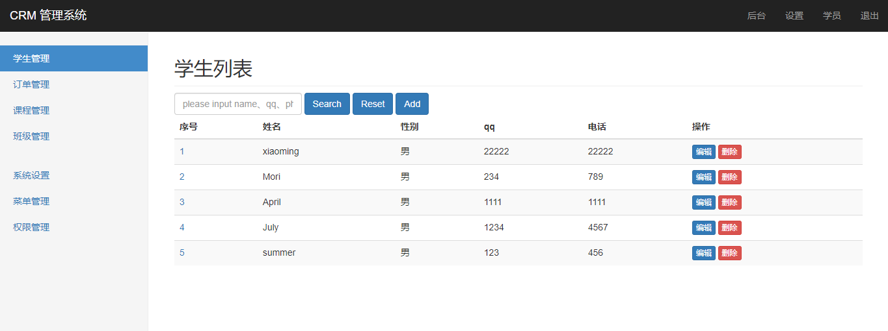
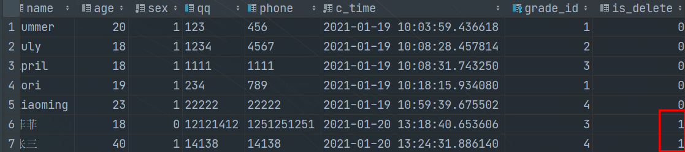

# Django——小案例

[TOC]

## 一、初始化

为了方便我们实验，我们创建一个新的app(Students)

步骤：

-   进入虚拟环境
-   进入apps
-   执行：`python ../manage.py startapp Students`
-   将文件下载到本地
-   配置urls和settings
-   将原来Student的app中的models.py复制到Students下
-   执行迁移
-   在templates目录下创建Students文件夹用于存放html页面
-   在static目录下创建Students文件夹用于存放静态文件

## 二、创建模板

### 1. 完成base页面

基础的页面可以去bootstrap官网查找，然后将一些需要添加url的地方填写完整,然后将不用的删除即可。

*base.html*

```html

<!DOCTYPE html>
<html lang="zh-CN">
  <head>
    <meta charset="utf-8">
    <meta http-equiv="X-UA-Compatible" content="IE=edge">
    <meta name="viewport" content="width=device-width, initial-scale=1">
    <!-- 上述3个meta标签*必须*放在最前面，任何其他内容都*必须*跟随其后！ -->
    <meta name="description" content="">
    <meta name="author" content="">

    <title>学生管理系统</title>

    <!-- Bootstrap core CSS -->
    <link href="https://cdn.bootcss.com/bootstrap/3.3.7/css/bootstrap.min.css" rel="stylesheet">

    <!-- IE10 viewport hack for Surface/desktop Windows 8 bug -->
    <link href="https://cdn.bootcss.com/assets/css/ie10-viewport-bug-workaround.css" rel="stylesheet">

    <!-- Custom styles for this template -->
    <link href="" rel="stylesheet">
     
    <!-- Just for debugging purposes. Don't actually copy these 2 lines! -->
    <!--[if lt IE 9]><script src="https://cdn.bootcss.com/assets/js/ie8-responsive-file-warning.js"></script><![endif]-->
    <script src="https://cdn.bootcss.com/assets/js/ie-emulation-modes-warning.js"></script>

    <!-- HTML5 shim and Respond.js for IE8 support of HTML5 elements and media queries -->
    <!--[if lt IE 9]>
      <script src="https://cdn.bootcss.com/html5shiv/3.7.3/html5shiv.min.js"></script>
      <script src="https://cdn.bootcss.com/respond.js/1.4.2/respond.min.js"></script>
    <![endif]-->
  </head>

  <body>

    <nav class="navbar navbar-inverse navbar-fixed-top">
      <div class="container-fluid">
        <div class="navbar-header">
          <button type="button" class="navbar-toggle collapsed" data-toggle="collapse" data-target="#navbar" aria-expanded="false" aria-controls="navbar">
            <span class="sr-only">Toggle navigation</span>
            <span class="icon-bar"></span>
            <span class="icon-bar"></span>
            <span class="icon-bar"></span>
          </button>
          <a class="navbar-brand" href="#">CRM 管理系统</a>
        </div>
        <div id="navbar" class="navbar-collapse collapse">
          <ul class="nav navbar-nav navbar-right">
            <li><a href="#">后台</a></li>
            <li><a href="#">设置</a></li>
            <li><a href="#">学员</a></li>
            <li><a href="#">退出</a></li>
          </ul>
        </div>
      </div>
    </nav>

    <div class="container-fluid">
      <div class="row">
        <div class="col-sm-3 col-md-2 sidebar">
          <ul class="nav nav-sidebar">
            <li class="active"><a href="#">学生管理 <span class="sr-only">(current)</span></a></li>
            <li><a href="#">订单管理</a></li>
            <li><a href="#">课程管理</a></li>
            <li><a href="#">班级管理</a></li>
          </ul>
          <ul class="nav nav-sidebar">
            <li><a href="">系统设置</a></li>
            <li><a href="">菜单管理</a></li>
            <li><a href="">权限管理</a></li>
          </ul>
        </div>
        <div class="col-sm-9 col-sm-offset-3 col-md-10 col-md-offset-2 main">
          <h2 class="sub-header"></h2>
            
                <div class="table-responsive">
            <table class="table table-striped">
              <thead>
                <tr>
                  <th>#</th>
                  <th>Header</th>
                  <th>Header</th>
                  <th>Header</th>
                  <th>Header</th>
                </tr>
              </thead>
            </table>
          </div>
            
        </div>
      </div>
    </div>

    <!-- Bootstrap core JavaScript!-->
    <!-- Placed at the end of the document so the pages load faster -->
    <script src="https://cdn.bootcss.com/jquery/1.12.4/jquery.min.js"></script>
    <script>window.jQuery || document.write('<script src="https://cdn.bootcss.com/assets/js/vendor/jquery.min.js"><\/script>')</script>
    <script src="https://cdn.bootcss.com/bootstrap/3.3.7/js/bootstrap.min.js"></script>
    <!-- Just to make our placeholder images work. Don't actually copy the next line! -->
    <script src="https://cdn.bootcss.com/assets/js/vendor/holder.min.js"></script>
    <!-- IE10 viewport hack for Surface/desktop Windows 8 bug -->
    <script src="https://cdn.bootcss.com/assets/js/ie10-viewport-bug-workaround.js"></script>
  </body>
</html>

```

### 2. 测试

*views.py*

```python
from django.shortcuts import render

# Create your views here.


def studets_list(request):
	return render(request, 'Students/base.html')
```

*urls.py*

```python
# -*- coding: utf-8 -*-
# @Author  : summer
from django.urls import path
from . import views

app_name = "students"

urlpatterns = [
	path("students_list", views.studets_list, name="students_list"),
]
```

*页面展示*



### 3. 完成学生信息页面

*views.py*

```python
from django.shortcuts import render
from .models import Student
# Create your views here.


def studets_list(request):
	stu = Student.objects.all()
	return render(request, 'Students/students_list.html', context={
		"section": "学生列表",
		"students": stu,
	})

```

*base.html*

```html


    Django_demo


    {{ section }}


    <div class="table-responsive">
        <table class="table table-striped">
            <thead>
                <tr>
                    <th>序号</th>
                    <th>姓名</th>
                    <th>性别</th>
                    <th>qq</th>
                    <th>电话</th>
                </tr>
            </thead>
            <tbody>
            
                <tr>
                    <td>{{ forloop.counter }}</td>
                    <td>{{ student.name }}</td>
                    <td>{{ student.sex }}</td>
                    <td>{{ student.qq }}</td>
                    <td>{{ student.phone }}</td>
                </tr>
            
            </tbody>
        </table>
    </div>

```

*页面展示*



此时，显示的页面中，性别不是我们想要的结果，我们就需要自己自定义一个过滤器

在app下创建templatetags包，然后创建python文件。

*students_filter.py*

```python
# -*- coding: utf-8 -*-
# @Author  : summer
from django import template 

register = template.Library()


@register.filter()
def to_male(value, flag="zh"):
	change = {
		"zh": ("女", "男"),
		"en": ("Female", "Male"),
	}
	return change[flag][value]
```

然后回到html，将过滤器加入即可

```html



    Django_demo


    {{ section }}


    <div class="table-responsive">
        <table class="table table-striped">
            <thead>
                <tr>
                    <th>序号</th>
                    <th>姓名</th>
                    <th>性别</th>
                    <th>qq</th>
                    <th>电话</th>
                </tr>
            </thead>
            <tbody>
            
                <tr>
                    <td>{{ forloop.counter }}</td>
                    <td>{{ student.name }}</td>
                    <td>{{ student.sex|to_male }}</td>
                    <td>{{ student.qq }}</td>
                    <td>{{ student.phone }}</td>
                </tr>
            
            </tbody>
        </table>
    </div>

```



### 4. 完成学生详情页

*views.py*

```python
def student_detail(request, pk):
	section = "学生详情"
	student = Student.objects.get(pk=pk)
	grades = Grade.objects.all()
	return render(request, 'Students/student_detail.html', context={
		"section": section,
		"student": student,
		"grades": grades,
	})
```

*student_detail.html*

```html


    学生详情页



    {{ section }}



	学生详情页

```

*urls.py*

```python
# -*- coding: utf-8 -*-
# @Author  : summer
from django.urls import path
from . import views

app_name = "students"

urlpatterns = [
	path("students_list", views.studets_list, name="students_list"),
	path("student_detail/<pk>", views.student_detail, name="student_detail"),
]
```

在此基础上，我们就需要在html页面上添加表格，使得页面可以显示数据。我们利用表单，来实现学生信息的展示：

*student_detail.html*

```html


    学生详情页



    {{ section }}



    <form class="form-horizontal">
        <div class="form-group">
            <label for="inputEmail3" class="col-sm-2 control-label">姓名</label>
            <div class="col-sm-2">
                <input type="text" class="form-control" id="inputEmail3" placeholder="请输入姓名" name="name"  value="{{ student.name }}">
            </div>
        </div>
        <div class="form-group">
            <label for="age" class="col-sm-2 control-label">年龄</label>
            <div class="col-sm-2">
                <input type="text" class="form-control" id="age" placeholder="请输入年龄" name="age"  value="{{ student.age }}">
            </div>
        </div>
        <div class="form-group">
            <label for="age" class="col-sm-2 control-label">性别</label>
            <div class="col-sm-2">
                <label class="radio-inline">
                    <input type="radio" name="sex" id="inlineRadio1" value=1
                            
                                checked
                             > 男
                </label>
                <label class="radio-inline">
                    <input type="radio" name="sex" id="inlineRadio2" value=0
                            
                                checked
                            > 女
                </label>
            </div>
        </div>
        <div class="form-group">
            <label for="qq" class="col-sm-2 control-label">qq</label>
            <div class="col-sm-2">
                <input type="text" class="form-control" id="qq" placeholder="请输入qq号" name="qq" value="{{ student.qq }}">
            </div>
        </div>
        <div class="form-group">
            <label for="phone" class="col-sm-2 control-label">电话</label>
            <div class="col-sm-2">
                <input type="text" class="form-control" id="phone" placeholder="请输入电话" name="phone" value="{{ student.phone }}">
            </div>
        </div>
        <div class="form-group">
            <label for="grade" class="col-sm-2 control-label">年级</label>
            <div class="col-sm-2">
                <input type="text" class="form-control" id="grade" placeholder="请输入年级" name="grade" value="{{ student.grade.name }}">
            </div>
        </div>
        <div class="form-group">
            <label for="college" class="col-sm-2 control-label">毕业院校</label>
            <div class="col-sm-2">
                <input type="text" class="form-control" id="college" placeholder="请输入毕业院校" name="college" value="{{ student.studentdetail.college }}">
            </div>
        </div>
        <div class="form-group">
            <div class="col-sm-offset-2 col-sm-10">
                <button type="submit" class="btn btn-primary">Save</button>
                <button type="reset" class="btn btn-primary">Reset</button>
                <a href="" class="btn btn-primary">返回</a>
            </div>
        </div>
    </form>


```

写上面需要注意的点：

-   由后台传参，然后通过模板变量获取值

-   性别里面，需要再次修改模型，使用一个可选的类型

    ```python
    	SEX_CHOICE = (
    		[0, "女"],
    		[1, "男"]
    	)
    	sex = models.SmallIntegerField("性别", choices=SEX_CHOICE, default=1)
    ```

    别忘了数据迁移

-   当实现后，我们可以利用判断，设定男为默认时，加一个if判断，只要不为0就选男

-   年级理应使用下拉列表框，这里先用这个用到的时候在修改

-   最后毕业院校，使用反向查询，通过moreandmore设定的位置进行反向查询，输出大学的名字

*页面展示*



## 三、实现数据操作

### 1. 实现查询操作

查询操作相对简单，我们需要处理用户输入的数据，先去掉首尾空格，然后设定默认值为空。如果找得到，就返回这个一条，如果没有就返回全部信息。这里使用了关联查询（django不能直接使用与或，必须导入Q进行判断）

*views.py*

```python
from django.shortcuts import render
from django.db.models import Q

from .models import Student
# Create your views here.


def studets_list(request):
	section = "学生列表"

	# 查询功能
	search = request.GET.get("search", "").strip()
	if search:
		if search.isdigit():
			stu = Student.objects.filter(Q(qq=search) | Q(phone=search))
		else:
			stu = Student.objects.filter(name=search)
	else:
		stu = Student.objects.all()
	
	stu = stu.order_by("-c_time")
	return render(request, 'Students/students_list.html', context={
		"section": section,
		"students": stu,
		"search": search,
	})
```

*students_list.html*

```html



    Django_demo


    {{ section }}


    <form class="form-inline">
        <div class="form-group">
            <input type="text" class="form-control"placeholder="please input name、qq、phone to find" name="search" value="{{ search }}">
        </div>
        <button type="submit" class="btn btn-primary">Search</button>
        <button type="reset" class="btn btn-primary">reset</button>
        <a href="#" class="btn btn-primary">Search</a>
</form>
    <div class="table-responsive">
        <table class="table table-striped">
            <thead>
                <tr>
                    <th>序号</th>
                    <th>姓名</th>
                    <th>性别</th>
                    <th>qq</th>
                    <th>电话</th>
                </tr>
            </thead>
            <tbody>
            
                <tr>
                    <td>{{ forloop.counter }}</td>
                    <td>{{ student.name }}</td>
                    <td>{{ student.sex|to_male }}</td>
                    <td>{{ student.qq }}</td>
                    <td>{{ student.phone }}</td>
                </tr>
            
            </tbody>
        </table>
    </div>

```

*页面展示*



### 2. 实现增加操作

在实现添加操作之前，我们需要把grade下拉框完成：

*student_detail.html*

```html
<div class="form-group">
    <label for="grade" class="col-sm-2 control-label">年级</label>
    <div class="col-sm-2">
        <select class="form-control" name="grade">
            <option value=0>-未分班-</option>
            
            <option selected value={{ grade.id }} >{{ grade.name }}</option>
            
        </select>
    </div>
</div>
```



需要注意，如果我们需要添加数据，我们使用的是表单的post方式，因此需要添加csrf认证。

*views.py*

```python
def student_add(request):
	if request.method == "GET":
        section = "添加学生"
		grades = Grade.objects.all()
		return render(request, "Students/student_detail.html", context={
			"section": section,
			"grades": grades,
		})
	
	if request.method == "POST":
		# 接收传过来的数据，并保存到数据库
		# 1.获取学生信息
		data = {
			"name": request.POST.get("name"),
			"age": request.POST.get("age"),
			"sex": request.POST.get("sex"),
			"qq": request.POST.get("qq"),
			"phone": request.POST.get("phone"),
			"grade_id": request.POST.get("grade"),
		}
		student = Student.objects.create(**data)
		# 获取学生详情并保存数据库
		StudentDetail.objects.create(
			college=request.POST.get("college"),
			student=student,
		)
		return redirect("students:students_list")
```

如果是get请求，则获取所有的grade，然后返回给前台，如果是post请求，接收数据，然后将数据进行相应的保存，最后重定向到学生信息页。





### 3. 实现删除操作

实现删除操作，并不是直接删除，而是设定一个`is_delete`字段，用来进行数据的判断。

所以我们得先去模型里面，添加这个字段，之后在进行数据迁移。

*models.py*

```python
class Student(models.Model):
	"""学生表"""
	name = models.CharField("学生姓名", max_length=20)
	age = models.SmallIntegerField("年龄", null=True)
	SEX_CHOICE = (
		[0, "女"],
		[1, "男"]
	)
	sex = models.SmallIntegerField("性别", choices=SEX_CHOICE, default=1)
	qq = models.CharField("QQ号", max_length=20, unique=True, null=True)
	phone = models.CharField("手机号", max_length=20, unique=True, null=True)
	c_time = models.DateTimeField("创建时间", auto_now_add=True)
	# ***与Detail的OneToOneField同样可以写在这里***
	# detail = models.OneToOneField('StudentDetail', on_delete=models.SET_NULL, null=True)  # 当学生详情被删除的时候，这个地方变成null
	# ***与Grade的一对多关系只可以写在这里***
	grade = models.ForeignKey('Grade', on_delete=models.SET_NULL, null=True)  # 如果班级删除，此时这里的值变成null。
	is_delete = models.BooleanField(default=False)  # 来记录一条数据的状态
	
	def __str__(self):
		return "{}-{}".format(self.name, self.age)
```

我们还需要在前台创建一个按钮，用来实现删除操作：

*student_list.html*

```html
<tr>
    <td><a href="">{{ forloop.counter }}</a></td>
    <td>{{ student.name }}</td>
    <td>{{ student.sex|to_male }}</td>
    <td>{{ student.qq }}</td>
    <td>{{ student.phone }}</td>
    <td>
        <a href="#" ><button type="button" class="btn btn-primary btn-xs">编辑</button></a>
        <a href=""><button type="button" class="btn btn-danger btn-xs">删除</button></a>
    </td>
</tr>
```

后台视图*views.py*

```python
def student_delete(request, pk):
	student = Student.objects.get(pk=pk)
	student.is_delete = True
	student.save()
	return redirect("students:students_list")
```

但是前面的查询操作是没有进行校验的，因此还需要进行简单的修改

```python
def studets_list(request):
	section = "学生列表"

	# 查询功能
	search = request.GET.get("search", "").strip()
	if search:
		if search.isdigit():
			stu = Student.objects.filter(Q(qq=search) | Q(phone=search),is_delete=False)
		else:
			stu = Student.objects.filter(name=search, is_delete=False)
	else:
		stu = Student.objects.filter(is_delete=False)
	
	stu = stu.order_by("-c_time")
	return render(request, 'Students/students_list.html', context={
		"section": section,
		"students": stu,
		"search": search,
	})
```

*页面显示*





### 4.  年级部分优化

我们发现，在add、list和detail里面都出现了gradde的查找和传参，我们就可以把这个部分单独领出来，写一个标签。

我们还是在之前的templatetags里面创建一个python文件，然后进行编写代码

*student_tag.py*

```python
# -*- coding: utf-8 -*-
# @Author  : summer
from Students.models import Grade
from django import template

register = template.Library()


@register.inclusion_tag("Students/grade_option.html")
def grade_option(student):
	grades = Grade.objects.all()
	return {
		"grades": grades,
		"student": student}
```

*grade_option.html*

```html
<option value=0>-未分班-</option>

    <option selected value={{ grade.id }} >{{ grade.name }}</option>

```

*student_detail.html*

```html
<div class="form-group">
    <label for="grade" class="col-sm-2 control-label">年级</label>
    <div class="col-sm-2">
        <select class="form-control" name="grade">
            
        </select>
    </div>
</div>
```

### 5.实现编辑操作

编辑操作与添加或者详细都可以在同一页面，只需要修改section的值，后续的post其实也与add差不多。

*urls.py*

```python
# -*- coding: utf-8 -*-
# @Author  : summer
from django.urls import path
from . import views

app_name = "students"

urlpatterns = [
	path("students_list", views.studets_list, name="students_list"),
	path("student_detail/<pk>", views.student_detail, name="student_detail"),
	path("student_add", views.student_add, name="student_add"),
	path("student_delete/<pk>", views.student_delete, name="student_delete"),
	path("student_edit/<pk>", views.student_edit, name="student_edit"),
]
```

*student_list.html*

```html
<tr>
    <td><a href="">{{ forloop.counter }}</a></td>
    <td>{{ student.name }}</td>
    <td>{{ student.sex|to_male }}</td>
    <td>{{ student.qq }}</td>
    <td>{{ student.phone }}</td>
    <td>
        <a href="" ><button type="button" class="btn btn-primary btn-xs">编辑</button></a>
        <a href=""><button type="button" class="btn btn-danger btn-xs">删除</button></a>
    </td>
</tr>
```

*views.py*

```python
def student_edit(request, pk):
	section = "修改学生信息"
	student = Student.objects.get(pk=pk)
	if request.method == "GET":
		return render(request, "Students/student_detail.html", context={
			"section": section,
			"student": student,
		})
	if request.method == "POST":
		# 学生列表
		# 获取grade实例
		grade_id = request.POST.get("grade")
		try:
			grade = Grade.objects.get(pk=grade_id)
		except:
			grade = None
		
		student.name = request.POST.get("name")
		student.age = request.POST.get("age")
		student.sex = request.POST.get("sex")
		student.qq = request.POST.get("qq")
		student.phone = request.POST.get("phone")
		# student.grade_id = request.POST.get("grade")  # 第一种，使用id方法
		student.grade = grade  # 第二种：使用表关联法
		
		
		# 学生详情
		try:
			student_detail = student.studentdetail  # 反向
		except:
			student_detail = StudentDetail()  # 正向：空实例
			student_detail.student = student
		
		student_detail.college = request.POST.get("college")
		
		student_detail.save()
		student.save()
		return redirect("students:students_list")
```

