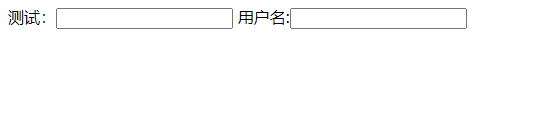
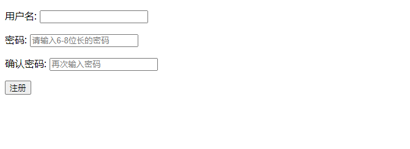
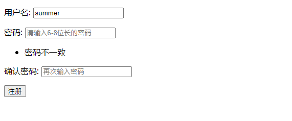
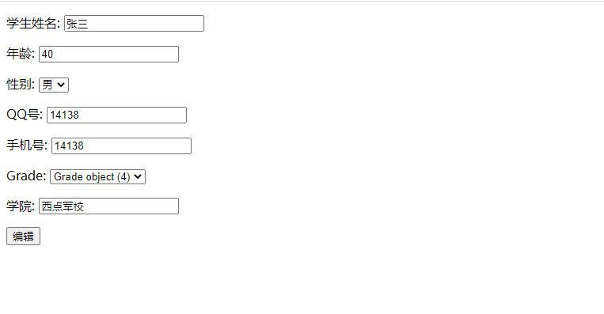
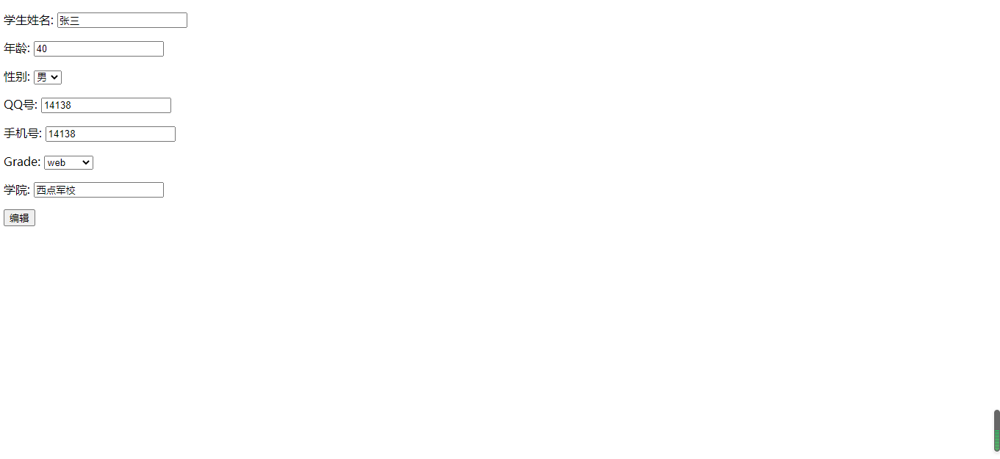
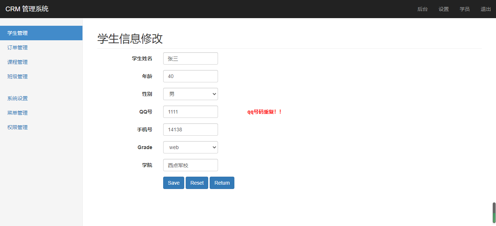

# Django——表单模块

[TOC]

## 一、简单表单

[官方文档](https://docs.djangoproject.com/zh-hans/3.1/ref/forms/api/)

表单本质上还是一个类。登录页面和注册页面都会用到form表单来提交数据，当数据提交到后台后,需要在视图函数中去验证数据的合法性。django中提供了一个form表单的功能,这个表单可以用来验证数据的合法性还可以用来生成HTML代码

### 1.  关于表单的使用

1. 创建一个forms.py的文件,放在指定的app当中,然后在里面写表单.
2. 表单是通过类实现的,继承自forms.Form,然后在里面定义要验证的字段.
3. 在表单中,创建字段跟模型是一模一样的,但是没有null=True或者blank=True等这几种参数了,有的参数是required=True/False.
4. 使用is_valid()方法可以验证用户提交的数据是否合法,而且HTML表单元素的name必须和django中的表单的name保持一致,否则匹配不到.
5. is_bound属性:用来表示form是否绑定了数据,如果绑定了,则返回True,否则返回False.
6. cleaned_data:这个是在is_valid()返回True的时候,保存用户提交上来的数据.

### 2.  form表单例子

*forms.py*

```python
# -*- coding: utf-8 -*-
# @Author  : summer
from django import forms


class RegisterForm(forms.Form):
	username = forms.CharField(label="用户名", max_length=20)
```

*urls.py*

```python
# -*- coding: utf-8 -*-
# @Author  : summer
from django.urls import path
from . import views

app_name = "students"

urlpatterns = [
	path("students_list", views.studets_list, name="students_list"),
	path("student_detail/<pk>", views.student_detail, name="student_detail"),
	path("student_add", views.student_add, name="student_add"),
	path("student_delete/<pk>", views.student_delete, name="student_delete"),
	path("student_edit/<pk>", views.student_edit, name="student_edit"),
	path("login", views.login, name="login"),
	path("index", views.index, name="index"),
	path("logout", views.logout, name="logout"),
	path("register", views.register, name="register"),
]
```

*views.py*

```python
def register(request):
	# 将from表单从后台往前台传
	if request.method == "GET":
		form = RegisterForm()
		return render(request, "Students/register.html", context={
			"form": form,
		})
```

*register.html*

```python
<!DOCTYPE html>
<html lang="en">
<head>
    <meta charset="UTF-8">
    <title>注册页</title>
</head>
<body>
    <form action="">
        {# 以前的写法 #}
        测试：<input type="text">
        {# 使用form表单 #}
        {{ form }}
    </form>
</body>
</html>
```

*页面展示*



我们可以发现，我们在froms中写的`label`在前端自动帮我们创建了一个label标签，然后名字为他的值，并且后面是一个输入框

### 3. 完成注册from表单

*forms.py*

```python
# -*- coding: utf-8 -*-
# @Author  : summer
from django import forms


class RegisterForm(forms.Form):
	username = forms.CharField(label="用户名", max_length=20)
	password = forms.CharField(
		label="密码",
		max_length=8,
		min_length=6,
		widget=forms.PasswordInput(attrs={"placeholder": "请输入6-8位长的密码"}),  # 添加额外的属性
		error_messages={
			"min_length": "密码长度小于6位",
			"max_length": "密码长度大于8位",
		}  # 设定报错信息
	)
	password_reapt = forms.CharField(label="确认密码", widget=forms.PasswordInput(attrs={"placeholder": "再次输入密码"}))
```

>   表单中一些参数说明：
>
>   max_length  最大长度
>   		min_length  最小长度
>   		widget  负责渲染网页上HTML 表单的输入元素和提取提交的原始数据
>   		attrs  包含渲染后的Widget 将要设置的HTML 属性
>   		error_messages 报错信息

*register.html*

```html
<!DOCTYPE html>
<html lang="en">
<head>
    <meta charset="UTF-8">
    <title>注册页</title>
</head>
<body>
    <form action="" method="post">
        
        {# 以前的写法 #}
		{# 测试：<input type="text">#}
        {# 使用form表单 #}
        {{ form.as_p }}
        <input type="submit" value="注册">
    </form>
</body>
</html>
```

注意：form表单标签+提交按钮需要手动加入

*页面显示*



### 4. 实现后台

注意，这里就不在使用request去拿去传过来的值（虽然也可以），我们可以使用from，然后利用`is_valid`函数去验证表单，如果成功则返回一个True，并且将数据存入`form.cleaned_data`。并且这里的数据已经是符合python的数据规范的了。

*views.py*

```python
def register(request):
	# 将from表单从后台往前台传
	if request.method == "GET":
		form = RegisterForm()  # 没有数据

	if request.method == "POST":
		form = RegisterForm(request.POST)  # 带前面返回的数据
		
		if form.is_valid():  # 实现校验，如果成功返回True
			# 一旦通过调用 `is_valid()` 验证成功（ `is_valid()` 返回 `True` ），已验证的表单数据将被放到 `form.cleaned_data` 字典中。这里的数据已经很好的为你转化为Python类型。
			password = form.cleaned_data.get("password")
			password_repeat = form.cleaned_data.get("password_repeat")
			if password == password_repeat:
				return redirect("students:students_list")
			
	return render(request, "Students/register.html", context={"form": form})
```

上面的代码已经基本上完成了，但是细心的还是会发现，如果密码两次输入不一样，会跳转到注册页面，如果我们想让他报错而并不是自动跳转呢？这个时候就需要使用自定义校验：

### 5. 自定义校验

我们的自定义校验也是写在forms.py内，

>   使用clean进行多字段校验，而使用clean_xxx来进行单字段校验

*forms.py*

```python
# -*- coding: utf-8 -*-
# @Author  : summer
from django import forms


class RegisterForm(forms.Form):
	username = forms.CharField(label="用户名", max_length=20)
	password = forms.CharField(
		label="密码",
		max_length=8,
		min_length=6,
		widget=forms.PasswordInput(attrs={"placeholder": "请输入6-8位长的密码"}),  # 添加额外的属性
		error_messages={
			"min_length": "密码长度小于6位",
			"max_length": "密码长度大于8位",
		}  # 设定报错信息
	)
	password_repeat = forms.CharField(label="确认密码", widget=forms.PasswordInput(attrs={"placeholder": "再次输入密码"}))
	
	def clean(self):  # 多字段联合校验
		cleaned_data = super().clean()
		
		# 增加提示信息
		password = cleaned_data.get("password")
		password_repeat = cleaned_data.get("password_repeat")
		if password != password_repeat:
			msg = "密码不一致"
			self.add_error("password_repeat", msg)
	
	def clean_username(self):  # 单字段校验
		pass
```

*页面展示*



## 二、模型表单

[官方地址](https://docs.djangoproject.com/zh-hans/3.1/topics/forms/modelforms/)

要玩模型表单，就需要到form中先导入模型，然后创建一个类来将模型导入

### 1. 初始化

*forms.py*

```python
from Students.models import Student, StudentDetail

# 模型表单
class StudentForm(forms.ModelForm):
	class Meta:
		model = Student  # 模型
        fields = "__all__"
		

class StudentDetailForm(forms.ModelForm):
	class Meta:
		model = StudentDetail  # 模型
        fields = "__all__"
```

>   fileds看下一节具体描述

*views.py*

```python
def detail_form(request):
	return render(request, "Students/detail_form.html")
```

*urls.py*

```python
# -*- coding: utf-8 -*-
# @Author  : summer
from django.urls import path
from . import views

app_name = "students"

urlpatterns = [
	path("students_list", views.studets_list, name="students_list"),
	path("student_detail/<pk>", views.student_detail, name="student_detail"),
	path("student_add", views.student_add, name="student_add"),
	path("student_delete/<pk>", views.student_delete, name="student_delete"),
	path("student_edit/<pk>", views.student_edit, name="student_edit"),
	path("login", views.login, name="login"),
	path("index", views.index, name="index"),
	path("logout", views.logout, name="logout"),
	path("register", views.register, name="register"),
	path("detail_form", views.detail_form, name="detail_form"),
]
```

*detail_form.html*

```html
<!DOCTYPE html>
<html lang="en">
<head>
    <meta charset="UTF-8">
    <title>Title</title>
</head>
<body>
<form action="" method="post">
    
    {{ form }}
    测试
</form>
</body>
</html>
```

*显示页面*


### 2. 扩展：选择要使用的字段

强烈建议您使用 `fields` 属性来显式设置所有应在表单中编辑的字段。如果不这样做，当一张表单不慎允许用户设置某些字段，尤其是在将新字段添加到模型中时，很容易导致安全问题。根据表单渲染方式的不同，甚至可能不会在网页上显示问题。

另一种方法是自动包含所有字段，或者只删除一些字段。这种基本方法被认为不太安全，已经导致大型网站上出现严重漏洞。

但是，有两种简单的方法保证你不会出现这些安全问题：

1.  将 `fields` 属性设置为特殊值 `'__all__'` 以表明需要使用模型中的所有字段。例如：

    ```
    from django.forms import ModelForm
    
    class AuthorForm(ModelForm):
        class Meta:
            model = Author
            fields = '__all__'
    ```

2.  将 `ModelForm` 中Meta类的 `exclude` 属性设置为表单中需要排除的字段列表。

    例如:

    ```
    class PartialAuthorForm(ModelForm):
        class Meta:
            model = Author
            exclude = ['title']
    ```

    由于 `Author` 模型有三个字段 `name`、 `title` 和 `birth_date` ，上例的结果是字段 `name` 和 `birth_date` 会呈现在表单中。

不管使用哪一种，字段会按模型中定义的顺序在表单中出现， `ManyToManyField` 会排在最后。

另外，Django有个规则：如果您在模型字段中定义了 `editable=False` ，任何使用 `ModelForm` 给该模型创建的表单都不会包含这个字段。

### 3. 实现模型表单

*views.py*

```python
def detail_form(request, pk):
	student = Student.objects.get(pk=pk)
	form = StudentForm(instance=student)  # 指定实例对象
	try:
		detail_form = StudentDetailForm(instance=student.studentdetail)
	except:  # 学生没有详情
		student_detail = StudentDetail()
		student_detail.student = student
		student_detail.save()
		detail_form = StudentDetailForm(instance=student_detail)
		
	return render(request, "Students/detail_form.html", context={
		"form": form,
		"detail_form": detail_form,
	})
```

*detail_form.html*

```html
<!DOCTYPE html>
<html lang="en">
<head>
    <meta charset="UTF-8">
    <title>Title</title>
</head>
<body>
<form action="" method="post">
    
    {{ form.as_p }}
    {{ detail_form.as_p }}
    <input type="submit" value="编辑">
</form>
</body>
</html>
```

*页面展示*



我们会发现，上面的grade显示出来的是一个对象，而不是我们想要的名字，因此我们可以再grade模型中添加一个str函数。

```python
 def __str__(self):
        return self.name
```



### 4. 将页面美化并且实现保存

首先，我们可以利用student_detail的页面，然后这里需要注意，应为我们放入的field是缺少一个class的，所以我们需要再创建一个自定义标签（简单标签）来添加这个类，其余的都基本上简单。

*detail_form.html*

```html



    学生详情页



    {{ section }}



    <form action="" method="post"  class="form-horizontal">
        
        
            <div class="form-group">
                <label for="{{ field.id_for_label }}" class="col-sm-2 control-label">{{ field.label }}</label>
                <div class="col-sm-2">
                      {# 给某个字段添加某个值 #}
                </div>
                {# 错误展示部分： #}
                
                    <label class="col-sm-2 control-label  has-error ">{{ error }}</label>
                
            </div>
        
{#        {{ detail_form.as_p }}#}
        
            <div class="form-group">
                <label for="{{ field.id_for_label }}" class="col-sm-2 control-label">{{ field.label }}</label>
                <div class="col-sm-2">
                      {# 给某个字段添加某个值 #}
                </div>
            </div>
        
        <div class="form-group">
            <div class="col-sm-offset-2 col-sm-10">
                <button type="submit" class="btn btn-primary">Save</button>
                <button type="reset" class="btn btn-primary">Reset</button>
                <a href="" class="btn btn-primary">Return</a>
            </div>
        </div>
    </form>

```

*templatetags.py*

```python
@register.simple_tag()
def add_class(field, class_str):
	return field.as_widget(attrs={"class": class_str})
```

并且上面的错误，是利用模型自带的错误机制：

*models.py*

```python
	qq = models.CharField("QQ号", max_length=20, unique=True, null=True, error_messages={"unique": "qq号码重复！！"})  # 错误信息提示
	phone = models.CharField("手机号", max_length=20, unique=True, null=True, error_messages={"unique": "电话号码重复"})
```

别忘了迁移

最后就是后端的视图函数

*views.py*

```python
def detail_form(request, pk):
	section = "学生信息修改"
	student = Student.objects.get(pk=pk)
	form = StudentForm(instance=student)  # 指定实例对象
	try:
		detail_form = StudentDetailForm(instance=student.studentdetail)
	except:  # 学生没有详情
		student_detail = StudentDetail()
		student_detail.student = student
		student_detail.save()
		detail_form = StudentDetailForm(instance=student_detail)
		
	if request.method == "POST":
		form = StudentForm(request.POST,instance=student)
		detail_form = StudentDetailForm(request.POST, instance=student.studentdetail)
		
		if form.is_valid() and detail_form.is_valid():
			form.save()
			detail_form.save()
			return render(request, "Students/students_list.html")
		
	return render(request, "Students/detail_form.html", context={
		"form": form,
		"detail_form": detail_form,
		"section": section,
	})
```

*页面展示*



### 5.  实现自定义校验功能

自定义校验功能是卸载form中，如果是clean则是全部校验，需要继承父类，而如果是单独校验某个字段，则直接clean加一个下划线在加这个名字即可。

*forms.py*

```python
# 模型表单
class StudentForm(forms.ModelForm):
	class Meta:
		model = Student  # 模型
		# fields = "__all__"
		exclude = ["is_delete"]  # 排除字段
		
	def clean_phone(self):
		phone = self.cleaned_data.get("phone")
		if (phone,) in Student.objects.values_list("phone"):
			raise forms.ValidationError("手机号码已经注册，请重新输入！！！")
		return phone
```