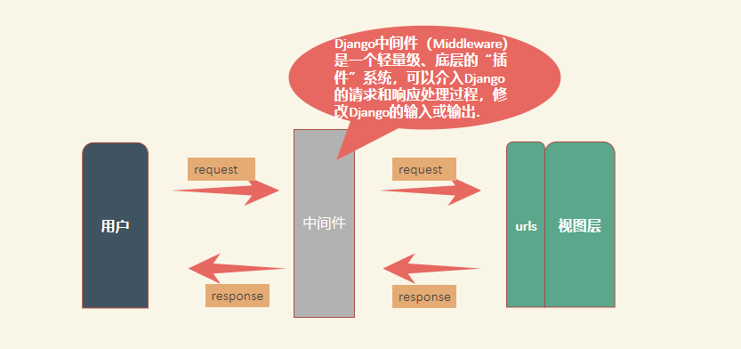
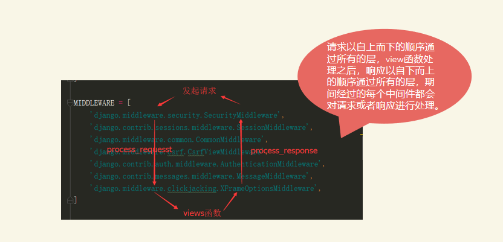

# Django——中间件

[toc]

## 一、中间件

### 1. 引入



### 2. 定义

django 中的中间件（middleware），在django中，中间件其实就是一个类，在请求到来和结束后，django会根据自己的规则在合适的时机执行中间件中相应的方法。

在django项目的settings模块中，有一个 MIDDLEWARE_CLASSES 变量，其中每一个元素就是一个中间件.

### 3. 结构

中间件中可以定义5个方法，分别是：

-   process_request(self,request) :
    执行视图之前被调用，在每个请求上调用，返回None或HttpResponse对象
-   process_view(self, request, callback, callback_args, callback_kwargs):
    调用视图之前被调用，在每个请求上调用，返回None或HttpResponse对象
-   process_template_response(self,request,response):
    在视图刚好执行完毕之后被调用，在每个请求上调用，返回实现了render方法的响应对象
-   process_exception(self, request, exception)
    当视图抛出异常时调用，在每个请求上调用，返回一个HttpResponse对象
-   process_response(self, request, response
    所有响应返回浏览器之前被调用，在每个请求上调用，返回HttpResponse对象

### 4. 执行顺序



从上面可以看出，中间件就类似于装饰器，执行装饰器的是时候由上到下，但是执行内部函数却是由下到上。

## 二、 定义中间件

注：中间件文件可以放在下项目路径下的任何位置

我们就再app目录下创建一个middleware.py文件(接收response，发送)

*Students/middleware.py*

```python
# -*- coding: utf-8 -*-
# @Author  : summer


def simple_middleware(get_response):  # 同时这个参数名也是不能改动的
	print("初始化设置")
	
	def middleware(request):
		print("处理请求前，执行的代码")
		response = get_response(request)
		print("处理请求后执行的代码")
		return response
	return middleware

```

此时，你还是需要将middleware导入settings

```python
MIDDLEWARE = [
    'django.middleware.security.SecurityMiddleware',
    'django.contrib.sessions.middleware.SessionMiddleware',
    'django.middleware.common.CommonMiddleware',
    'django.middleware.csrf.CsrfViewMiddleware',
    'django.contrib.auth.middleware.AuthenticationMiddleware',
    'django.contrib.messages.middleware.MessageMiddleware',
    'django.middleware.clickjacking.XFrameOptionsMiddleware',
    "Students.middleware.simple_middleware",
]
```

此时如果我们访问index页面，可以看看控制台输出什么：

```python
System check identified no issues (0 silenced).
January 22, 2021 - 11:56:26
Django version 3.1.5, using settings 'DjangoModel.settings'
Starting development server at http://0.0.0.0:8000/
Quit the server with CONTROL-C.
初始化设置
处理请求前，执行的代码
处理请求后执行的代码
INFO basehttp 157 "GET /index HTTP/1.1" 200 199
```

而正常情况下并灭有中间的三行文字。

### 使用类实现中间件

```python
# 类
class SimpeMiddleWare:
	def __init__(self, get_response):
		self.get_response = get_response
		print("初始化设置2")
	
	def __call__(self, request, *args, **kwargs):
		# 实现只能google浏览器才能访问
		user_agent = request.META.get("HTTP_USER_AGENT")
		if not "chrome" in user_agent.lower():
			return HttpResponseForbidden()
		
		print("处理请求前，执行的代码3")
		response = self.get_response(request)
		print("处理请求后执行的代码4")
		return response
```

导入settings

```python
MIDDLEWARE = [
    'django.middleware.security.SecurityMiddleware',
    'django.contrib.sessions.middleware.SessionMiddleware',
    'django.middleware.common.CommonMiddleware',
    'django.middleware.csrf.CsrfViewMiddleware',
    'django.contrib.auth.middleware.AuthenticationMiddleware',
    'django.contrib.messages.middleware.MessageMiddleware',
    'django.middleware.clickjacking.XFrameOptionsMiddleware',
    "Students.middleware.simple_middleware",
    "Students.middleware.SimpeMiddleWare",
]
```

我们来看看代码执行情况：

```python
System check identified no issues (0 silenced).
January 22, 2021 - 12:14:57
Django version 3.1.5, using settings 'DjangoModel.settings'
Starting development server at http://0.0.0.0:8000/
Quit the server with CONTROL-C.
初始化设置2
初始化设置1
处理请求前，执行的代码1
处理请求前，执行的代码3
处理请求后执行的代码4
处理请求后执行的代码2
INFO basehttp 157 "GET /index HTTP/1.1" 200 199
```

