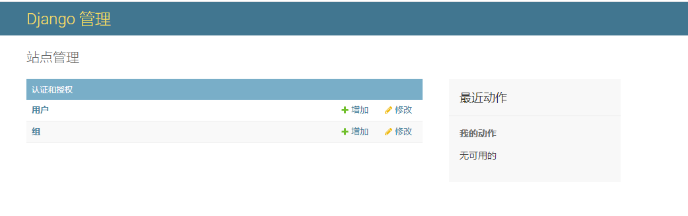
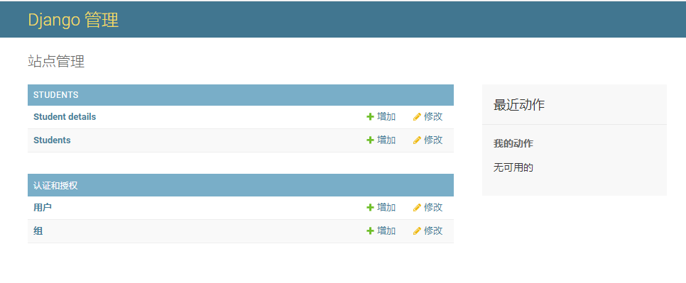
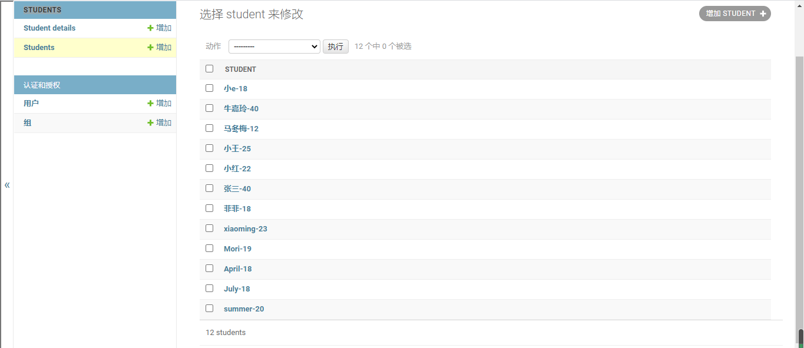
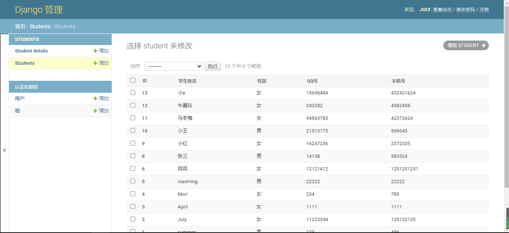
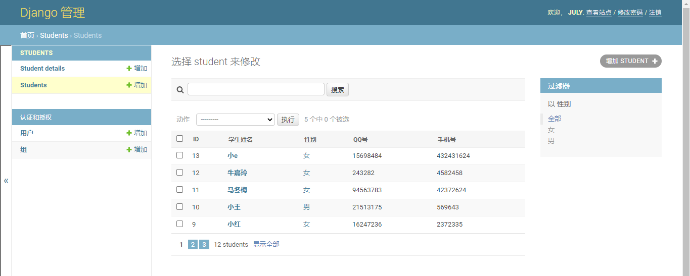
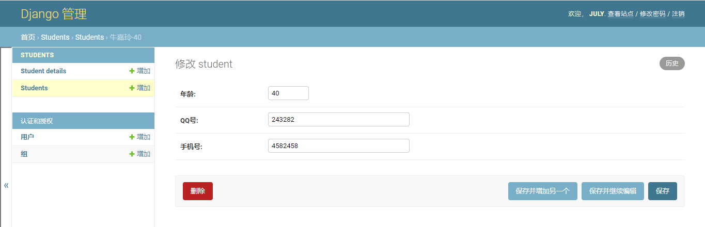
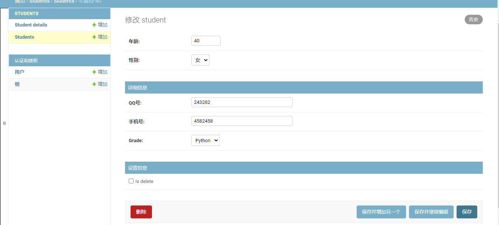

# Django——admin

[toc]

## 一、admin

Django 产生于一个公众页面和内容发布者页面完全分离的新闻类站点的开发过程中。站点管理人员使用管理系统来添加新闻、事件和体育时讯等，这些添加的内容被显示在公众页面上。Django 通过为站点管理人员创建统一的内容编辑界面解决了这个问题。

管理界面不是为了网站的访问者，而是为管理者准备的。

而与此同时，你可以在项目的 settings.py 中的 INSTALLED_APPS 看到它：

```python
INSTALLED_APPS = [
    'django.contrib.admin',
    'django.contrib.auth',
    'django.contrib.contenttypes',
    'django.contrib.sessions',
    'django.contrib.messages',
    'django.contrib.staticfiles',
    "tempmd",
    "Student",
    "Students",
]
```

django.contrib是一套庞大的功能集，它是Django基本代码的组成部分。

## 二、admin路由

通常我们在生成项目时会在 urls.py 中自动设置好，我们只需去掉注释即可。

配置项如下所示：

```python
# urls.py
from django.conf.urls import url
from django.contrib import admin
 
urlpatterns = [
    url(r'^admin/', admin.site.urls),
]
```

当这一切都配置好后，Django 管理工具就可以运行了。

## 三、使用admin

入127.0.0.1:8000/admin之后你会看到出来这样一个界面,让你输入用户名和密码去登录?那么用户名和密码从哪里来,登录之后又是什么样的呢?


你可以通过命令 **python manage.py createsuperuser** 来创建超级用户，如下所示：

```python
(DjangoModel)~/DjangoTest$ python manage.py createsuperuser
用户名 (leave blank to use 'summer'): july
电子邮件地址: july@123.com
Password: 
Password (again): 
密码跟 用户名 太相似了。
密码长度太短。密码必须包含至少 8 个字符。
这个密码太常见了。
Bypass password validation and create user anyway? [y/N]: y
Superuser created successfully.

```

之后输入用户名密码登录，界面如下：



>    当然，如果你的页面是英文的，只需要再settings里面将languae-code改为“zh-hans”即可。

将之前在表关系中那几个模型类创建在现在的app的models.py中.将模型类执行映射在数据库中生成表.在app里面有个admin.py的文件,在这个文件中注册模型.

```python
from django.contrib import admin
from .models import Student, StudentDetail

# Register your models here.


admin.site.register(Student)
admin.site.register(StudentDetail)

```

将模型类再admin.py中注册过后,刷新管理页面,对数据表中数据进行增删改查操作





## 四、自定义管理页面

Django提供了admin.ModelAdmin类，通过定义ModelAdmin的子类，来定义模型在Admin界面的显示方式

列表页属性:

-   list_display：显示字段，可以点击列头进行排序

-   list_filter：过滤字段，过滤框会出现在右侧

-   search_fields：搜索字段，搜索框会出现在上侧
-   list_per_page：分页，分页框会出现在下侧

添加、修改页属性

-   fields：属性的先后顺序
-   fieldsets：属性分组

注意：上面两个属性，二者选一。

我们添加一个查询操作：

```python
from django.contrib import admin
from .models import Student, StudentDetail

# Register your models here.


class StudentAdmin(admin.ModelAdmin):
	list_display = ["id", "name", "sex", "qq", "phone"]


admin.site.register(Student, StudentAdmin)
admin.site.register(StudentDetail)
```

而此时的页面就会发生改变：



我们可以再试试其他操作：

```python
from django.contrib import admin
from .models import Student, StudentDetail

# Register your models here.


class StudentAdmin(admin.ModelAdmin):
	list_display = ["id", "name", "sex", "qq", "phone"]  # 设置显示的内容
	list_display_links = ["name", "sex"]  # 设置可以实现跳转的内容
	list_filter = ["sex"]  # 添加过滤器
	search_fields = ["name", "qq", "phone"]  # 添加搜索功能
	list_per_page = 5  # 分页功能


admin.site.register(Student, StudentAdmin)
admin.site.register(StudentDetail)
```



那如果我们想控制修改的内容，应该怎么办？使用fields

```python
from django.contrib import admin
from .models import Student, StudentDetail

# Register your models here.


class StudentAdmin(admin.ModelAdmin):
	list_display = ["id", "name", "sex", "qq", "phone"]  # 设置显示的内容
	list_display_links = ["name", "sex"]  # 设置可以实现跳转的内容
	list_filter = ["sex"]  # 添加过滤器
	search_fields = ["name", "qq", "phone"]  # 添加搜索功能
	list_per_page = 5  # 分页功能
	
	# 详情页
	fields = ["age", "qq", "phone"]


admin.site.register(Student, StudentAdmin)
admin.site.register(StudentDetail)
```



但是还是会想到，如果我想改分组设置怎么办？使用fieldsets

```python
from django.contrib import admin
from .models import Student, StudentDetail

# Register your models here.


class StudentAdmin(admin.ModelAdmin):
	list_display = ["id", "name", "sex", "qq", "phone"]  # 设置显示的内容
	list_display_links = ["name", "sex"]  # 设置可以实现跳转的内容
	list_filter = ["sex"]  # 添加过滤器
	search_fields = ["name", "qq", "phone"]  # 添加搜索功能
	list_per_page = 5  # 分页功能
	
	# 详情页
	# fields = ["age", "qq", "phone"]  # 显示信息
	fieldsets = [  # 分组设置
		(None, {"fields": ["age", "sex"]}),
		("详细信息", {"fields": ["qq", "phone", "grade"]}),
		('设置信息', {"fields": ["is_delete"]})
	]


admin.site.register(Student, StudentAdmin)
admin.site.register(StudentDetail)
```

这样详细页面就是这样的

