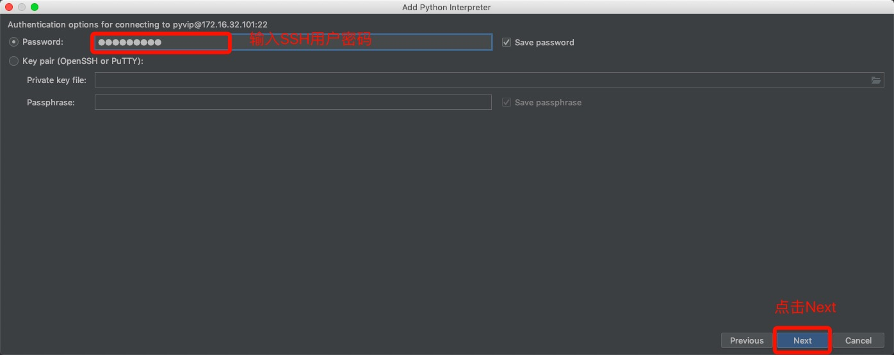

# 二、配置环境

## 2.1 下载环境包

首先安装虚拟环境，命令如下:

```
sudo pip3 install virtualenv #安装虚拟环境
```

接下来还要安装虚拟环境扩展包，命令如下：

```
sudo pip3 install virtualenvwrapper
```

安装虚拟环境包装器的目的是使用更加简单的命令来管理虚拟环境。

修改用户家目录下的配置文件.bashrc,添加如下内容：

`.sh`文件可以使用查找命令找出其位置。

```
export WORKON_HOME=$HOME/.virtualenvs
source /usr/local/bin/virtualenvwrapper.sh
```

使用source .bashrc命令使配置文件生效。

创建python3虚拟环境的命令如下：

```
mkvirtualenv -p python3 虚拟环境名称
例：
mkvirtualenv -p python3 py_django
```

## 2.2 创建虚拟环境

`mkvirtualenv -p /usr/bin/python3 (环境名)`

## 2.3 进入虚拟环境并安装Django版本

`workon 123(环境名)`

`pip install django==2.1.7`

## 2.4创建项目目录

`mkdir djangoApp(项目文件目录)`

## 2.5-1：用命令行搭建django服务器

`cd djangoApp(项目文件目录)`

`django-admin startproject CRM(项目名称)`

此时就可以ls一下查看有无这个文件了，这里就是一个完整的django服务器了

## 2.5-2：启动服务器

`cd CRM(项目名称)`

`ls`查看有无manage.py文件

`python manage.py runserver 0.0.0.0:8000`

现在就可以用到网页来访问自己创建的django服务器：`127.0.0.1:8000`

这时就会看到一个小飞机说明你成功了。

>   为了方便后续，我们可以将刚才命令创建django服务器的删除，然后让pycharm自行创建即可

## 2.5 用pycharm创建django项目文件并配置

### 1.配置远程解释器

**在pycharm中新建项目，取名、添加虚拟机上的虚拟环境**





**解释器的路径一般为：**

```linux
/home/pyvip/.virtualenvs/youkou_env/bin/python3.6
```


**添加远程虚拟机上的项目路径：**


**选择云服务器中的项目路径：**


### 2.修改host端口与port

**修改Host和端口（如果在阿里云服务器上创建工程，Host设置为0.0.0.0）：**


### 3.设置本地与服务器代码自动同步：


### 4.其他基础设置

**由于没有使用django默认的admin用户认证系统，所以会报错。**


**修改settings.py文件，将Host地址添加到ALLOWED_HOSTS列表中。如果为空，只能通过127.0.0.1或者localhost来访问服务器。**


**大功告成，配置成功！**

