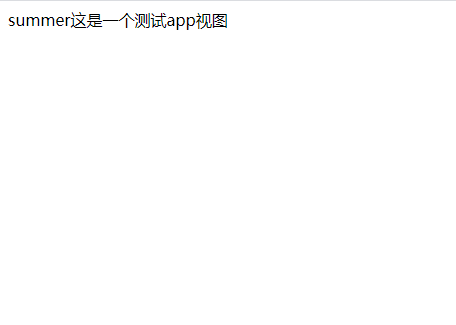
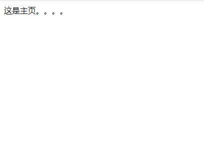

# Django——URL应用

上篇文章将url做了一个简单的理解，下面我们来运用一下基本的一些内容：

## 一、直接传参

我们知道，要从url中取值，我们就需要传参，而在url中就必须用一个`<>`将内容括起来。

test1/urls.py

```python
from django.urls import path
from . import views

app_name = "demo"  # 这个是命名空间

urlpatterns = [
	path('demo', views.demo),  # 不传参，直接使用该函数中的默认参数
	path('demo/<id>', views.demo),  # 传参，使用传入的参数
	path('demo/<name>/<age>', views.demo3),  # 传入两个参数无法判断值
]
```

test1/views.py

```python
from django.shortcuts import render
from django.http import HttpResponse
# Create your views here.


def demo(request, n_id=1):
	res = str(n_id) + "这是一个测试app视图"
	return HttpResponse(res)


def demo2(request, name):
	res = "本人的名字是:"+name
	return HttpResponse(res)


def demo3(request, name, age):
	if isinstance(age, int):
		res = "本人名字是：" + name + "，年龄是：" + str(age)
		return HttpResponse(res)
	else:
		return HttpResponse("传入的数字有误！！！")

```

当写完以后，我们就可以开启django，然后输入url进行测试：

`127.0.0.1:8000/demo`


`127.0.0.1:8000/demo/500`


为什么会出现这样的情况？应为我们子啊视图内部的形参是`n_id`而url里写的是`id`。因此这个地方需要非常注意，两个值必须写对。将url里的值修改为`path('demo/<n_id>', views.demo),  # 传参，使用传入的参数`


`127.0.0.1:8000/demo/summer/july`


看一下view的代码：

```python
def demo3(request, name, age):
	if isinstance(age, int):
		res = "本人名字是：" + name + "，年龄是：" + str(age)
		return HttpResponse(res)
	else:
		return HttpResponse("传入的数字有误！！！")
```

此时我们首先判断了传入的age是否是int类型，如果不是就报错，那有么有什么方法可以直接来呢？有，那就是转化器

## 二、使用转换器

下面的路径转换器在默认情况下是有效的：

-   `str` - 匹配除了 `'/'` 之外的非空字符串。如果表达式内不包含转换器，则会默认匹配字符串。
-   `int` - 匹配 0 或任何正整数。返回一个 `int` 。
-   `slug` - 匹配任意由 ASCII 字母或数字以及连字符和下划线组成的短标签。比如，`building-your-1st-django-site` 。
-   `uuid` - 匹配一个格式化的 UUID 。为了防止多个 URL 映射到同一个页面，必须包含破折号并且字符都为小写。比如，`075194d3-6885-417e-a8a8-6c931e272f00`。返回一个 [`UUID`](https://docs.python.org/3/library/uuid.html#uuid.UUID) 实例。
-   `path` - 匹配非空字段，包括路径分隔符 `'/'` 。它允许你匹配完整的 URL 路径而不是像 `str` 那样匹配 URL 的一部分。

我们就单独演示一下str和int：

test1/urls.py

```python
from django.urls import path
from . import views

app_name = "demo"

urlpatterns = [
	path('demo', views.demo),  # 不传参，直接使用该函数中的默认参数
	path('demo/<n_id>', views.demo),  # 传参，使用传入的参数
	# path('demo/<name>/<age>', views.demo3),  # 传入两个参数无法判断值
	
	# 使用转换器，
	path('demo/<str:name>', views.demo2),  # 规定传入的值
	path('demo/<str:name>/<int:age>', views.demo3),  # 如果是像这样的，需要先把使用转换器的放前面，然后将能接受所有的都传入（没意义）
	path('demo/<name>/<age>', views.demo3),  # 传入两个参数无法判断值
]
```

视图还是上面的视图，不变。

`127.0.0.1:8000/demo/summer`



`127.0.0.1:8000/demo/summer/20`


上面之所以把之前的直接传参放下来是应为如果那个在上面会导致不管传入的这两个值是什么类型的都会进入，导致后面的转换器无法启用。

## 三、使用正则表达式

如果要使用正则，那就不能使用path，而是转化为re_path。并且在 Python 正则表达式中，命名正则表达式组的语法是 `(?P<name>pattern)` ，其中 `name` 是组名，`pattern` 是要匹配的模式。

test1/urls.py

```python
from django.urls import path, re_path
from . import views

app_name = "demo"

urlpatterns = [
    # 正则匹配
	re_path(r'^demo/(?P<year>[0-9]{4})', views.demo4)
]
```

test1/views.py

```python
def demo4(request, year):
	res = "今年是：%s年" % year
	return HttpResponse(res)
```

`127.0.0.1:8000/demo/2021


## 四、kwargs（额外参数）的使用

kwargs和python中类似，传入的是一个字典。直接上代码：

test1/urls.py

```python
from django.urls import path, re_path
from . import views

app_name = "demo"

urlpatterns = [
    # 使用kwargs
	path('student', views.stu, kwargs={"name": "summer"}),
]
```

test1/views.py

```python
def stu(request, name):
	return HttpResponse('{}是学生'.format(name))
```

访问路径：

`127.0.0.1:8000/student`


注意和直接在url中传入值的区别。

## 五、反向解析

在 Django 项目中，一个常见需求是获取最终形式的 URL，比如用于嵌入生成的内容中（视图和资源网址，给用户展示网址等）或用户服务器端的导航处理（重定向等）。

强烈建议不要硬编码 URL（这是一个费力、不能扩展、容易出错的主意）。同样危险的是设计临时机制来生成的 URL 与URLconf描述的设计的URL一样，这会导致 URL 随着时间的推移变得过时。

换句话说，需要的是 DRY 机制。除其他优势外，它还允许 URL 设计自动更新，而不必遍历所有项目代码来搜索和替换过时的 URL 。

我们用来获取 URL 的首要信息是负责处理它的视图的标识(例如名称)。必须参与查找正确网址的其他信息是视图参数的类型(位置、关键字)和值。

Django 提供了一个解决方案，使得 URL 映射是 URL 设计唯一的仓库。你使用 URLconf 来填充它，然后可以双向使用它：

-   从用户/浏览器请求的 URL 开始，它调用正确的Django视图，并从 URL 中提取它的参数需要的值。
-   从相应的 Django 视图标识以及要传递给它的参数来获取相关联的 URL 。

我们假设有一个登录的路由和一个主页路由，我们访问登录的路由然后之后重定向到主页：

test1/urls.py

```python
from django.urls import path, re_path
from . import views

app_name = "demo"

urlpatterns = [
    # name属性（反向解析）
	path("index", views.index, name='index'),
	path("login", views.login),
]
```

test1/views.py

```python
from django.shortcuts import redirect

def index(request):
	return HttpResponse("这是主页。。。。")


def login(request):
    # return redirect('/index')  # 硬编码 不推荐
	return redirect('demo:index')  # 反向解析
```

访问路由

`127.0.0.1:8000/login`



我们会发现他直接跳转到了index页面，当然为了我们理解，我们可以加入一个sleep：

test1/views.py

```python
from django.shortcuts import redirect

def index(request):
	return HttpResponse("这是主页。。。。")


def login(request):
	# return redirect('/index')  # 硬编码 不推荐
	time.sleep(2)
	return redirect('demo:index')
```

上面的代码会在login停留2s，然后在跳转到index