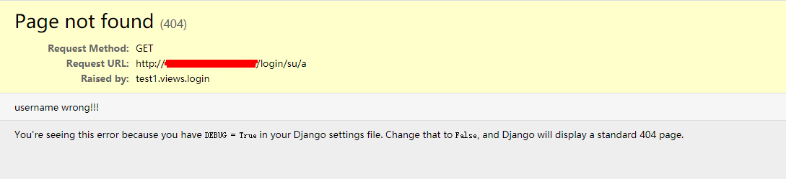
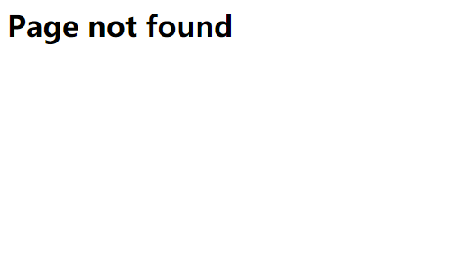

# Django——视图应用

这次，我们使用视图来写一个用户登录模块，用户输入用户名和密码，然后由后台判断，如果正确，跳转到index，如果错误就404错误

我们直接使用url和view来查看我们的小应用是否正确：

**test1/urls.py**

```python
from django.urls import path, re_path
from . import views

app_name = "demo"

urlpatterns = [
	# 小实验
	path("index", views.index, name='index'),
	path("login/<name>/<passwd>", views.login, name='login')
]
```

**test1/views.py**

我们知道报错信息可以分为多种，我们这里就使用两种来表示404

**第一种HTTP404**

```python
from django.shortcuts import render, redirect
from django.http import HttpResponse, Http404, HttpResponseNotFound


def index(request):
	return HttpResponse("这是主页。。。。")


def login(request, name, passwd):
	if name == "summer" and passwd == "123456":
		return redirect('demo:index')  # 使用重定向
	else:
		raise Http404("username wrong!!!")  # 发出报错信息
```

**访问路由1**

`127.0.0.1:8000/login/su/a`



**访问路由2**

`127.0.0.1:8000/summer/123456`


**第二种HttpResponseNotFound**

```python
from django.shortcuts import render, redirect
from django.http import HttpResponse, Http404, HttpResponseNotFound


def index(request):
	return HttpResponse("这是主页。。。。")


def login(request, name, passwd):
	if name == "summer" and passwd == "123456":
		return redirect('demo:index')
	else:
		# raise Http404("username wrong!!!")  # 发出报错信息
		return HttpResponseNotFound('<h1>Page not found</h1>')
```

**访问路由3**

`127.0.0.1:8000/su/a`



以上就是一个最简单的用户登录模块。

**注意HTTP404的使用**：

为了在 Django 返回404时显示自定义的 HTML，你可以创建名为 `404.html` 的HTML模板，并将其放置在你的模板树顶层。这个模板将在 [`DEBUG`](https://docs.djangoproject.com/zh-hans/3.1/ref/settings/#std:setting-DEBUG) 设为 `False` 时提供。

当 [`DEBUG`](https://docs.djangoproject.com/zh-hans/3.1/ref/settings/#std:setting-DEBUG) 为 `True` 时，你可以提供 `Http404` 信息，并且在标准的 404 调试模板里显示。使用这些信息来调试；它们通常不适合在生产环境下的404模板。