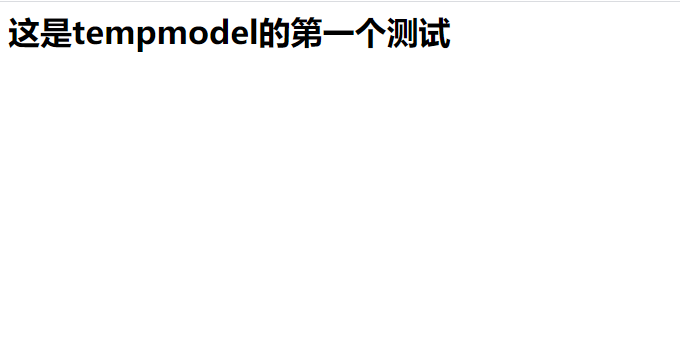
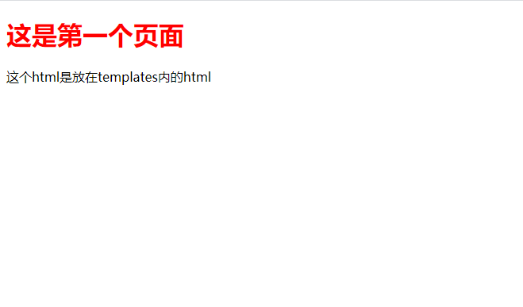
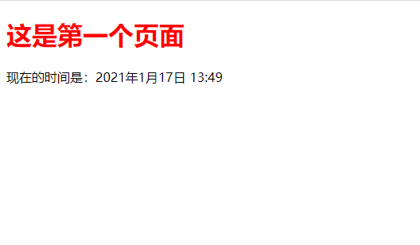
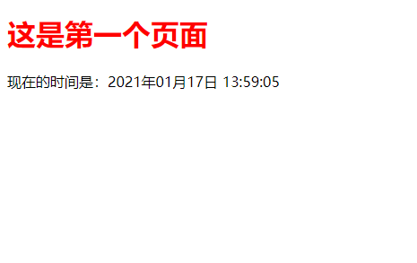
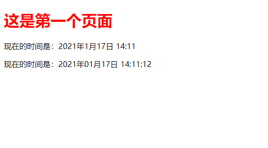
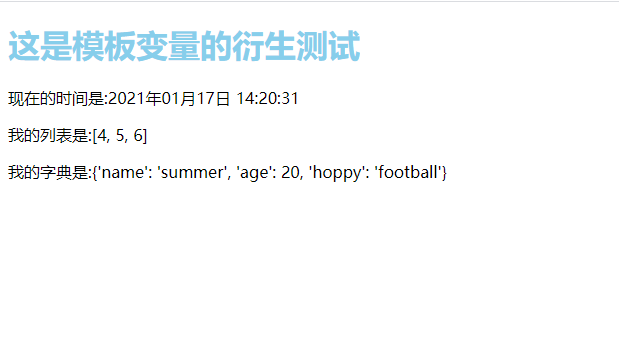
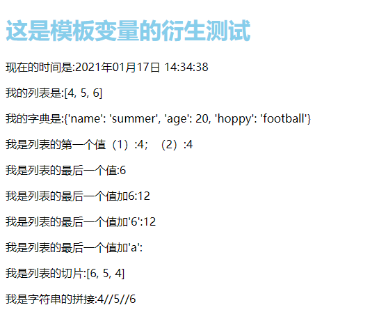
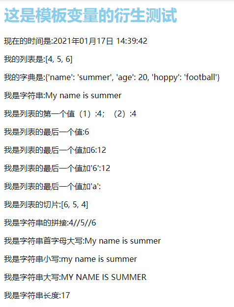

# Django——模板操作

[TOC]

我们一般将html文件放入Templates而将css和js等静态文件放入static文件中。

## 一、回顾

我们先来回顾以下，如何创建app：

-   首先进入到虚拟环境

-   然后进入到apps目录下

-   执行下面语句:`python ../manage.py startapp tempmd(app_name)`

-   最后将创建出来的文件下载到本地即可

-   应为创建的app是没有url的，因此我们需要创建一个urls.py文件

-   然后将这个路由在总路由中创建即可

    ```python
    from django.urls import include, path
    
    urlpatterns = [
        path('', include('test1.urls')),
        path('', include('tempmd.urls')),
    ]
    ```

创建完app以后，我们可以查看以下是否能顺利运行：

```python
# tempmd/urls.py
from django.urls import path
from . import views

app_name = "tempmodel"

urlpatterns = [
	path('', views.test1)
]
```

```python
# tempmd/views.py
from django.shortcuts import render
from django.http import HttpResponse

# Create your views here.


def test1(request):
	return HttpResponse("<h1>这是tempmodel的第一个测试</h1>")

```

运行url：`127.0.0.1:8000`



## 二、模板位置

上面的代码可以看到，我们使用html是可以返回并且在浏览器上显示出来的，那如果我们直接使用一个html文件，然后让这个函数返回这个html文件可以么？答案是可以的，django有一个模板模块，可以用来渲染html，他可以写入两个地方：

-   与manage.py同意级的templates文件中
-   放在app目录的templates中（一般都使用这个方法）

### 1.在app中的templates

这个方法一般就是把属于每个app的页面放在这个里面，而不属于自己的html就不会出现，但是这里有一个注意点（这里的templates不能改名字，必须这个）

-   在app下创建templates文件夹

-   settings.py配置

    ```python
    INSTALLED_APPS = [
        'django.contrib.admin',
        'django.contrib.auth',
        'django.contrib.contenttypes',
        'django.contrib.sessions',
        'django.contrib.messages',
        'django.contrib.staticfiles',
        'tempmd',  # 其实这个我们已经配置过了，我们之前的diamagnetic回顾一下，使用sys
    ]
    
    # 同时要设置'APP_DIRS'为True
    ```

    回顾之前的app配置路径：

    ```python
    # 创建应用之后，把apps目录加入到sys.path中
    sys.path.insert(0, BASE_DIR)
    sys.path.insert(1, os.path.join(BASE_DIR, 'apps'))  # 这个会自动配置好路径，因此我们可以不用上一步
    ```

-   使用

### 2.集中到templates文件

-   模板要放到特定的文件夹中，在项目根目录下（和manage.py同级）去创建一个文件夹

-   在setting.py中的配置环境

    ```python
    TEMPLATES = [
        {
            'BACKEND': 'django.template.backends.django.DjangoTemplates',
            'DIRS': [BASE_DIR / 'templates'],
            'APP_DIRS': True,
            'OPTIONS': {
                'context_processors': [
                    'django.template.context_processors.debug',
                    'django.template.context_processors.request',
                    'django.contrib.auth.context_processors.auth',
                    'django.contrib.messages.context_processors.messages',
                ],
                'builtins': ['django.templatetags.static']  # 这个不是自动生成的，而是我们自己加的，方便后续 
            },
        },
    ]
    ```

-   但是为了方便我们后续，我们同样可以在总的templates文件夹中创建app_name文件夹，将属于这个app的html存入即可

### 3. 例子

*templates/tempmd/index.html*

```html
<!DOCTYPE html>
<html lang="en">
<head>
    <meta charset="UTF-8">
    <title>主页</title>
</head>
<body>
    <h1 style="color: red">这是第一个页面</h1>
    这个html是放在templates内的html
</body>
</html>
```

*tempmd/urls.py*

```python
from django.urls import path
from . import views

app_name = "tempmodel"

urlpatterns = [
	path('', views.test1)
]
```

*tempmd/views.py*

```python
from django.shortcuts import render
from django.http import HttpResponse
from django.template.loader import get_template


# Create your views here.


def test1(request):
	# return HttpResponse("<h1>这是tempmodel的第一个测试</h1>")
	t = get_template('tempmd/index.html')
	html = t.render()
	return HttpResponse(html)
```

路由：`127.0.0.1:8000`



### 3-1.渲染升级

其实正常的开发不是上面这样(先获取模板，然后渲染最后返回)的，而是直接使用一个函数，看下面代码：

*tempmd/views.py*

```python
from django.shortcuts import render
from django.http import HttpResponse
from django.template.loader import get_template


# Create your views here.


def test1(request):
	# 1.直接返回html
	# return HttpResponse("<h1>这是tempmodel的第一个测试</h1>")
	
	# 2.使用模板渲染返回
	# t = get_template('tempmd/index.html')
	# html = t.render()
	# return HttpResponse(html)
	
	# 3.正常的返回
	return render(request, 'tempmd/index.html')
```

### 4. 总结

-   模板两种存放方式：1.app目录下templates；2.根目录下定义一个目录集中存放
-   如何选择：1.一般情况下，我们会选择集中存放2.如果app需要重复使用时，把模板放在app下
-   为什么我们要在templates文件夹下创建以app名字命名的文件夹？
    -   不同应用会有同名的模板，所以为了区分不同应用的模板

## 三、模板变量

我们页面分为静态和动态，静态就是没有和后台进行交互的一个html文件，而动态是随着时间的改变而内容发生改变的一个html文件。模板是通过上下文来渲染的。渲染用变量的值替换变量，变量的值在上下文中查找，并执行标签。其他的一切都按原样输出。

### 1. 模板变量语法`{{ name }}`

我们通过后台的的render函数内部的参数`context`将一个字典类型的值传到前端，然后前端使用`{{ key }}`获取后端传入的值。

>   注意这个name必须同样也得遵守python的命令规则。

*templates/tempmd/index.html*

```html
<!DOCTYPE html>
<html lang="en">
<head>
    <meta charset="UTF-8">
    <title>主页</title>
</head>
<body>
    <h1 style="color: red">这是第一个页面</h1>
    <p>现在的时间是：{{ now }}</p>
</body>
</html>
```

*tempmd/urls.py*

```python
from django.urls import path
from . import views

app_name = "tempmodel"

urlpatterns = [
	# path('', views.test1)  # 回顾和理解template
	path("", views.index),
]
```

*temdmd/views.py*

```python
from datetime import datetime

from django.shortcuts import render
from django.http import HttpResponse


def index(request):
	now = datetime.now()  # 获取当前时间
	return render(request, 'tempmd/index.html', context={
		'now': now,
	})

```

访问url：`127.0.0.1:8000`



### 2. 模板过滤器

#### 1). 直接在后台控制时间的输出

*tempmd/views.py*

```python
def index(request):
	now = datetime.now()  # 获取当前时间
	now = now.strftime("%Y年%m月%d日 %H:%M:%S")
	return render(request, 'tempmd/index.html', context={
		'now': now,
	})
```

其他不变，继续上次的路由：



#### 2). 使用模板过滤器

模板过滤器可以让我们在模板文件上直接对模板变量进行再处理。常用过滤器：

-   add：字符串相加
-   default：提供一个默认值
-   first：返回列表中的第一个
-   last：返回列表中的最后一个
-   date：格式化日期和时间
-   time：格式化时间
-   join：和python的join方法一样
-   length：返回字符串长度
-   lower：所有字符串变小写
-   capfirst：首字母大写
-   slice：切割列表
-   floatformat：浮点数格式化

[关于模板过滤器的官方地址](https://docs.djangoproject.com/zh-hans/3.1/ref/templates/builtins/#date)

我们这里使用date进行再次修改：

*tempmd/views.py*

```python
def index(request):
	now = datetime.now()  # 获取当前时间
	# now = now.strftime("%Y年%m月%d日 %H:%M:%S")
	return render(request, 'tempmd/index.html', context={
		'now': now,
	})
```

*templates/temped/index.html*

```html
<!DOCTYPE html>
<html lang="en">
<head>
    <meta charset="UTF-8">
    <title>主页</title>
</head>
<body>
    <h1 style="color: red">这是第一个页面</h1>
    {#<!- 这是模板变量的语法{{ name }}#}
    <p>现在的时间是：{{ now }}</p>
    {# 过滤器语法{{ name|过滤器:格式 #}
    <p>现在的时间是：{{ now|date:"Y年m月d日 H:i:s" }}</p>
</body>
</html>
```

路由:`127.0.0.1:8000`



#### 3). 模板变量的衍生

##### one. 最基本的引用

*templates/temdmd/test2.html*

```html
<!DOCTYPE html>
<html lang="en">
<head>
    <meta charset="UTF-8">
    <title>模板变量衍生</title>
</head>
<body>
    <h1 style="color: skyblue">这是模板变量的衍生测试</h1>
    <p>现在的时间是:{{ now|date:"Y年m月d日 H:i:s" }}</p>
    <p>我的列表是:{{ li }}</p>
    <p>我的字典是:{{ stu }}</p>
</body>
</html>
```

*tempmd/urls.py*

```python
from django.urls import path
from . import views

app_name = "tempmodel"

urlpatterns = [
	# path('', views.test1)  # 回顾和理解template
	path("index", views.index),  # 基础的模板测试
	path("", views.test2),  # 使用过滤器的模板测试
]

```

*tempmd/views.py*

```python
def test2(request):
	now = datetime.now()  # 获取当前时间
	li = [4, 5, 6]
	stu = {"name": "summer", "age": 20, "hoppy": "football"}
	return render(request, 'tempmd/test2.html', context={
		"now": now,
		"li":  li,
		"stu": stu,
	})
```

*路由：*`127.0.0.1:8000`



##### two. 有关列表的过滤器

*templates/temdmd/test2.html*

```html
<!DOCTYPE html>
<html lang="en">
<head>
    <meta charset="UTF-8">
    <title>模板变量衍生</title>
</head>
<body>
    <h1 style="color: skyblue">这是模板变量的衍生测试</h1>
    <p>现在的时间是:{{ now|date:"Y年m月d日 H:i:s" }}</p>
    <p>我的列表是:{{ li }}</p>
    <p>我的字典是:{{ stu }}</p>
    <p>我是字符串:{{ st }}</p>
    {# 有关列表的过滤器{{ name|过滤器:值 }} #}
    <p>我是列表的第一个值（1）:{{ li.0 }}；（2）:{{ li|first }}</p>
    <p>我是列表的最后一个值:{{ li|last }}</p>
    <p>我是列表的最后一个值加6:{{ li.2|add:6 }}</p>
    <p>我是列表的最后一个值加'6':{{ li.2|add:'6' }}</p>
    <p>我是列表的最后一个值加'a':{{ li.2|add:'a' }}</p>
    <p>我是列表的切片:{{ li|slice:'::-1' }}</p>
    <p>我是字符串的拼接:{{ li|join:'//' }}</p>
</body>
</html>
```

*tempmd/views.py*

```python
def test2(request):
	now = datetime.now()  # 获取当前时间
	li = [4, 5, 6]
	stu = {"name": "summer", "age": 20, "hoppy": "football"}
	st = "My name is summer"
	return render(request, 'tempmd/test2.html', context={
		"now": now,
		"li":  li,
		"stu": stu,
		"st": st,
	})
```

*路由：*`127.0.0.1:8000`



##### three.有关字符串的过滤器

*templates/temdmd/test2.html*

```html
<!DOCTYPE html>
<html lang="en">
<head>
    <meta charset="UTF-8">
    <title>模板变量衍生</title>
</head>
<body>
    <h1 style="color: skyblue">这是模板变量的衍生测试</h1>
    <p>现在的时间是:{{ now|date:"Y年m月d日 H:i:s" }}</p>
    <p>我的列表是:{{ li }}</p>
    <p>我的字典是:{{ stu }}</p>
    <p>我是字符串:{{ st }}</p>
    {# 有关列表的过滤器{{ name|过滤器:值 }} #}
    <p>我是列表的第一个值（1）:{{ li.0 }}；（2）:{{ li|first }}</p>
    <p>我是列表的最后一个值:{{ li|last }}</p>
    <p>我是列表的最后一个值加6:{{ li.2|add:6 }}</p>
    <p>我是列表的最后一个值加'6':{{ li.2|add:'6' }}</p>
    <p>我是列表的最后一个值加'a':{{ li.2|add:'a' }}</p>
    <p>我是列表的切片:{{ li|slice:'::-1' }}</p>
    <p>我是字符串的拼接:{{ li|join:'//' }}</p>
    <p>我是字符串首字母大写:{{ st|capfirst }}</p>
    <p>我是字符串小写:{{ st|lower }}</p>
    <p>我是字符串大写:{{ st|upper }}</p>
    <p>我是字符串长度:{{ st|length }}</p>
</body>
</html>
```

*路由：*`127.0.0.1:8000`



#### 4). 总结

-   模板过滤器的语法

{{ 模板变量|过滤器 }}

{{ 模板变量|过滤器：字符串参数/模板变量 }}

-   注意：
    -   冒号前后不能空格
    -   可以链式操作