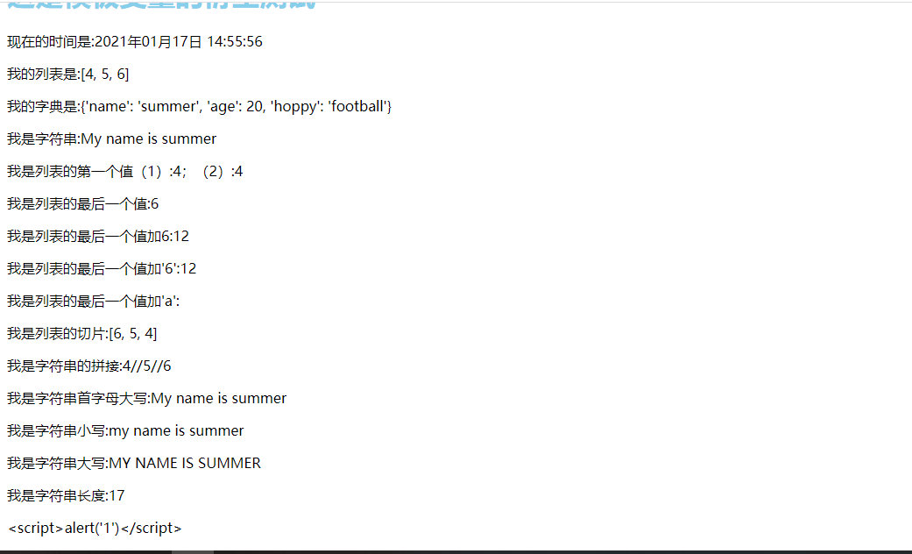
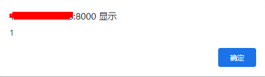
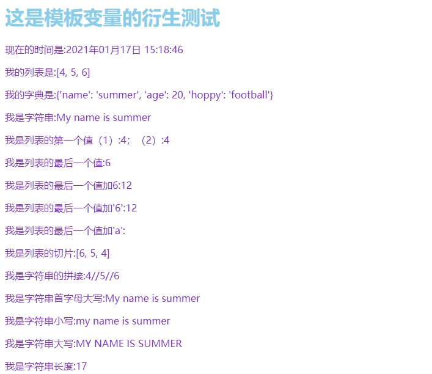
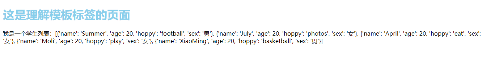
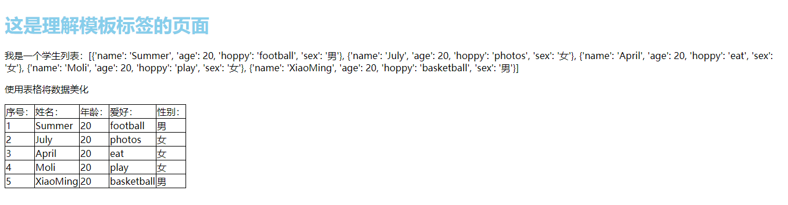
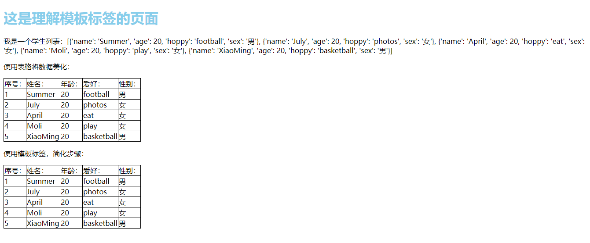
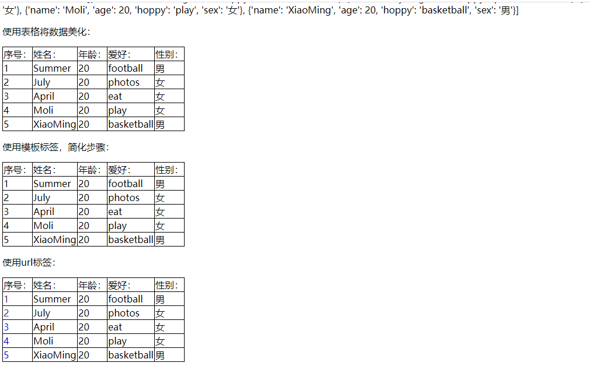
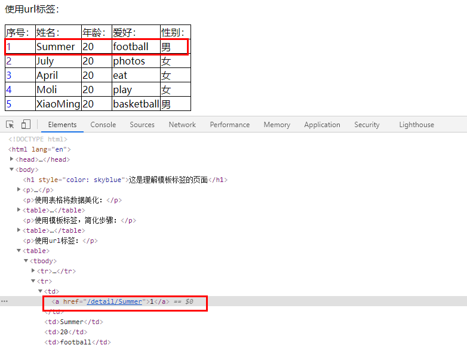
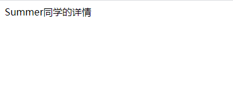
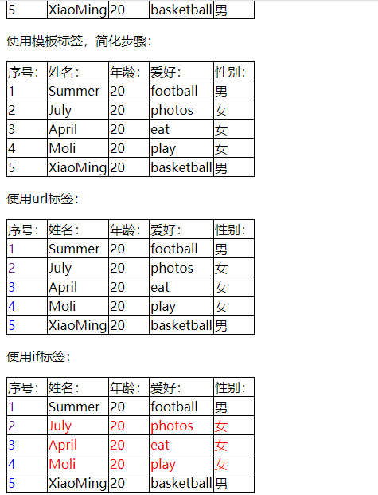

# Django——模板操作

[TOC]

这篇接上文，标签就不改了

## 三、模板变量

### 3.跨域脚本攻击

-   反射型
-   存储型

我们django已经帮我们做了一些防护，我们简单看一下这个代码：

*temdmd/view.py*

```python
def test2(request):
	now = datetime.now()  # 获取当前时间
	li = [4, 5, 6]
	stu = {"name": "summer", "age": 20, "hoppy": "football"}
	st = "My name is summer"
	js = "<script>alert('1')</script>"
	return render(request, 'tempmd/test2.html', context={
		"now": now,
		"li":  li,
		"stu": stu,
		"st": st,
		"js": js,
	})
```

*templates/tempmd/index.html*

```html
<!DOCTYPE html>
<html lang="en">
<head>
    <meta charset="UTF-8">
    <title>模板变量衍生</title>
</head>
<body>
    <h1 style="color: skyblue">这是模板变量的衍生测试</h1>
    <p>现在的时间是:{{ now|date:"Y年m月d日 H:i:s" }}</p>
    <p>我的列表是:{{ li }}</p>
    <p>我的字典是:{{ stu }}</p>
    <p>我是字符串:{{ st }}</p>
    {# 有关列表的过滤器{{ name|过滤器:值 }} #}
    <p>我是列表的第一个值（1）:{{ li.0 }}；（2）:{{ li|first }}</p>
    <p>我是列表的最后一个值:{{ li|last }}</p>
    <p>我是列表的最后一个值加6:{{ li.2|add:6 }}</p>
    <p>我是列表的最后一个值加'6':{{ li.2|add:'6' }}</p>
    <p>我是列表的最后一个值加'a':{{ li.2|add:'a' }}</p>
    <p>我是列表的切片:{{ li|slice:'::-1' }}</p>
    <p>我是字符串的拼接:{{ li|join:'//' }}</p>
    <p>我是字符串首字母大写:{{ st|capfirst }}</p>
    <p>我是字符串小写:{{ st|lower }}</p>
    <p>我是字符串大写:{{ st|upper }}</p>
    <p>我是字符串长度:{{ st|length }}</p>
    {#  组织脚本攻击  #}
    <p>{{ js }}</p>
</body>
</html>
```

我们在使用原来的代码看看会不会跳出一个框：



我们会发现，这段js代码直接当作一个str类型存放进了html中。而如果说我们信任代码，那就可以直接用safe

html文件：

```html
    {#  组织脚本攻击  #}
    <p>{{ js|safe }}</p>
```

此时我们刷新一下就会发现弹窗出来了。




## 四、静态文件导入

网站通常需要提供类似图片，JavaScript 或 CSS 的额外文件服务。在 Django 中，我们将这些文件称为“静态文件”。Django 提供了 `django.contrib.staticfiles` 帮你管理它们。

### 1.配置静态文件

1.  确保 INSTALLED_APPS`包含了 `django.contrib.staticfiles`。

2.  在配置文件中，定义 `STATIC_URL`，例子:

    ```
    # Static files (CSS, JavaScript, Images)
    # https://docs.djangoproject.com/en/3.1/howto/static-files/
    STATIC_URL = '/static/'
    ```

    **注意**：只要这里修改了，如果要访问静态资源，也得更着修改对应的url。（如果使用link导入）

3.  在模板中，用 `static` 模板标签基于配置 `STATICFILES_STORAGE` 位给定的相对路径构建 URL。

    ```
    
    
    ```

4.  将你的静态文件保存至程序中名为 `static` 的目录中。例如 `static/tempmd/example.jpg`。

你的工程可能包含未与任何应用绑定的静态资源。除了在 apps 中使用 `static/` 目录，你可以在配置文件中定义一个目录列表 (`STATICFILES_DIRS`) ，Django 会从中寻找静态文件。例子:

```
STATIC_URL = '/static/'

STATICFILES_DIRS = [
    os.path.join(BASE_DIR, 'static')
]
```

### 2.开发时提供静态文件服务

若你使用了前文所述的 `django.contrib.staticfiles`， `runserver`会在 `DEBUG`为 `True` 时自动处理。若你未在 `INSTALLED_APPS`中包含 `django.contrib.staticfiles`，你仍能手动通过`django.views.static.serve()` 为静态文件提供服务。

这不适合生产环境！常见的部署策略请参考 [部署静态文件](https://docs.djangoproject.com/zh-hans/3.1/howto/static-files/deployment/)。

例如，若 `STATIC_URL`为 `/static/`，你能通过添加以下代码片段至 urls.py 完成目的:

```
from django.conf import settings
from django.conf.urls.static import static

urlpatterns = [
    # ... the rest of your URLconf goes here ...
] + static(settings.STATIC_URL, document_root=settings.STATIC_ROOT)
```

### 3.小实验

#### 1) 使用最基本的文件导入

*templates/tempmd/test2.heml*

```html
<!DOCTYPE html>
<html lang="en">
<head>
    <meta charset="UTF-8">
    <title>模板变量衍生</title>
    <link rel="stylesheet" href="/static/tempmd/css/test2.css">
</head>
<body>
    <h1 style="color: skyblue">这是模板变量的衍生测试</h1>
    <p>现在的时间是:{{ now|date:"Y年m月d日 H:i:s" }}</p>
    <p>我的列表是:{{ li }}</p>
    <p>我的字典是:{{ stu }}</p>
    <p>我是字符串:{{ st }}</p>
    {# 有关列表的过滤器{{ name|过滤器:值 }} #}
    <p>我是列表的第一个值（1）:{{ li.0 }}；（2）:{{ li|first }}</p>
    <p>我是列表的最后一个值:{{ li|last }}</p>
    <p>我是列表的最后一个值加6:{{ li.2|add:6 }}</p>
    <p>我是列表的最后一个值加'6':{{ li.2|add:'6' }}</p>
    <p>我是列表的最后一个值加'a':{{ li.2|add:'a' }}</p>
    <p>我是列表的切片:{{ li|slice:'::-1' }}</p>
    <p>我是字符串的拼接:{{ li|join:'//' }}</p>
    <p>我是字符串首字母大写:{{ st|capfirst }}</p>
    <p>我是字符串小写:{{ st|lower }}</p>
    <p>我是字符串大写:{{ st|upper }}</p>
    <p>我是字符串长度:{{ st|length }}</p>
    {#  组织脚本攻击  #}
    <p>{{ js }}</p>
</body>
</html>
```

*static/tempmd/css/test2.css*

```css
p{
    color: blueviolet;
}
```

*访问url*`127.0.0.1:8000`



#### 2）使用内置的模板标签导入(推荐)

*templates/tempmd/test2.heml*

```html

<!DOCTYPE html>
<html lang="en">
<head>
    <meta charset="UTF-8">
    <title>模板变量衍生</title>
    {#  最基本的引用  #}
    {#  <link rel="stylesheet" href="/static/tempmd/css/test2.css">  #}
    {#  使用模板标签导入  #}
    <link rel="stylesheet" href="">
</head>
<body>
    <h1 style="color: skyblue">这是模板变量的衍生测试</h1>
    <p>现在的时间是:{{ now|date:"Y年m月d日 H:i:s" }}</p>
    <p>我的列表是:{{ li }}</p>
    <p>我的字典是:{{ stu }}</p>
    <p>我是字符串:{{ st }}</p>
    {# 有关列表的过滤器{{ name|过滤器:值 }} #}
    <p>我是列表的第一个值（1）:{{ li.0 }}；（2）:{{ li|first }}</p>
    <p>我是列表的最后一个值:{{ li|last }}</p>
    <p>我是列表的最后一个值加6:{{ li.2|add:6 }}</p>
    <p>我是列表的最后一个值加'6':{{ li.2|add:'6' }}</p>
    <p>我是列表的最后一个值加'a':{{ li.2|add:'a' }}</p>
    <p>我是列表的切片:{{ li|slice:'::-1' }}</p>
    <p>我是字符串的拼接:{{ li|join:'//' }}</p>
    <p>我是字符串首字母大写:{{ st|capfirst }}</p>
    <p>我是字符串小写:{{ st|lower }}</p>
    <p>我是字符串大写:{{ st|upper }}</p>
    <p>我是字符串长度:{{ st|length }}</p>
    {#  组织脚本攻击  #}
    <p>{{ js }}</p>
</body>
</html>
```

这样的好处是不会随着`STATIC_URL`的改变而去大量的修改url。

## 五、使用BootStrap

[官网链接](https://www.bootcss.com/)

我们可以直接在网站中寻找想要的页面，然后复制源代码过来即可

## 六、模板标签

[官网入口](https://docs.djangoproject.com/zh-hans/3.1/ref/templates/builtins/)

### 1.初始化

我们先来制作一个小模板，用于我们实验：

*templates/tempmd/undtag.html*

```html
<!DOCTYPE html>
<html lang="en">
<head>
    <meta charset="UTF-8">
    <title>理解模板标签</title>
</head>
<body>
    <h1 style="color: skyblue">这是理解模板标签的页面</h1>
    <p>我是一个学生列表：{{ students }}</p>
</body>
</html>
```

*tempmd/urls.py*

```python
from django.urls import path
from . import views

app_name = "tempmodel"

urlpatterns = [
	# path('', views.test1)  # 回顾和理解template
	path("index", views.index),  # 基础的模板测试
	path("filter", views.test2),  # 使用过滤器的模板测试
	path("login", views.login, name="login"),  # 使用bootstrap
	path("", views.test3, name="tag"),  # 使用模板标签的测试
]
```

*tempmd/views.py*

```python
# 理解模板标签
def test3(request):
	stu = [
		{"name": "Summer", "age": 20, "hoppy": "football", "sex": "男"},
		{"name": "July", "age": 20, "hoppy": "photos", "sex": "女"},
		{"name": "April", "age": 20, "hoppy": "eat", "sex": "女"},
		{"name": "Moli", "age": 20, "hoppy": "play", "sex": "女"},
		{"name": "XiaoMing", "age": 20, "hoppy": "basketball", "sex": "男"},
	]
	
	return render(request, 'tempmd/undtag.html', context={
		"students": stu,
	})
```

*路由*：`127.0.0.1:8000`



### 2. 使用表格将数据美化

*templates/tempmd/undtag.html*

```html

<!DOCTYPE html>
<html lang="en">
<head>
    <meta charset="UTF-8">
    <title>理解模板标签</title>
    <link rel="stylesheet" href="">
</head>
<body>
    <h1 style="color: skyblue">这是理解模板标签的页面</h1>
    <p>我是一个学生列表：{{ students }}</p>
    <p>使用表格将数据美化</p>
    <table>
        <tr>
            <td>序号：</td>
            <td>姓名：</td>
            <td>年龄：</td>
            <td>爱好：</td>
            <td>性别：</td>
        </tr>
        <tr>
            <td>1</td>
            <td>{{ students.0.name }}</td>
            <td>{{ students.0.age }}</td>
            <td>{{ students.0.hoppy }}</td>
            <td>{{ students.0.sex }}</td>
        </tr>
        <tr>
            <td>2</td>
            <td>{{ students.1.name }}</td>
            <td>{{ students.1.age }}</td>
            <td>{{ students.1.hoppy }}</td>
            <td>{{ students.1.sex }}</td>
        </tr>
        <tr>
            <td>3</td>
            <td>{{ students.2.name }}</td>
            <td>{{ students.2.age }}</td>
            <td>{{ students.2.hoppy }}</td>
            <td>{{ students.2.sex }}</td>
        </tr>
        <tr>
            <td>4</td>
            <td>{{ students.3.name }}</td>
            <td>{{ students.3.age }}</td>
            <td>{{ students.3.hoppy }}</td>
            <td>{{ students.3.sex }}</td>
        </tr>
        <tr>
            <td>5</td>
            <td>{{ students.4.name }}</td>
            <td>{{ students.4.age }}</td>
            <td>{{ students.4.hoppy }}</td>
            <td>{{ students.4.sex }}</td>
        </tr>
    </table>
</body>
</html>
```

*static/tempmd/css/undtag.css*

```css
table{
    border-collapse: collapse;
}
tr,td{
    border: 1px solid black;
}
```

*路由*：`127.0.0.1:8000`



### 3.使用for标签

我们发现，我们上面的代码是一次一次将所有代码全写出来，很浪费时间，有么有什么办法可以提高效率呢？使用模板标签！！！我们可以使用一个for循环然后依次循环即可。

*templates/tempmd/undtag.html*

```python

<!DOCTYPE html>
<html lang="en">
<head>
    <meta charset="UTF-8">
    <title>理解模板标签</title>
    <link rel="stylesheet" href="">
</head>
<body>
    <h1 style="color: skyblue">这是理解模板标签的页面</h1>
    <p>我是一个学生列表：{{ students }}</p>
    <p>使用表格将数据美化：</p>
    <table>
        <tr>
            <td>序号：</td>
            <td>姓名：</td>
            <td>年龄：</td>
            <td>爱好：</td>
            <td>性别：</td>
        </tr>
        <tr>
            <td>1</td>
            <td>{{ students.0.name }}</td>
            <td>{{ students.0.age }}</td>
            <td>{{ students.0.hoppy }}</td>
            <td>{{ students.0.sex }}</td>
        </tr>
        <tr>
            <td>2</td>
            <td>{{ students.1.name }}</td>
            <td>{{ students.1.age }}</td>
            <td>{{ students.1.hoppy }}</td>
            <td>{{ students.1.sex }}</td>
        </tr>
        <tr>
            <td>3</td>
            <td>{{ students.2.name }}</td>
            <td>{{ students.2.age }}</td>
            <td>{{ students.2.hoppy }}</td>
            <td>{{ students.2.sex }}</td>
        </tr>
        <tr>
            <td>4</td>
            <td>{{ students.3.name }}</td>
            <td>{{ students.3.age }}</td>
            <td>{{ students.3.hoppy }}</td>
            <td>{{ students.3.sex }}</td>
        </tr>
        <tr>
            <td>5</td>
            <td>{{ students.4.name }}</td>
            <td>{{ students.4.age }}</td>
            <td>{{ students.4.hoppy }}</td>
            <td>{{ students.4.sex }}</td>
        </tr>
    </table>
    <p>使用模板标签，简化步骤：</p>
    <table>
        <tr>
            <td>序号：</td>
            <td>姓名：</td>
            <td>年龄：</td>
            <td>爱好：</td>
            <td>性别：</td>
        </tr>
        {# 使用模板标签循环输出 #}
        
            <tr>
                {# 使用计数 #}
                <td>{{ forloop.counter }}</td>
                <td>{{ student.name }}</td>
                <td>{{ student.age }}</td>
                <td>{{ student.hoppy }}</td>
                <td>{{ student.sex }}</td>
            </tr>
        
    </table>

</body>
</html>
```

*路由：*



注意：for循环里面，有一个计数器可以来计数当前循环了几次

|        变量名         |                        描述                         |
| :-------------------: | :-------------------------------------------------: |
|   `forloop.counter`   |   循环计数器，表示当前循环的索引（从``1``开始）。   |
|  `forloop.counter0`   |   循环计数器，表示当前循环的索引（从``0``开始）。   |
| `forloop.revcounter`  | 反向循环计数器（以最后一次循环为``1``，反向计数）。 |
| `forloop.revcounter0` | 反向循环计数器（以最后一次循环为``0``，反向计数）。 |
|    `forloop.first`    |         当前循环为首个循环时，该变量为True          |
|    `forloop.last`     |       当前循环为最后一个循环时，该变量为True        |
| `forloop.parentloop`  |        在嵌套循环中，指向当前循环的上级循环         |

### 4.使用url标签

在表格中，最常见的就是a标签，路由的书写也是一个麻烦的存在，django提供了一个url标签，我们来看看：

*templates/tempmd/undtag.html*

```html

<!DOCTYPE html>
<html lang="en">
<head>
    <meta charset="UTF-8">
    <title>理解模板标签</title>
    <link rel="stylesheet" href="">
</head>
<body>
    <h1 style="color: skyblue">这是理解模板标签的页面</h1>
    <p>我是一个学生列表：{{ students }}</p>

    <p>使用表格将数据美化：</p>
    <table>
        <tr>
            <td>序号：</td>
            <td>姓名：</td>
            <td>年龄：</td>
            <td>爱好：</td>
            <td>性别：</td>
        </tr>
        <tr>
            <td>1</td>
            <td>{{ students.0.name }}</td>
            <td>{{ students.0.age }}</td>
            <td>{{ students.0.hoppy }}</td>
            <td>{{ students.0.sex }}</td>
        </tr>
        <tr>
            <td>2</td>
            <td>{{ students.1.name }}</td>
            <td>{{ students.1.age }}</td>
            <td>{{ students.1.hoppy }}</td>
            <td>{{ students.1.sex }}</td>
        </tr>
        <tr>
            <td>3</td>
            <td>{{ students.2.name }}</td>
            <td>{{ students.2.age }}</td>
            <td>{{ students.2.hoppy }}</td>
            <td>{{ students.2.sex }}</td>
        </tr>
        <tr>
            <td>4</td>
            <td>{{ students.3.name }}</td>
            <td>{{ students.3.age }}</td>
            <td>{{ students.3.hoppy }}</td>
            <td>{{ students.3.sex }}</td>
        </tr>
        <tr>
            <td>5</td>
            <td>{{ students.4.name }}</td>
            <td>{{ students.4.age }}</td>
            <td>{{ students.4.hoppy }}</td>
            <td>{{ students.4.sex }}</td>
        </tr>
    </table>

    <p>使用模板标签，简化步骤：</p>
    <table>
        <tr>
            <td>序号：</td>
            <td>姓名：</td>
            <td>年龄：</td>
            <td>爱好：</td>
            <td>性别：</td>
        </tr>
        {# 使用模板标签循环输出 #}
        
            <tr>
                {# 使用计数 #}
                <td>{{ forloop.counter }}</td>
                <td>{{ student.name }}</td>
                <td>{{ student.age }}</td>
                <td>{{ student.hoppy }}</td>
                <td>{{ student.sex }}</td>
            </tr>
        
    </table>

    <p>使用url标签：</p>
    <table>
        <tr>
            <td>序号：</td>
            <td>姓名：</td>
            <td>年龄：</td>
            <td>爱好：</td>
            <td>性别：</td>
        </tr>
        {# 使用模板标签循环输出 #}
        
            <tr>
                <td><a href="">{{ forloop.counter }}</a></td>
                <td>{{ student.name }}</td>
                <td>{{ student.age }}</td>
                <td>{{ student.hoppy }}</td>
                <td>{{ student.sex }}</td>
            </tr>
        
    </table>

</body>
</html>
```

这里使用``模板来进行跳转。

*static/tempmd/css/undtag.css*

```css
table{
    border-collapse: collapse;
}
tr,td{
    border: 1px solid black;
}
a{
    text-decoration: none;
}
```

*tempmd/urls.py*

```python
from django.urls import path
from . import views

app_name = "tempmodel"

urlpatterns = [
	# path('', views.test1)  # 回顾和理解template
	path("index", views.index),  # 基础的模板测试
	path("filter", views.test2),  # 使用过滤器的模板测试
	path("login", views.login, name="login"),  # 使用bootstrap
	path("", views.test3, name="tag"),  # 使用模板标签的测试
	path("detail/<name>", views.detail, name="detail"),  # 学生详情页面
]
```

*tempmd/views.py*

```python
def detail(request, name):
	return HttpResponse("{}同学的详情".format(name))
```

*路由*







### 5.使用if标签

我们规定如果性别为女，则整行为红色。

*templates/tempmd/undtag.html*

```html

<!DOCTYPE html>
<html lang="en">
<head>
    <meta charset="UTF-8">
    <title>理解模板标签</title>
    <link rel="stylesheet" href="">
</head>
<body>
    <h1 style="color: skyblue">这是理解模板标签的页面</h1>
    <p>我是一个学生列表：{{ students }}</p>

    <p>使用表格将数据美化：</p>
    <table>
        <tr>
            <td>序号：</td>
            <td>姓名：</td>
            <td>年龄：</td>
            <td>爱好：</td>
            <td>性别：</td>
        </tr>
        <tr>
            <td>1</td>
            <td>{{ students.0.name }}</td>
            <td>{{ students.0.age }}</td>
            <td>{{ students.0.hoppy }}</td>
            <td>{{ students.0.sex }}</td>
        </tr>
        <tr>
            <td>2</td>
            <td>{{ students.1.name }}</td>
            <td>{{ students.1.age }}</td>
            <td>{{ students.1.hoppy }}</td>
            <td>{{ students.1.sex }}</td>
        </tr>
        <tr>
            <td>3</td>
            <td>{{ students.2.name }}</td>
            <td>{{ students.2.age }}</td>
            <td>{{ students.2.hoppy }}</td>
            <td>{{ students.2.sex }}</td>
        </tr>
        <tr>
            <td>4</td>
            <td>{{ students.3.name }}</td>
            <td>{{ students.3.age }}</td>
            <td>{{ students.3.hoppy }}</td>
            <td>{{ students.3.sex }}</td>
        </tr>
        <tr>
            <td>5</td>
            <td>{{ students.4.name }}</td>
            <td>{{ students.4.age }}</td>
            <td>{{ students.4.hoppy }}</td>
            <td>{{ students.4.sex }}</td>
        </tr>
    </table>

    <p>使用模板标签，简化步骤：</p>
    <table>
        <tr>
            <td>序号：</td>
            <td>姓名：</td>
            <td>年龄：</td>
            <td>爱好：</td>
            <td>性别：</td>
        </tr>
        {# 使用模板标签循环输出 #}
        
            <tr>
                {# 使用计数 #}
                <td>{{ forloop.counter }}</td>
                <td>{{ student.name }}</td>
                <td>{{ student.age }}</td>
                <td>{{ student.hoppy }}</td>
                <td>{{ student.sex }}</td>
            </tr>
        
    </table>

    <p>使用url标签：</p>
    <table>
        <tr>
            <td>序号：</td>
            <td>姓名：</td>
            <td>年龄：</td>
            <td>爱好：</td>
            <td>性别：</td>
        </tr>
        {# 使用模板标签循环输出 #}
        
            <tr>
                <td><a href="">{{ forloop.counter }}</a></td>
                <td>{{ student.name }}</td>
                <td>{{ student.age }}</td>
                <td>{{ student.hoppy }}</td>
                <td>{{ student.sex }}</td>
            </tr>
        
    </table>

    <p>使用if标签：</p>
    <table>
        <tr>
            <td>序号：</td>
            <td>姓名：</td>
            <td>年龄：</td>
            <td>爱好：</td>
            <td>性别：</td>
        </tr>
        {# 使用模板标签循环输出 #}
        
            <tr style="color: red" >
                <td><a href="">{{ forloop.counter }}</a></td>
                <td>{{ student.name }}</td>
                <td>{{ student.age }}</td>
                <td>{{ student.hoppy }}</td>
                <td>{{ student.sex }}</td>
            </tr>
        
    </table>

</body>
</html>
```

*路由*



### 6.with标签

with可以给一个变量进行重命名，这里就不再写了直接给出代码：

```html

	...

```

