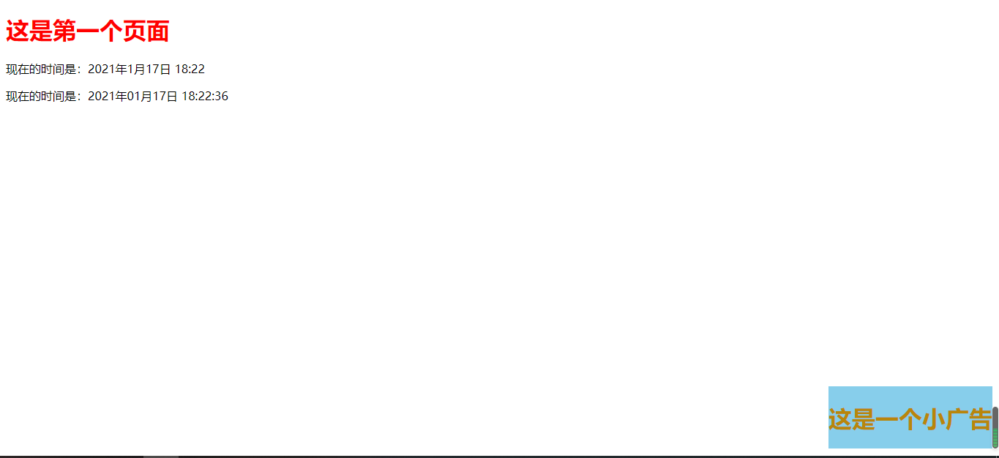
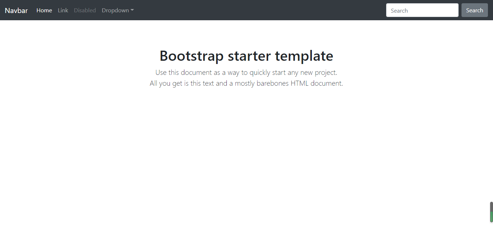
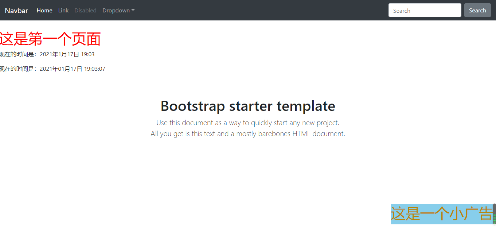

# Django——模板操作

[TOC]

本章也是接上回

## 七、模板的继承和引用

### 1.引用(include)

Django模板通过模板标签include实现一个模板，在其特定的位置引入另一个模板的内容

#### 1). 小实例

我们实现在index.html里面通过include添加一个小广告(ad.html)

*dempmd/urls.py*

```python
from django.urls import path
from . import views

app_name = "tempmodel"

urlpatterns = [
	# path('', views.test1)  # 回顾和理解template
	path("index2", views.index),  # 基础的模板测试(这里改了一下，应为之前的test1app也有index这个url)
	path("filter", views.test2),  # 使用过滤器的模板测试
	path("login", views.login, name="login"),  # 使用bootstrap
	path("tag", views.test3, name="tag"),  # 使用模板标签的测试
	path("detail/<name>", views.detail, name="detail"),  # 学生详情页面
]
```

*static/tempmd/css/ad.css*

```css
.ad{
    color: darkgoldenrod;
}
```

*templates/tempmd/ad.html*

```html

<!DOCTYPE html>
<html lang="en">
<head>
    <meta charset="UTF-8">
    <title>小广告——include</title>
    <link rel="stylesheet" href="">
</head>
<body>
    <h1 class="ad">这是一个小广告</h1>
</body>
</html>
```

*templates/tempmd/index.html*

```html
<!DOCTYPE html>
<html lang="en">
<head>
    <meta charset="UTF-8">
    <title>主页</title>
    <style>
        #ad{
            position: fixed;
            bottom: 10px;
            right: 10px;
            background-color: skyblue;
        }
    </style>
</head>
<body>
    <h1 style="color: red">这是第一个页面</h1>
    {#<!- 这是模板变量的语法{{ name }}#}
    <p>现在的时间是：{{ now }}</p>
    {# 过滤器语法{{ name|过滤器:格式 #}
    <p>现在的时间是：{{ now|date:"Y年m月d日 H:i:s" }}</p>
    <div id="ad">
        
    </div>
</body>
</html>
```

*路由*：`127.0.0.1:8000/index2`



#### 2). 添加简单的交互(js)

*static/tempmd/js/ad.js*

```javascript
var $ad = $("h1");
function f(){
    $ad.toggleClass("ad")
}
setInterval(f, 1000);
```

*templates/tempmd/index.html*

```html

<!DOCTYPE html>
<html lang="en">
<head>
    <meta charset="UTF-8">
    <title>主页</title>
    <style>
        #ad{
            position: fixed;
            bottom: 10px;
            right: 10px;
            background-color: skyblue;
        }
    </style>
</head>
<body>
    <h1 style="color: red">这是第一个页面</h1>
    {#<!- 这是模板变量的语法{{ name }}#}
    <p>现在的时间是：{{ now }}</p>
    {# 过滤器语法{{ name|过滤器:格式 #}
    <p>现在的时间是：{{ now|date:"Y年m月d日 H:i:s" }}</p>
    <div id="ad">
        
    </div>
    <script src="https://cdn.bootcdn.net/ajax/libs/jquery/3.5.1/jquery.js"></script>
    <script src=""></script>
</body>
</html>
```

这个运行起来之后就会发现小广告会一闪一闪。

### 2.继承(extends)

标记此模板继承的父模板的标签.

这个标签有两种使用方式:

-   `` (使用引号) Django将使用字面值 `"base.html"` 作为所继承的父模板的名字.
-   `` 使用变量 `variable`. 如果变量是一个字符串, Django会使用这个字符串作为所继承的父模板的名字. 如果变量是一个 `Template` 对象, Django会使用这个对象作为父模板.

#### 1). 小实例

在bootstrap中寻找一个模板，用作后续的模板

*tempmd/views.py*

````python
def test4(request):
	now = datetime.now()  # 获取当前时间
	return render(request, 'tempmd/extends.html', context={'now': now, })
````

*tempmd/urls.py*

```python
from django.urls import path
from . import views

app_name = "tempmodel"

urlpatterns = [
	# path('', views.test1)  # 回顾和理解template
	path("index2", views.index),  # 基础的模板测试
	path("filter", views.test2),  # 使用过滤器的模板测试
	path("login", views.login, name="login"),  # 使用bootstrap
	path("tag", views.test3, name="tag"),  # 使用模板标签的测试
	path("detail/<name>", views.detail, name="detail"),  # 学生详情页面
	path("", views.test4, name="extend")  # 模板的继承和引用测试
]
```

*templates/tempmd/base.html*

```html

<!doctype html>
<html lang="en">
  <head>
    <meta charset="utf-8">
    <meta name="viewport" content="width=device-width, initial-scale=1, shrink-to-fit=no">
    <meta name="description" content="">
    <meta name="author" content="Mark Otto, Jacob Thornton, and Bootstrap contributors">
    <meta name="generator" content="Jekyll v4.0.1">
    <title>Starter Template · Bootstrap</title>

    <link rel="canonical" href="https://v4.bootcss.com/docs/examples/starter-template/">

    <!-- Bootstrap core CSS -->
    <link href="" rel="stylesheet">

    <!-- Favicons -->
    <link rel="apple-touch-icon" href="https://v4.bootcss.com/docs/assets/img/favicons/apple-touch-icon.png" sizes="180x180">
    <link rel="icon" href="https://v4.bootcss.com/docs/assets/img/favicons/favicon-32x32.png" sizes="32x32" type="image/png">
    <link rel="icon" href="https://v4.bootcss.com/docs/assets/img/favicons/favicon-16x16.png" sizes="16x16" type="image/png">
    <link rel="manifest" href="https://v4.bootcss.com/docs/assets/img/favicons/manifest.json">
    <link rel="mask-icon" href="https://v4.bootcss.com/docs/assets/img/favicons/safari-pinned-tab.svg" color="#563d7c">
    <link rel="icon" href="https://v4.bootcss.com/docs/assets/img/favicons/favicon.ico">
    <meta name="msapplication-config" content="/docs/assets/img/favicons/browserconfig.xml">
    <meta name="theme-color" content="#563d7c">

    <style>
      .bd-placeholder-img {
        font-size: 1.125rem;
        text-anchor: middle;
        -webkit-user-select: none;
        -moz-user-select: none;
        -ms-user-select: none;
        user-select: none;
      }

      @media (min-width: 768px) {
        .bd-placeholder-img-lg {
          font-size: 3.5rem;
        }
      }
    </style>
    <!-- Custom styles for this template -->
    <link href="" rel="stylesheet">
  </head>
  <body>
    {# 头部 #}
    <nav class="navbar navbar-expand-md navbar-dark bg-dark fixed-top">
        <a class="navbar-brand" href="#">Navbar</a>
        <button class="navbar-toggler" type="button" data-toggle="collapse" data-target="#navbarsExampleDefault" aria-controls="navbarsExampleDefault" aria-expanded="false" aria-label="Toggle navigation">
            <span class="navbar-toggler-icon"></span>
        </button>

        <div class="collapse navbar-collapse" id="navbarsExampleDefault">
        <ul class="navbar-nav mr-auto">
        <li class="nav-item active">
        <a class="nav-link" href="#">Home <span class="sr-only">(current)</span></a>
        </li>
        <li class="nav-item">
        <a class="nav-link" href="#">Link</a>
        </li>
        <li class="nav-item">
        <a class="nav-link disabled" href="#" tabindex="-1" aria-disabled="true">Disabled</a>
        </li>
        <li class="nav-item dropdown">
        <a class="nav-link dropdown-toggle" href="#" id="dropdown01" data-toggle="dropdown" aria-haspopup="true" aria-expanded="false">Dropdown</a>
        <div class="dropdown-menu" aria-labelledby="dropdown01">
          <a class="dropdown-item" href="#">Action</a>
          <a class="dropdown-item" href="#">Another action</a>
          <a class="dropdown-item" href="#">Something else here</a>
        </div>
        </li>
        </ul>
        <form class="form-inline my-2 my-lg-0">
        <input class="form-control mr-sm-2" type="text" placeholder="Search" aria-label="Search">
        <button class="btn btn-secondary my-2 my-sm-0" type="submit">Search</button>
        </form>
        </div>
    </nav>
    
    {# 尾部 #}
    <main role="main" class="container">

        <div class="starter-template">
            <h1>Bootstrap starter template</h1>
            <p class="lead">Use this document as a way to quickly start any new project.<br> All you get is this text and a mostly barebones HTML document.</p>
        </div>

    </main><!-- /.container -->
    <script src="https://cdn.jsdelivr.net/npm/jquery@3.5.1/dist/jquery.slim.min.js"></script>
    <script>window.jQuery || document.write('<script src="/docs/assets/js/vendor/jquery.slim.min.js"><\/script>')</script>
    <script src="/docs/dist/js/bootstrap.bundle.min.js"></script></body>
</html>

```

*templates/tempmd/extends.html*

```python


<!DOCTYPE html>
<html lang="en">
<head>
    <meta charset="UTF-8">
    <title>主页</title>
        <style>
            #ad{
                position: fixed;
                bottom: 10px;
                right: 10px;
                background-color: skyblue;
            }
        </style>

</head>
<body>
    <h1 style="color: red">这是第一个页面</h1>
    {#<!- 这是模板变量的语法{{ name }}#}
    <p>现在的时间是：{{ now }}</p>
    {# 过滤器语法{{ name|过滤器:格式 #}
    <p>现在的时间是：{{ now|date:"Y年m月d日 H:i:s" }}</p>
    <div id="ad">
        
    </div>
    <script src="https://cdn.bootcdn.net/ajax/libs/jquery/3.5.1/jquery.js"></script>
    <script src=""></script>
</body>
</html>
```

*路由：*`127.0.0.1:8000`



#### 2) 块（block）

我们看到，我们虽然在这个面试出现了base页面，但是并没有出现我我们自己的页面。Django 的模板引擎中最强大的——也是最复杂的——部分是模板继承。模板继承允许你建立一个基本的“骨架”模板，它包含了你网站的所有常用元素，并定义了子模板可以覆盖的 **块**。

你可以根据需要使用任意层次的继承。一种常见的使用继承的方式是像以下的三层继承：

-   创建一个 `base.html` 模板，以保持你网站的主要外观和风格。
-   为你网站的每个“部分”创建一个 `base_SECTIONNAME.html` 模板。例如，`base_news.html`、`base_sports.html`。这些模板都是对 `base.html` 的扩展，并包括特定部分的样式／设计。
-   为每种类型的页面创建单独的模板，如新闻文章或博客条目。这些模板扩展了相应的部分模板。

这种方法可以最大限度地重用代码，并有助于将项目添加到共享内容区域，如全部分导航。

下面是一些关于继承工作的技巧：

-   如果你在模板中使用 ``，它必须是该模板中的第一个模板标签。否则，模板继承将无法使用。

-   基础模板中的 `` 标签越多越好。记住，子模板不需要定义所有的父块，所以你可以在一些块中填入合理的默认值，然后只定义以后需要的块。钩子多比钩子少好。

-   如果你发现自己的内容在多个模板中重复，可能意味着你应该把这些内容移到父模板中的 ``。

-   如果你需要从父模板中获取块的内容，`{{ block.super }}` 变量就可以做到这一点。如果你想添加到父模板的内容中，而不是完全覆盖它，这很有用。使用 `{{ block.super }}` 插入的数据不会被自动转义，因为如果需要的话，它已经在父模板中被转义了。

-   通过使用与继承模板相同的模板名称，``可以在覆盖模板的同时继承它。结合 `{{ block.super }}`，这可以成为一种强大的小规模定制方式。

-   在 ``之外使用模板标签 `as` 语法创建的变量不能在块中使用。例如，这个模板不会呈现任何东西：

    ```
    
    {{ title }}
    ```

-   为了增加可读性，你可以给你的 `` 标签起一个**名字**。例如：

    ```
    
    ...
    
    ```

    在较大的模板中，这种技术可以帮助你看到哪些 `` 标签正在被关闭。

最后，请注意，你不能在同一个模板中定义多个同名的 `block` 标签。之所以有这种限制，是因为块标签可以“双向”工作。也就是说，一个块标签不只是提供一个洞来填补——它还定义了填补父模板中洞的内容。如果一个模板中有两个名称相似的 `block`标签，那么该模板的父标签就不知道该使用哪一个块的内容。

*templates/tempmd/extends.html*

```html


<!DOCTYPE html>
<html lang="en">
<head>
    <meta charset="UTF-8">
    <title>主页</title>
    
        <style>
            #ad{
                position: fixed;
                bottom: 10px;
                right: 10px;
                background-color: skyblue;
            }
        </style>
    

</head>
<body>
    
    <h1 style="color: red">这是第一个页面</h1>
    {#<!- 这是模板变量的语法{{ name }}#}
    <p>现在的时间是：{{ now }}</p>
    {# 过滤器语法{{ name|过滤器:格式 #}
    <p>现在的时间是：{{ now|date:"Y年m月d日 H:i:s" }}</p>
    <div id="ad">
        
    </div>
    <script src="https://cdn.bootcdn.net/ajax/libs/jquery/3.5.1/jquery.js"></script>
    <script src=""></script>
    
</body>
</html>
```

*templates/tempmd/base.html*

```html

<!doctype html>
<html lang="en">
  <head>
    <meta charset="utf-8">
    <meta name="viewport" content="width=device-width, initial-scale=1, shrink-to-fit=no">
    <meta name="description" content="">
    <meta name="author" content="Mark Otto, Jacob Thornton, and Bootstrap contributors">
    <meta name="generator" content="Jekyll v4.0.1">
    <title>Starter Template · Bootstrap</title>

    <link rel="canonical" href="https://v4.bootcss.com/docs/examples/starter-template/">

    <!-- Bootstrap core CSS -->
    <link href="" rel="stylesheet">

    <!-- Favicons -->
    <link rel="apple-touch-icon" href="https://v4.bootcss.com/docs/assets/img/favicons/apple-touch-icon.png" sizes="180x180">
    <link rel="icon" href="https://v4.bootcss.com/docs/assets/img/favicons/favicon-32x32.png" sizes="32x32" type="image/png">
    <link rel="icon" href="https://v4.bootcss.com/docs/assets/img/favicons/favicon-16x16.png" sizes="16x16" type="image/png">
    <link rel="manifest" href="https://v4.bootcss.com/docs/assets/img/favicons/manifest.json">
    <link rel="mask-icon" href="https://v4.bootcss.com/docs/assets/img/favicons/safari-pinned-tab.svg" color="#563d7c">
    <link rel="icon" href="https://v4.bootcss.com/docs/assets/img/favicons/favicon.ico">
    <meta name="msapplication-config" content="/docs/assets/img/favicons/browserconfig.xml">
    <meta name="theme-color" content="#563d7c">
	<title></title>
      
    <style>
      .bd-placeholder-img {
        font-size: 1.125rem;
        text-anchor: middle;
        -webkit-user-select: none;
        -moz-user-select: none;
        -ms-user-select: none;
        user-select: none;
      }

      @media (min-width: 768px) {
        .bd-placeholder-img-lg {
          font-size: 3.5rem;
        }
      }
    </style>
    <!-- Custom styles for this template -->
    <link href="" rel="stylesheet">
    
  </head>
  <body>
    {# 头部 #}
    <nav class="navbar navbar-expand-md navbar-dark bg-dark fixed-top">
        <a class="navbar-brand" href="#">Navbar</a>
        <button class="navbar-toggler" type="button" data-toggle="collapse" data-target="#navbarsExampleDefault" aria-controls="navbarsExampleDefault" aria-expanded="false" aria-label="Toggle navigation">
            <span class="navbar-toggler-icon"></span>
        </button>

        <div class="collapse navbar-collapse" id="navbarsExampleDefault">
        <ul class="navbar-nav mr-auto">
        <li class="nav-item active">
        <a class="nav-link" href="#">Home <span class="sr-only">(current)</span></a>
        </li>
        <li class="nav-item">
        <a class="nav-link" href="#">Link</a>
        </li>
        <li class="nav-item">
        <a class="nav-link disabled" href="#" tabindex="-1" aria-disabled="true">Disabled</a>
        </li>
        <li class="nav-item dropdown">
        <a class="nav-link dropdown-toggle" href="#" id="dropdown01" data-toggle="dropdown" aria-haspopup="true" aria-expanded="false">Dropdown</a>
        <div class="dropdown-menu" aria-labelledby="dropdown01">
          <a class="dropdown-item" href="#">Action</a>
          <a class="dropdown-item" href="#">Another action</a>
          <a class="dropdown-item" href="#">Something else here</a>
        </div>
        </li>
        </ul>
        <form class="form-inline my-2 my-lg-0">
        <input class="form-control mr-sm-2" type="text" placeholder="Search" aria-label="Search">
        <button class="btn btn-secondary my-2 my-sm-0" type="submit">Search</button>
        </form>
        </div>
    </nav>

    {# 中心 #}
    
    

    {# 尾部 #}
    <main role="main" class="container">

        <div class="starter-template">
            <h1>Bootstrap starter template</h1>
            <p class="lead">Use this document as a way to quickly start any new project.<br> All you get is this text and a mostly barebones HTML document.</p>
        </div>

    </main><!-- /.container -->
    <script src="https://cdn.jsdelivr.net/npm/jquery@3.5.1/dist/jquery.slim.min.js"></script>
    <script>window.jQuery || document.write('<script src="/docs/assets/js/vendor/jquery.slim.min.js"><\/script>')</script>
    <script src="/docs/dist/js/bootstrap.bundle.min.js"></script></body>
</html>

```

*路由*`127.0.0.1:8000`



## 八、过滤器和标签汇总

```python
{{ students|first }}    	# 过滤器
{{ students|add:"2" }}  	# 过滤器操作
			# load标签
	# url标签
		# 由开头和end组成的tag例如for和if
	# extends标签
 # block标签a为这个快的名字
```

