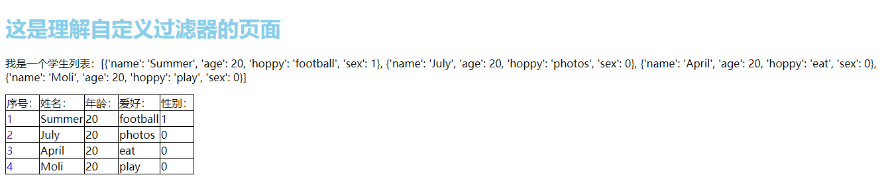

# Django——模板操作

[TOC]

承接上章

## 九、自定义模板过滤器

[官方文档地址](https://docs.djangoproject.com/zh-hans/3.1/howto/custom-template-tags/)

在我们平时存储数据时，通常不会直接使用：男，女；而是使用数字来表示男和女。但是我们又希望显示的时候是显示男女的，那么接下来我们使用简单的例子来看看自定义模板过滤器是如何使用的：

### 1. 初始操作

*tempmd/views.py*

```python
# 理解自定义模板过滤器
def test5(request):
	stu = [
		{"name": "Summer", "age": 20, "hoppy": "football", "sex": 1},
		{"name": "July", "age": 20, "hoppy": "photos", "sex": 0},
		{"name": "April", "age": 20, "hoppy": "eat", "sex": 0},
		{"name": "Moli", "age": 20, "hoppy": "play", "sex": 0}]

	return render(request, 'tempmd/diyfileter.html', context={"students": stu, })
```

*tempmd/urls.py*

```python
from django.urls import path
from . import views

app_name = "tempmodel"

urlpatterns = [
	# path('', views.test1)  # 回顾和理解template
	path("index2", views.index),  # 基础的模板测试
	path("filter", views.test2),  # 使用过滤器的模板测试
	path("login", views.login, name="login"),  # 使用bootstrap
	path("tag", views.test3, name="tag"),  # 使用模板标签的测试
	path("detail/<name>", views.detail, name="detail"),  # 学生详情页面
	path("extend", views.test4, name="extend"),  # 模板的继承和引用测试
	path("", views.test5, name="diyfilter"),  # 自定义模板过滤器
]

```

*templates/tempmd/diyfilter.html*

```html

<!DOCTYPE html>
<html lang="en">
<head>
    <meta charset="UTF-8">
    <title>理解模板标签</title>
    <link rel="stylesheet" href="">
</head>
<body>
    <h1 style="color: skyblue">这是理解自定义过滤器的页面</h1>
    <p>我是一个学生列表：{{ students }}</p>
    <table>
        <tr>
            <td>序号：</td>
            <td>姓名：</td>
            <td>年龄：</td>
            <td>爱好：</td>
            <td>性别：</td>
        </tr>
        {# 使用模板标签循环输出 #}
        
            <tr>
                <td><a href="">{{ forloop.counter }}</a></td>
                <td>{{ student.name }}</td>
                <td>{{ student.age }}</td>
                <td>{{ student.hoppy }}</td>
                <td>{{ student.sex }}</td>
            </tr>
        
    </table>
</body>
</html>
```

*查看*



### 2. 使用自定义模板过滤器

#### 1). 代码布局

>   定制自定义模板 tags 和 filters 的位置就是 Django 应用内。如果它们关联至某个已存在的应用，在那里将它们打包就很有用；否则，它们能被添加至新应用。当一个 Django 应用被添加至 `INSTALLED_APPS`，所以其在常规位置（下面介绍）定义的标签都可以在模板中自动加载。

>   该应用应包含一个 `templatetags` 目录，与 `models.py`， `views.py` 等同级。若该目录不存在，创建它——不要忘了用 `__init__.py` 文件确保目录被视作一个 Python 包。

​	其实我们同样有两种存放方式和static与templates相同，可是为了方便，我们一般都是将这个文件创建在app目录中。

#### 2). 步骤

-   在app目录下创建templatetags名的python包(`__init__.py`)

    ```python
    /apps/tempmd$ tree
    .
    ├── admin.py
    ├── apps.py
    ├── __init__.py
    ├── migrations
    │   └── __init__.py
    ├── models.py
    ├── templatetags
    │   └── __init__.py
    ├── tests.py
    ├── urls.py
    └── views.py
    
    ```

-   app必须在settings中注册

    ```python
    INSTALLED_APPS = [
        'django.contrib.admin',
        'django.contrib.auth',
        'django.contrib.contenttypes',
        'django.contrib.sessions',
        'django.contrib.messages',
        'django.contrib.staticfiles',
        "tempmd",  # 我们之前是使用sys导入路径，但是现在这个地方必须写一下
    ]
    ```

-   接着重启服务器

-   在templatetags新建一个pyhton文件即可在里面写入自定义过滤器了

-   注册

-   使用

#### 3). 写自定义过滤器

*apps\tempmd\templatetags\diy_filters.py*

```python
# -*- coding: utf-8 -*-
# @Author  : summer

def to_sex(value, language="zh"):
	change = {
		"zh": ("女", "男"),
		"en": ("Female", "Male"),
	}
	return change[language][value]

```

#### 4). 注册

*apps\tempmd\templatetags\diy_filters.py*

<font style="color:red">注意：这个变量名必须是register否则起不来</font>

```python
# -*- coding: utf-8 -*-
# @Author  : summer
from django import template

register = template.Library()  # 这里的变量名必须为register


def to_sex(value, language="zh"):
	change = {
		"zh": ("女", "男"),
		"en": ("Female", "Male"),
	}
	return change[language][value]


# 注册
# def filter(self, name=None, filter_func=None, **flags):因此你是可以为这个过滤器添加一个名字的在这个名字前（如果不加就是函数名)
# register.filter("sex", to_sex)
register.filter(to_sex)

```

#### 5). 使用

```html


<!DOCTYPE html>
<html lang="en">
<head>
    <meta charset="UTF-8">
    <title>理解模板标签</title>
    <link rel="stylesheet" href="">
</head>
<body>
    <h1 style="color: skyblue">这是理解自定义过滤器的页面</h1>
    <p>我是一个学生列表：{{ students }}</p>
    <table>
        <tr>
            <td>序号：</td>
            <td>姓名：</td>
            <td>年龄：</td>
            <td>爱好：</td>
            <td>性别：</td>
        </tr>
        {# 使用模板标签循环输出 #}
        
            <tr>
                <td><a href="">{{ forloop.counter }}</a></td>
                <td>{{ student.name }}</td>
                <td>{{ student.age }}</td>
                <td>{{ student.hoppy }}</td>
                <td>{{ student.sex|to_sex }}</td>  {# 使用比较方便，和普通过滤器没什么分别 #}
            </tr>
        
    </table>
</body>
</html>
```

*查看*


#### 6). 传入参数的过滤器

```html


<!DOCTYPE html>
<html lang="en">
<head>
    <meta charset="UTF-8">
    <title>理解模板标签</title>
    <link rel="stylesheet" href="">
</head>
<body>
    <h1 style="color: skyblue">这是理解自定义过滤器的页面</h1>
    <p>我是一个学生列表：{{ students }}</p>
    <table>
        <tr>
            <td>序号：</td>
            <td>姓名：</td>
            <td>年龄：</td>
            <td>爱好：</td>
            <td>性别：</td>
        </tr>
        {# 使用模板标签循环输出 #}
        
            <tr>
                <td><a href="">{{ forloop.counter }}</a></td>
                <td>{{ student.name }}</td>
                <td>{{ student.age }}</td>
                <td>{{ student.hoppy }}</td>
                <td>{{ student.sex|to_sex }}</td>  {# 使用比较方便，和普通过滤器没什么分别 #}
            </tr>
        
    </table>

    <table>
        <tr>
            <td>序号：</td>
            <td>姓名：</td>
            <td>年龄：</td>
            <td>爱好：</td>
            <td>性别：</td>
        </tr>
        {# 使用模板标签循环输出 #}
        
            <tr>
                <td><a href="">{{ forloop.counter }}</a></td>
                <td>{{ student.name }}</td>
                <td>{{ student.age }}</td>
                <td>{{ student.hoppy }}</td>
                <td>{{ student.sex|to_sex:"en" }}</td>
            </tr>
        
    </table>
</body>
</html>
```


#### 7).使用装饰器注册

```python
# -*- coding: utf-8 -*-
# @Author  : summer
from django import template

register = template.Library()  # 这里的变量名必须为register


@register.filter()  # 里面同样可以起名字，加个name属性即可
def to_sex(value, language="zh"):
	change = {
		"zh": ("女", "男"),
		"en": ("Female", "Male"),
	}
	return change[language][value]


# 注册
# def filter(self, name=None, filter_func=None, **flags):因此你是可以为这个过滤器添加一个名字的在这个名字前（如果不加就是函数名)
# register.filter(to_sex)
```

## 十、自定义标签

​		标签比过滤器更复杂，因为标签啥都能做。Django 提供了很多快捷方式，简化了编写绝大多数类型的标签过程。我们先探索这些快捷方式，然后解释如何在快捷方式不够强大的情况下从零编写标签。

### 前提：

​		app必须设置好路径：`INSTALLED_APPS配置好app的路径`

### 1.简单标签

#### 1). 步骤

-   创建文件夹（templatetags包），创建py文件
-   在文件中写入自定义标签程序
-   注册

#### 2).  标签代码

*apps\tempmd\templatetags\diy_tag.py*

```python
# -*- coding: utf-8 -*-
# @Author  : summer
from datetime import datetime


def current_time(format_str):
	now = datetime.now().strftime(format_str)
	return now
	
```

#### 3). 注册

*apps\tempmd\templatetags\diy_tag.py*

```python
# -*- coding: utf-8 -*-
# @Author  : summer
from datetime import datetime
from django.template import Library

register = Library()


def current_time(format_str):
	now = datetime.now().strftime(format_str)
	return now


# 注册
register.simple_tag(current_time, name="currtag")  # 这里重新起了名字
```

*\templates\tempmd\diytag.html*

```html


<!DOCTYPE html>
<html lang="en">
<head>
    <meta charset="UTF-8">
    <title>理解模板</title>
    <link rel="stylesheet" href="">
</head>
<body>
    <h1 style="color: skyblue">这是理解自定义标签的页面</h1>
    <p>现在的时间是：{{ now }}</p>
    <p>现在的时间是：{{ now|date:"Y年m月d日 H:i:s" }}</p>
    <p>我是通过自定义模板标签实现的时间：{% currtag "%Y年%m月%d日 %H:%M:%S" %}</p>

</body>
</html>
```


#### 4). 使用装饰器

*apps\tempmd\templatetags\diy_tag.py*

```python
# -*- coding: utf-8 -*-
# @Author  : summer
from datetime import datetime
from django.template import Library

register = Library()


# 使用装饰器注册
@register.simple_tag(name="currtag")
def current_time(format_str):
	now = datetime.now().strftime(format_str)
	return now


# 直接注册
# register.simple_tag(current_time, name="currtag")
```

#### 5). 使用上下文管理

从视图函数中，context传递自定义标签

*apps\tempmd\templatetags\diy_tag.py*

```python
# -*- coding: utf-8 -*-
# @Author  : summer
from datetime import datetime
from django.template import Library

register = Library()


# 使用装饰器注册
# @register.simple_tag(name="currtag")
# def current_time(format_str):
# 	now = datetime.now().strftime(format_str)
# 	return now


# 使用上下文
@register.simple_tag(name="currtag", takes_context=True)
def current_time(context):
	now = datetime.now().strftime(context["format_str"])
	return now


# 直接注册
# register.simple_tag(current_time, name="currtag")


```

*\templates\tempmd\diytag.html*

```html


<!DOCTYPE html>
<html lang="en">
<head>
    <meta charset="UTF-8">
    <title>理解模板</title>
    <link rel="stylesheet" href="">
</head>
<body>
    <h1 style="color: skyblue">这是理解自定义标签的页面</h1>
    <p>现在的时间是：{{ now }}</p>
    <p>现在的时间是：{{ now|date:"Y年m月d日 H:i:s" }}</p>
	{# <p>我是通过自定义模板标签实现的时间：{% currtag "%Y年%m月%d日 %H:%M:%S" %}</p> #}
    <p>我是通过自定义模板标签+上下文实现的时间：</p>

</body>
</html>
```

### 2.包含标签

>另一种常见的模板标签会为 *另一个* 模板渲染数据。例如， Django 的后台利用自定义模板标签在表单页的底部展示按钮。这些按钮看起来一样，但是连接目标根据被编辑的对象不同而不同——所以，这是一个极好的例子，展示如何用当前对象的细节填充小模板。（在后台例子中，即 `submit_row` 标签。）

这种标签被称为“包含标签”。

#### 1). 初始化

*templates\tempmd\diytag.html*

```html



<!DOCTYPE html>
<html lang="en">
<head>
    <meta charset="UTF-8">
    <title>理解模板</title>
    <link rel="stylesheet" href="">
</head>
<body>
    <h1 style="color: skyblue">这是理解自定义标签的页面</h1>
    <p>现在的时间是：{{ now }}</p>
    <p>现在的时间是：{{ now|date:"Y年m月d日 H:i:s" }}</p>
    {# <p>我是通过自定义模板标签实现的时间：{% currtag "%Y年%m月%d日 %H:%M:%S" %}</p> #}
    <p>我是通过自定义模板标签+上下文实现的时间：</p>
    <p>下面是包含标签的模型：</p>
    <table>
        <tr>
            <td>序号：</td>
            <td>姓名：</td>
            <td>年龄：</td>
            <td>爱好：</td>
            <td>性别：</td>
            <td>课程：</td>
        </tr>
        
            <tr>
                <td><a href="">{{ forloop.counter }}</a></td>
                <td>{{ student.name }}</td>
                <td>{{ student.age }}</td>
                <td>{{ student.hoppy }}</td>
                <td>{{ student.sex|to_sex }}</td>
{#                <td>{{ student.course }}</td>#} {# 最基础的获取 #}
                {# 使用for循环获取 #}
{#                <td>#}
{#                    #}
{#                        {{ course }}#}
{#                    #}
{#                </td>#}
                {# 使用li标签美化 #}
                <td>
                    <ul>
                        
                        <li>{{ course }}</li>
                        
                    </ul>
                </td>
            </tr>
        
    </table>

</body>
</html>
```

以上是html页面，我们看一下成果：


在现实中，我们经常需要用到for循环，然后将内容依次填入到ul的li标签中，英雌我们可以单独把这一部分独立出来，形成一个模板：

#### 2). 利用模板和自定义标签来实现

-   创建文件夹
-   注册（多一步模板渲染）
-   使用

这是基本的步骤，我们来看一看。

*tempmd\templatetags\diy_tag.py*

```python
def show_list_as_ul(value):  # 定义一个函数,接收模板变量
	return {'ls': value}  #


t = get_template('tempmd/show_list_as_ul.html')  # 模板渲染
register.inclusion_tag(t)(show_list_as_ul)
```

*templates\tempmd\show_list_as_ul.html*

```html
<ul>
        {# 这个变量ls如果是什么,那么在diy_tag里面也必须是什么 #}
    <li>{{ item }}</li>
    
</ul>
```

这里我们将基础模板抽出来，然后用来后续操作

**templates\tempmd\diytag.html**

```html



<!DOCTYPE html>
<html lang="en">
<head>
    <meta charset="UTF-8">
    <title>理解模板</title>
    <link rel="stylesheet" href="">
</head>
<body>
    <h1 style="color: skyblue">这是理解自定义标签的页面</h1>
    <p>现在的时间是：{{ now }}</p>
    <p>现在的时间是：{{ now|date:"Y年m月d日 H:i:s" }}</p>
    {# <p>我是通过自定义模板标签实现的时间：{% currtag "%Y年%m月%d日 %H:%M:%S" %}</p> #}
    <p>我是通过自定义模板标签+上下文实现的时间：</p>
    <p>下面是包含标签的模型：</p>
    <table>
        <tr>
            <td>序号：</td>
            <td>姓名：</td>
            <td>年龄：</td>
            <td>爱好：</td>
            <td>性别：</td>
            <td>课程：</td>
        </tr>
        
            <tr>
                <td><a href="">{{ forloop.counter }}</a></td>
                <td>{{ student.name }}</td>
                <td>{{ student.age }}</td>
                <td>{{ student.hoppy }}</td>
                <td>{{ student.sex|to_sex }}</td>
{#                <td>{{ student.course }}</td>#} {# 最基础的获取 #}
                {# 使用for循环获取 #}
{#                <td>#}
{#                    #}
{#                        {{ course }}#}
{#                    #}
{#                </td>#}
                {# 使用li标签美化 #}
{#                <td>#}
{#                    <ul>#}
{#                        #}
{#                        <li>{{ course }}</li>#}
{#                        #}
{#                    </ul>#}
{#                </td>#}
                {# 使用自定义包含标签 #}
                <td></td>
            </tr>
        
    </table>

</body>
</html>
```

上面完成之后，我们的页面就可以显示了。

使用装饰器完成注册：

*tempmd\templatetags\diy_tag.py*

```python
@register.inclusion_tag('tempmd/show_list_as_ul.html')
def show_list_as_ul(value):  # 定义一个函数,接收模板变量
	return {'ls': value}  #


# t = get_template('tempmd/show_list_as_ul.html')  # 模板渲染
# register.inclusion_tag(t)(show_list_as_ul)
```

### 3.小总结

对于简单标签，先创建函数，然后注册最后在template进行导入和使用即可。

而对于包含标签，就需要在创建函数之后先进性模板渲染，其余的操作也类似。