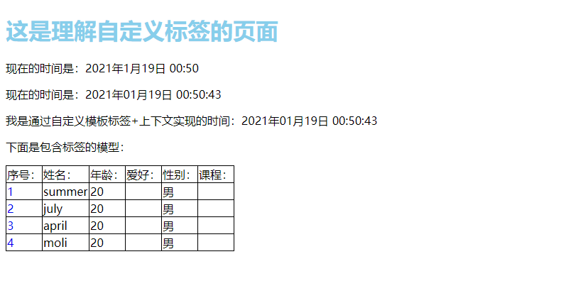

# Django——Model模块

[TOC]

## 一、回顾

到现在，我们已经从如何创建django环境到url的时候再到view（类视图还没）到上次的template，一步一步可以让django显示出我们想要的页面了，接下来我们将使用Model，让django接入mysql使整个系统活起来。接下来我们先回顾以下之前的知识：

### 1.django创建

-   下载环境包
-   创建虚拟环境：`mkvituralenv python 环境名`
-   下载django：`pip install django`
-   在虚拟机或者云服务器上创建出项目存放的包
-   在pycharm中配置远程解释器和自动同步
-   settings的基础配置
    -   templates配置
    -   static配置
    -   时区等相关配置

### 2. app创建

-   现在跟目录下创建apps目录
-   进入apps，然后使用命令创建出app：`python ../manage.py startapp app_name`
-   在settings中注册app：两种方式1）使用sys包，2）在INSTALLED_APPS下加入app名
-   在app中创建urls.py文件
-   在主url中添加app的路径：`include`
-   在views文件中创建一个函数，然后在url中进行相关配置
-   浏览器输入相应url查看是否正确配置
-   相关知识点：
    -   path
    -   re_path
    -   传参

### 3. templates应用

-   在settings中进行配置
-   创建相关的app名文件夹
-   写入一个html文件
-   在app的url中配置路由
-   在app的views中写入相关的函数（return 时使用render渲染页面）
-   在浏览器输入相应url查看是否正确
-   相关知识点：
    -   模板变量：`{{ 变量名 }}`
    -   模板标签：``
        -   ``
        -   ``…``
    -   过滤器：`{{ 变量名|过滤器 }}`
    -   注释：`{# 注释内容 #}`
    -   模型继承：``
    -   模型引用：``
    -   块：````
    -   自定义过滤器：
        -   先创建templatetags包，然后创建py文件
        -   写对应函数
        -   注册
        -   使用
    -   自定义标签：
        -   简单标签（过程于上面一样）
        -   包含标签（在完成函数之后需要使用get_template进行渲染）
    -   自定义使用技巧
        -   在html上面使用：``
        -   在对应地方使用函数名的模板变量即可：`{{ 函数名 }}`

接下来我们进入Django——Model模块

## 二、初始化

我们在使用model时，先重新创建一个app名为：Student。

```python
workon 虚拟环境
cd apps
python ../manage.py startapp Student

# settings.py配置
INSTALLED_APPS = [
    'django.contrib.admin',
    'django.contrib.auth',
    'django.contrib.contenttypes',
    'django.contrib.sessions',
    'django.contrib.messages',
    'django.contrib.staticfiles',
    "tempmd",
    "Student"
]

# urls.py配置
from django.urls import include, path

urlpatterns = [
    path('test1', include('test1.urls')),  # 最初的测试django是否正确
    path('tempmd', include('tempmd.urls')),  # 理解模板的app
    path('', include('Student.urls')),  # 理解Model的app
]
```

## 三、模型的创建和映射

### 1. 模型文件：

`Student/models.py`

### 2. 创建模型

```python
from django.db import models


# Create your models here.
class Student(models.Model):
	name = models.CharField(max_length=20)  # 对应于mysql的varchar
	age = models.SmallIntegerField()  # 对应于mysql的smallint
	sex = models.SmallIntegerField(default=1)  # default是默认值
	qq = models.CharField(max_length=20)  # qq和电话虽然是数字，但是我们保存一般使用字符串去保存
	phone = models.CharField(max_length=20)
	# c_time = models.DateTimeField(verbose_name="创建时间", auto_now_add=True)  # verbose_name用来给该字段添加说明      auto_now_add=True自动填充当前时间)
	c_time = models.DateTimeField("创建时间", auto_now_add=True)  # 当然你想完全可以在第一个参数写入名字而省略写verbose_name这个参数名
```

### 3. 激活模型

注意：要激活模型那么这个app必须注册

-   第一步：确保注册app

-   第二步：进行迁移

    -   指定需要迁移的app

        ```python
        python manage.py makemigrations app_name	# 指定app生成迁移
        ```

    -   全部模型进行迁移

        ```python
        python manage.py makemigrations # 全部模型进行迁移
        ```

```python
(DjangoModel)~/DjangoTest$ python manage.py makemigrations
Migrations for 'Student':
  apps/Student/migrations/0001_initial.py
    - Create model Student
```

可以使用如下命令查看原生的sql命令：

```python
python manage.py sqlmigrate app_name 0001
```

注意：这个0001会随着更新模型的次数而发送改变

```sql
(DjangoModel)~/DjangoTest$ python manage.py sqlmigrate Student 0001
--
-- Create model Student
--
CREATE TABLE `Student_student` (`id` integer AUTO_INCREMENT NOT NULL PRIMARY KEY, `name` varchar(20) NOT NULL, `age` smallint NOT NULL, `sex` smallint NOT NULL, `qq` varchar(20) NOT NULL, `phone` varchar(20) NOT NULL, `c_time` datetime(6) NOT NULL);
```

-   第三步：迁移生效

    -   指定app迁移生效

        ```python
        python manage.py migrate app_name
        ```

    -   指定全部迁移生效

        ```python
        python manage.py migrate
        ```

        ```python
        (DjangoModel)~/DjangoTest$ python manage.py migrate
        Operations to perform:
          Apply all migrations: Student, admin, auth, contenttypes, sessions
        Running migrations:
          Applying Student.0001_initial... OK
        ```

### 4. 修改模型

```python
from django.db import models


# Create your models here.
class Student(models.Model):
	name = models.CharField(max_length=20)  # 对应于mysql的varchar
	age = models.SmallIntegerField(null=True)  # 对应于mysql的smallint
	sex = models.SmallIntegerField(default=1)  # default是默认值
	qq = models.CharField(max_length=20, null=True)  # qq和电话虽然是数字，但是我们保存一般使用字符串去保存
	phone = models.CharField(max_length=20, null=True)
	# c_time = models.DateTimeField(verbose_name="创建时间", auto_now_add=True)  # verbose_name用来给该字段添加说明      auto_now_add=True自动填充当前时间)
	c_time = models.DateTimeField("创建时间", auto_now_add=True)  # 当然你想完全可以在第一个参数写入名字而省略写verbose_name这个参数名
```

接下来还是使用一样的方法，创建迁移、然后迁移生效

```python
python manage.py makemigrations
python manage.py migrate
```

```python
(DjangoModel)~/DjangoTest$ python manage.py makemigrations
Migrations for 'Student':
  apps/Student/migrations/0002_auto_20210118_2342.py
    - Alter field age on student
    - Alter field phone on student
    - Alter field qq on student
(DjangoModel)~/DjangoTest$ python manage.py migrate
Operations to perform:
  Apply all migrations: Student, admin, auth, contenttypes, sessions
Running migrations:
  Applying Student.0002_auto_20210118_2342... OK
```

### 5. 注意

迁移功能是非常强大的,在开发项目时随时更改模型，不需要删除数据库或创建新的表----实时升级数据库而不丢失数据。

### 6. 总结：模型修改三部曲

1. 修改模型（创建模型）
2. 运行`python manage.py makemigrations`创建迁移
3. 运行`python manage.py migrate`迁移生效

## 四、数据的增删改查

在进行操作之前，我们可以查看mysql中是否已经生成

### 1. 查看mysql

```sql
mysql> use DjangoModel;
Reading table information for completion of table and column names
You can turn off this feature to get a quicker startup with -A

Database changed
mysql> show tables;
+----------------------------+
| Tables_in_DjangoModel      |
+----------------------------+
| Student_student            |
| auth_group                 |
| auth_group_permissions     |
| auth_permission            |
| auth_user                  |
| auth_user_groups           |
| auth_user_user_permissions |
| django_admin_log           |
| django_content_type        |
| django_migrations          |
| django_session             |
+----------------------------+
11 rows in set (0.00 sec)
```

上面的`Student_student`表就是我们利用Model创建的一个数据表。

```sql
mysql> select * from Student_student;
Empty set (0.00 sec)

mysql> desc Student_student;
+--------+-------------+------+-----+---------+----------------+
| Field  | Type        | Null | Key | Default | Extra          |
+--------+-------------+------+-----+---------+----------------+
| id     | int         | NO   | PRI | NULL    | auto_increment |
| name   | varchar(20) | NO   |     | NULL    |                |
| age    | smallint    | YES  |     | NULL    |                |
| sex    | smallint    | NO   |     | NULL    |                |
| qq     | varchar(20) | YES  |     | NULL    |                |
| phone  | varchar(20) | YES  |     | NULL    |                |
| c_time | datetime(6) | NO   |     | NULL    |                |
+--------+-------------+------+-----+---------+----------------+
7 rows in set (0.00 sec)
```

### 2. 进入交互页面

```python
# 安装ipython
(DjangoModel)~/DjangoTest$ pip install ipython
# 开始交互
(DjangoModel)~/DjangoTest$ python manage.py shell
Python 3.8.5 (default, Jul 28 2020, 12:59:40) 
Type 'copyright', 'credits' or 'license' for more information
IPython 7.19.0 -- An enhanced Interactive Python. Type '?' for help.

In [1]: from teacher.models import Student  # 导入模型
```

### 3. 增

#### 3-1 第一种：直接创建实例

```python
In [2]: s = Student(name="summer",age=20,qq="12345678")

In [3]: s.save()
```

注意，应为这里自动打开了事务，因此在进行增删改操作时必须要save（相当于commint）不然在数据库中这记录是找不到的。

```sql
mysql> select * from Student_student;
+----+--------+------+-----+----------+-------+----------------------------+
| id | name   | age  | sex | qq       | phone | c_time                     |
+----+--------+------+-----+----------+-------+----------------------------+
|  1 | summer |   20 |   1 | 12345678 | NULL  | 2021-01-18 15:49:24.419077 |
+----+--------+------+-----+----------+-------+----------------------------+
1 row in set (0.00 sec)
```

#### 3-2 第二种：创建空实例，再属性赋值

```python
In [4]: s1 = Student()

In [5]: s1.name = "july"

In [6]: s1.age = 20

In [7]: s1.save()
```

注意：还是不变，需要保存

```sql
mysql> select * from Student_student;
+----+--------+------+-----+----------+-------+----------------------------+
| id | name   | age  | sex | qq       | phone | c_time                     |
+----+--------+------+-----+----------+-------+----------------------------+
|  1 | summer |   20 |   1 | 12345678 | NULL  | 2021-01-18 15:49:24.419077 |
|  2 | july   |   20 |   1 | NULL     | NULL  | 2021-01-18 15:53:40.947205 |
+----+--------+------+-----+----------+-------+----------------------------+
2 rows in set (0.00 sec)
```

#### 3-3 第三种：create直接写入数据库

```python
In [8]: Student.objects.create(name="april",age=20)
Out[8]: <Student: Student object (3)>
```

注意：这个就不需要保存了，他自己直接保存并且返回一个值

```sql
mysql> select * from Student_student;
+----+--------+------+-----+----------+-------+----------------------------+
| id | name   | age  | sex | qq       | phone | c_time                     |
+----+--------+------+-----+----------+-------+----------------------------+
|  1 | summer |   20 |   1 | 12345678 | NULL  | 2021-01-18 15:49:24.419077 |
|  2 | july   |   20 |   1 | NULL     | NULL  | 2021-01-18 15:53:40.947205 |
|  3 | april  |   20 |   1 | NULL     | NULL  | 2021-01-18 15:56:36.554288 |
+----+--------+------+-----+----------+-------+----------------------------+
3 rows in set (0.00 sec)
```

#### 3-4 第四种：get_or_create，先查，没有才创建

```python
In [10]: s4 = Student.objects.get_or_create(name="summer")

In [11]: s4
Out[11]: (<Student: Student object (1)>, False)
```

这里面返回了两个参数，第一个是实例对象而第二个如果是False则说明这个方法是查询操作。

```sql
mysql> select * from Student_student;
+----+--------+------+-----+----------+-------+----------------------------+
| id | name   | age  | sex | qq       | phone | c_time                     |
+----+--------+------+-----+----------+-------+----------------------------+
|  1 | summer |   20 |   1 | 12345678 | NULL  | 2021-01-18 15:49:24.419077 |
|  2 | july   |   20 |   1 | NULL     | NULL  | 2021-01-18 15:53:40.947205 |
|  3 | april  |   20 |   1 | NULL     | NULL  | 2021-01-18 15:56:36.554288 |
+----+--------+------+-----+
```

使用添加操作

```python
In [12]: s4 = Student.objects.get_or_create(name="moli", age=19, sex=0)

```

注意：同样不需要使用save

```sql
mysql> select * from Student_student;
+----+--------+------+-----+----------+-------+----------------------------+
| id | name   | age  | sex | qq       | phone | c_time                     |
+----+--------+------+-----+----------+-------+----------------------------+
|  1 | summer |   20 |   1 | 12345678 | NULL  | 2021-01-18 15:49:24.419077 |
|  2 | july   |   20 |   1 | NULL     | NULL  | 2021-01-18 15:53:40.947205 |
|  3 | april  |   20 |   1 | NULL     | NULL  | 2021-01-18 15:56:36.554288 |
|  4 | moli   |   19 |   0 | NULL     | NULL  | 2021-01-18 16:00:57.783542 |
+----+--------+------+-----+----------+-------+----------------------------+
4 rows in set (0.00 sec)
```

### 4. 查

为了方便我们查看，我们可以在模型上添加一个魔术方法`__str__`，当打印的时候来告诉我们这个实例的name属性是什么：

```python
from django.db import models


# Create your models here.
class Student(models.Model):
	name = models.CharField(max_length=20)  # 对应于mysql的varchar
	age = models.SmallIntegerField(null=True)  # 对应于mysql的smallint
	sex = models.SmallIntegerField(default=1)  # default是默认值
	qq = models.CharField(max_length=20, null=True)  # qq和电话虽然是数字，但是我们保存一般使用字符串去保存
	phone = models.CharField(max_length=20, null=True)
	# c_time = models.DateTimeField(verbose_name="创建时间", auto_now_add=True)  # verbose_name用来给该字段添加说明      auto_now_add=True自动填充当前时间)
	c_time = models.DateTimeField("创建时间", auto_now_add=True)  # 当然你想完全可以在第一个参数写入名字而省略写verbose_name这个参数名
	
	def __str__(self):
		return "这个学生的名字是：%s，年龄为：%d" %(self.name, self.age)
```

#### 4-1 不迁移的情况下

##### 1. 查所有

```python
In [14]: res = Student.objects.all()

In [15]: res
Out[15]: <QuerySet [<Student: Student object (1)>, <Student: Student object (2)>, <Student: Student object (3)>, <Student: Student object (4)>]>
    
# 更具这个QuerySet，我们可以使用query来查询这个返回值的原生sql语句

In [16]: print(res.query)
SELECT `Student_student`.`id`, `Student_student`.`name`, `Student_student`.`age`, `Student_student`.`sex`, `Student_student`.`qq`, `Student_student`.`phone`, `Student_student`.`c_time` FROM `Student_student`
```

##### 2. 查单条

```python
In [17]: Student.objects.get(pk=1)
Out[17]: <Student: Student object (1)>
```

注意：主键不一定会命名为id，为了避免错误，使用pk（primarykey），它会自动的去找表的主键，而不去管表的字段名

```python
In [18]: Student.objects.get(sex=1)
---------------------------------------------------------------------------
MultipleObjectsReturned                   Traceback (most recent call last)
<ipython-input-18-355f369a883e> in <module>
----> 1 Student.objects.get(sex=1)
...
MultipleObjectsReturned: get() returned more than one Student -- it returned 3!

```

注意：使用get时，所返回的值必须是一个确定的，如果有多个就会发生报错

```python
In [19]: Student.objects.get(sex=3)
---------------------------------------------------------------------------
DoesNotExist                              Traceback (most recent call last)
<ipython-input-19-bab2f2ba1448> in <module>
----> 1 Student.objects.get(sex=3)
...
DoesNotExist: Student matching query does not exist.
```

注意：使用get时，同时页不能让其返回值为空。

##### 3. 带条件查询

```python
In [20]: Student.objects.filter(age=20)
Out[20]: <QuerySet [<Student: Student object (1)>, <Student: Student object (2)>, <Student: Student object (3)>]>

In [21]: Student.objects.filter(age=19)
Out[21]: <QuerySet [<Student: Student object (4)>]>

In [22]: Student.objects.filter(age=18
    ...: )
Out[22]: <QuerySet []>

# 查看原生sql语句
In [23]: res = Student.objects.filter(age=20)

In [24]: print(res.query)
SELECT `Student_student`.`id`, `Student_student`.`name`, `Student_student`.`age`, `Student_student`.`sex`, `Student_student`.`qq`, `Student_student`.`phone`, `Student_student`.`c_time` FROM `Student_student` WHERE `Student_student`.`age` = 20
```

#### 4-2 模型迁移的情况下

在迁移完成之后，你需要退出ipython然后重新进过，因为现在的Student类是之前的并不会在内部发送改变

```python
In [1]: from Student.models import Student

In [2]: Student.objects.filter(age=20)
Out[2]: <QuerySet [<Student: 这个学生的名字是：summer，年龄为：20>, <Student: 这个学生的名字是：july，年龄为：20>, <St>]>

In [3]: Student.objects.filter(age=19)
Out[3]: <QuerySet [<Student: 这个学生的名字是：moli，年龄为：19>]>

In [4]: Student.objects.filter(age=18)
Out[4]: <QuerySet []>

In [5]: Student.objects.get(age=19)
Out[5]: <Student: 这个学生的名字是：moli，年龄为：19>
```

我们发现，随着模型迁移的完成，原来的打印是一个类对象地址而现在已经变成了我们在魔法属性内写的参数了。

### 5. 改

#### 5-1 改单条（get）

```python
In [7]: s = Student.objects.get(pk=2)

In [8]: s
Out[8]: <Student: 这个学生的名字是：july，年龄为：20>

In [9]: s.sex = 0

In [10]: s.save()

In [11]: s
Out[11]: <Student: 这个学生的名字是：july，年龄为：20>
```

注意：修改别忘了保存！！！

```sql
mysql> select * from Student_student;
+----+--------+------+-----+----------+-------+----------------------------+
| id | name   | age  | sex | qq       | phone | c_time                     |
+----+--------+------+-----+----------+-------+----------------------------+
|  1 | summer |   20 |   1 | 12345678 | NULL  | 2021-01-18 15:49:24.419077 |
|  2 | july   |   20 |   1 | NULL     | NULL  | 2021-01-18 15:53:40.947205 |
|  3 | april  |   20 |   1 | NULL     | NULL  | 2021-01-18 15:56:36.554288 |
|  4 | moli   |   19 |   0 | NULL     | NULL  | 2021-01-18 16:00:57.783542 |
+----+--------+------+-----+----------+-------+----------------------------+
4 rows in set (0.00 sec)

# 修改之后的操作
mysql> select * from Student_student;
+----+--------+------+-----+----------+-------+----------------------------+
| id | name   | age  | sex | qq       | phone | c_time                     |
+----+--------+------+-----+----------+-------+----------------------------+
|  1 | summer |   20 |   1 | 12345678 | NULL  | 2021-01-18 15:49:24.419077 |
|  2 | july   |   20 |   0 | NULL     | NULL  | 2021-01-18 15:53:40.947205 |
|  3 | april  |   20 |   1 | NULL     | NULL  | 2021-01-18 15:56:36.554288 |
|  4 | moli   |   19 |   0 | NULL     | NULL  | 2021-01-18 16:00:57.783542 |
+----+--------+------+-----+----------+-------+----------------------------+
4 rows in set (0.00 sec)

```

#### 5-2 改多条（filter）

```python
In [12]: Student.objects.filter(age=20).update(phone="123456789")
Out[12]: 3
```

注意：返回值是修改数据的条数

```sql
mysql> select * from Student_student;
+----+--------+------+-----+----------+-----------+----------------------------+
| id | name   | age  | sex | qq       | phone     | c_time                     |
+----+--------+------+-----+----------+-----------+----------------------------+
|  1 | summer |   20 |   1 | 12345678 | 123456789 | 2021-01-18 15:49:24.419077 |
|  2 | july   |   20 |   0 | NULL     | 123456789 | 2021-01-18 15:53:40.947205 |
|  3 | april  |   20 |   1 | NULL     | 123456789 | 2021-01-18 15:56:36.554288 |
|  4 | moli   |   19 |   0 | NULL     | NULL      | 2021-01-18 16:00:57.783542 |
+----+--------+------+-----+----------+-----------+----------------------------+
4 rows in set (0.00 sec)
```

### 6. 删

#### 6-1 删除一条

```python
In [1]: from Student.models import Student

In [2]: s = Student.objects.get(pk=4)

In [3]: s
Out[3]: <Student: 这个学生的名字是：moli，年龄为：19>

In [4]: s.delete()
Out[4]: (1, {'Student.Student': 1})
```

注意：这里也是不需要保存的

我们再来看一下数据改变了吗

```sql
mysql> select * from Student_student;
+----+--------+------+-----+----------+-----------+----------------------------+
| id | name   | age  | sex | qq       | phone     | c_time                     |
+----+--------+------+-----+----------+-----------+----------------------------+
|  1 | summer |   20 |   1 | 12345678 | 123456789 | 2021-01-18 15:49:24.419077 |
|  2 | july   |   20 |   0 | NULL     | 123456789 | 2021-01-18 15:53:40.947205 |
|  3 | april  |   20 |   1 | NULL     | 123456789 | 2021-01-18 15:56:36.554288 |
+----+--------+------+-----+----------+-----------+----------------------------+
3 rows in set (000 sec)
```

#### 6-2 删除多条

```python
In [5]: s = Student.objects.filter(age=20)

In [6]: s
Out[6]: <QuerySet [<Student: 这个学生的名字是：summer，年龄为：20>, <Student: 这个学生的名字是：july，年龄为：20>, <St>]>

In [7]: s.delete()
Out[7]: (3, {'Student.Student': 3})

In [8]: s = Student.objects.all().delete()

In [9]: s
Out[9]: (0, {})
```

我们可以查看一下数据库的变化

```sql
mysql> select * from Student_student;
Empty set (0.00 sec)
```

## 五、小案例

我们利用之前的student修改现在的模型，然后让其在页面展示。

此时我们需要回到tempmd这个app中，在里面创建模型

### 1. 初始化

*tempmd/models.py*

```python
from django.db import models


# Create your models here.
class Student(models.Model):
	name = models.CharField(max_length=20)
	age = models.SmallIntegerField(null=True)
	height = models.SmallIntegerField(null=True)
	sex = models.SmallIntegerField(default=1)
	qq = models.CharField(max_length=20, null=True)
	phone = models.CharField(max_length=20, null=True)
	c_time = models.DateTimeField("创建时间", auto_now_add=True)
	
	def __str__(self):
		return self.name
```

接下来就是数据迁移

```python
python manage.py makemigrations
python manage.py migrate
```

查看数据库是是否创建了对应的数据表

```sql
mysql> show tables;
+----------------------------+
| Tables_in_DjangoModel      |
+----------------------------+
| Student_student            |
| auth_group                 |
| auth_group_permissions     |
| auth_permission            |
| auth_user                  |
| auth_user_groups           |
| auth_user_user_permissions |
| django_admin_log           |
| django_content_type        |
| django_migrations          |
| django_session             |
| tempmd_student             |
+----------------------------+
12 rows in set (0.00 sec)
```

### 2. 添加对象

```python
In [1]: from tempmd.models import Student

In [2]: Student.objects.create(name="summer",age=20, height=170)
Out[2]: <Student: summer>

In [3]: Student.objects.create(name="july",age=20, height=160)
Out[3]: <Student: july>

In [4]: Student.objects.create(name="april",age=20, height=162)
Out[4]: <Student: april>

In [5]: Student.objects.create(name="moli",age=20, height=165)
Out[5]: <Student: moli>
```

此时查看一下数据库

```sql
mysql> select * from tempmd_student;
+----+--------+------+--------+-----+------+-------+----------------------------+
| id | name   | age  | height | sex | qq   | phone | c_time                     |
+----+--------+------+--------+-----+------+-------+----------------------------+
|  1 | summer |   20 |    170 |   1 | NULL | NULL  | 2021-01-18 16:44:55.193210 |
|  2 | july   |   20 |    160 |   1 | NULL | NULL  | 2021-01-18 16:45:06.055330 |
|  3 | april  |   20 |    162 |   1 | NULL | NULL  | 2021-01-18 16:45:13.597891 |
|  4 | moli   |   20 |    165 |   1 | NULL | NULL  | 2021-01-18 16:45:48.953462 |
+----+--------+------+--------+-----+------+-------+----------------------------+
4 rows in set (0.00 sec)
```

### 3.在后台进行数据操作

*tempmd/views.py*

```python
from .model import Student

# 使用model去修改stu
def test7(request):
	now = datetime.now()  # 获取当前时间
	# stu = [
	# 	{"name": "Summer", "age": 20, "hoppy": "football", "sex": 1, "course": ["python", "web", "java", "c++"]},
	# 	{"name": "July", "age": 20, "hoppy": "photos", "sex": 0, "course": ["python", "web", "java", "c++"]},
	# 	{"name": "April", "age": 20, "hoppy": "eat", "sex": 0, "course": ["python", "web", "java", "c++"]},
	# 	{"name": "Moli", "age": 20, "hoppy": "play", "sex": 0, "course": ["python", "web", "java", "c++"]}
	# ]
	stu = Student.objects.all()
	
	return render(request, 'tempmd/diytag.html', context={
		"now": now,
		"format_str": "%Y年%m月%d日 %H:%M:%S",
		"students": stu,
	})
```

*路由*:127.0.0.1:8000

