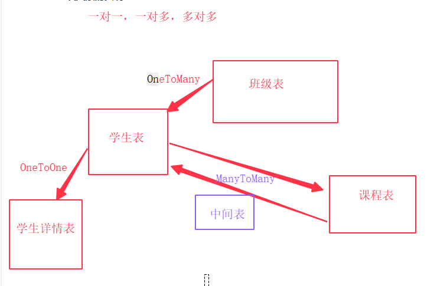

# Django——Model模块

[TOC]

本文接上文

## 九、关系表的创建



|  关系  |      数据库层面       |    模型层面     |
| :----: | :-------------------: | :-------------: |
| 一对多 |         外键          | ForeignKeyField |
| 一对一 |      外键+唯一键      |  OneToOneField  |
| 多对多 | 关联表：外键+联合唯一 | ManyToManyField |

我们根据上面的图，在models.py内创建出这几个表

*Student/models.py*

```python
from django.db import models


# Create your models here.
# 模型的简单理解
# class Student(models.Model):
# 	name = models.CharField(max_length=20)  # 对应于mysql的varchar
# 	age = models.SmallIntegerField(null=True)  # 对应于mysql的smallint
# 	sex = models.SmallIntegerField(default=1)  # default是默认值
# 	qq = models.CharField(max_length=20, null=True, unique=True)  # qq和电话虽然是数字，但是我们保存一般使用字符串去保存
# 	phone = models.CharField(max_length=20, null=True, unique=True)
# 	# c_time = models.DateTimeField(verbose_name="创建时间", auto_now_add=True)  # verbose_name用来给该字段添加说明      auto_now_add=True自动填充当前时间)
# 	c_time = models.DateTimeField("创建时间", auto_now_add=True)  # 当然你想完全可以在第一个参数写入名字而省略写verbose_name这个参数名
# 	x_time = models.DateTimeField("修改时间", auto_now=True)  # 修改之后自动保存
#
# 	def __str__(self):
# 		return "这个学生的名字是：%s，年龄为：%d" % (self.name, self.age)


# 表关系的实现
class Student(models.Model):
	"""学生表"""
	name = models.CharField("学生姓名", max_length=20)
	age = models.SmallIntegerField("年龄", null=True)
	sex = models.SmallIntegerField("性别", default=1)
	qq = models.CharField("QQ号", max_length=20, unique=True, null=True)
	phone = models.CharField("手机号", max_length=20, unique=True, null=True)
	c_time = models.DateTimeField("创建时间", auto_now_add=True)
	# ***与Detail的OneToOneField同样可以写在这里***
	# detail = models.OneToOneField('StudentDetail', on_delete=models.SET_NULL, null=True)  # 当学生详情被删除的时候，这个地方变成null
	# ***与Grade的一对多关系只可以写在这里***
	grade = models.ForeignKey('Grade', on_delete=models.SET_NULL, null=True)  # 如果班级删除，此时这里的值变成null。

	def __str__(self):
		return "{}-{}".format(self.name, self.age)


class StudentDetail(models.Model):
	"""学生详情表"""
	college = models.CharField("学院", max_length=20)
	student = models.OneToOneField('Student', on_delete=models.CASCADE)  # 随着学生信息的删除，此详情也更着删除


class Grade(models.Model):
	"""班级表"""
	name = models.CharField("班级名称", max_length=20)
	num = models.CharField("班期", max_length=20)
	

class Course(models.Model):
	"""课程表"""
	name = models.CharField("课程名", max_length=20)
	students = models.ManyToManyField("Student")  # 多对多可以不创建中间表，他自动会生成一个中间表
```

**注意**：OneToOne可以在两个任意类上写，Foreign必须写在more的地方，而MoreToMore同样可以写在任意一个类上，但是注意，如果不写中间表，django会自动创建一个中间表。而on_delete中的CASCADE表示级联删除

**开始迁移**

```python
python manage.py makemigrations
python manage.py migrate
```

**查看数据库**：

```sql
mysql> show tables;
+----------------------------+
| Tables_in_DjangoModel      |
+----------------------------+
| Student_course             |
| Student_course_stuednts    |  这个就是自动创建的中间表
| Student_grade              |
| Student_student            |
| Student_studentdetail      |

mysql> desc Student_course_stuednts;
+------------+------+------+-----+---------+----------------+
| Field      | Type | Null | Key | Default | Extra          |
+------------+------+------+-----+---------+----------------+
| id         | int  | NO   | PRI | NULL    | auto_increment |
| course_id  | int  | NO   | MUL | NULL    |                |
| student_id | int  | NO   | MUL | NULL    |                |
+------------+------+------+-----+---------+----------------+
3 rows in set (0.00 sec)
```

但是我们还是可以自己来完成一个中间表，此时我们需要添加利用事务来回滚到上个版本。

```python
(DjangoModel)~/DjangoTest$ python manage.py migrate Student 0004
Operations to perform:
  Target specific migration: 0004_auto_20210119_1211, from Student
Running migrations:
  Rendering model states... DONE
  Unapplying Student.0005_auto_20210119_1613... OK
```

**注意**：此时我的现在版本为0005，因此上个版本为0004，我回去就是到这个，同样前面的也是可以回滚回去的。同时别忘了删除最后那次的迁移数据（0005）

**开始创建中间表**：

```python
from django.db import models


# Create your models here.
# 模型的简单理解
# class Student(models.Model):
# 	name = models.CharField(max_length=20)  # 对应于mysql的varchar
# 	age = models.SmallIntegerField(null=True)  # 对应于mysql的smallint
# 	sex = models.SmallIntegerField(default=1)  # default是默认值
# 	qq = models.CharField(max_length=20, null=True, unique=True)  # qq和电话虽然是数字，但是我们保存一般使用字符串去保存
# 	phone = models.CharField(max_length=20, null=True, unique=True)
# 	# c_time = models.DateTimeField(verbose_name="创建时间", auto_now_add=True)  # verbose_name用来给该字段添加说明      auto_now_add=True自动填充当前时间)
# 	c_time = models.DateTimeField("创建时间", auto_now_add=True)  # 当然你想完全可以在第一个参数写入名字而省略写verbose_name这个参数名
# 	x_time = models.DateTimeField("修改时间", auto_now=True)  # 修改之后自动保存
#
# 	def __str__(self):
# 		return "这个学生的名字是：%s，年龄为：%d" % (self.name, self.age)


# 表关系的实现
class Student(models.Model):
	"""学生表"""
	name = models.CharField("学生姓名", max_length=20)
	age = models.SmallIntegerField("年龄", null=True)
	sex = models.SmallIntegerField("性别", default=1)
	qq = models.CharField("QQ号", max_length=20, unique=True, null=True)
	phone = models.CharField("手机号", max_length=20, unique=True, null=True)
	c_time = models.DateTimeField("创建时间", auto_now_add=True)
	# ***与Detail的OneToOneField同样可以写在这里***
	# detail = models.OneToOneField('StudentDetail', on_delete=models.SET_NULL, null=True)  # 当学生详情被删除的时候，这个地方变成null
	# ***与Grade的一对多关系只可以写在这里***
	grade = models.ForeignKey('Grade', on_delete=models.SET_NULL, null=True)  # 如果班级删除，此时这里的值变成null。

	def __str__(self):
		return "{}-{}".format(self.name, self.age)


class StudentDetail(models.Model):
	"""学生详情表"""
	college = models.CharField("学院", max_length=20)
	student = models.OneToOneField('Student', on_delete=models.CASCADE)  # 随着学生信息的删除，此详情也更着删除


class Grade(models.Model):
	"""班级表"""
	name = models.CharField("班级名称", max_length=20)
	num = models.CharField("班期", max_length=20)
	

class Course(models.Model):
	"""课程表"""
	name = models.CharField("课程名", max_length=20)
	students = models.ManyToManyField("Student", through="Enroll")  # 多对多可以不创建中间表，他自动会生成一个中间表。如果自己写了中间表，此时就需要添加一个through


class Enroll(models.Model):
	"""中间表"""
	student = models.ForeignKey("Student", on_delete=models.CASCADE)
	course = models.ForeignKey("Course", on_delete=models.CASCADE)
	pay = models.FloatField("缴费金额", default=0)
	c_time = models.DateTimeField("缴费时间", auto_now_add=True)
```

同样是数据迁移和查看。

```sql
mysql> show tables;
+----------------------------+
| Tables_in_DjangoModel      |
+----------------------------+
| Student_course             |
| Student_enroll             |
| Student_grade              |
| Student_student            |
| Student_studentdetail      |
```

## 十、关系表数据操作

数据操作总结就四个：**增删改查**

### 1.增

我们回顾以下zeng的四个步骤

-   实例化（别忘了save）
-   空实例+传参（别忘了save）
-   create
-   get_or_create

```python
In [6]: from Student.models import Student as S,StudentDetail as SD,Grade as G,Course as C,Enroll as E

In [7]: g1 = G.objects.create(name="Django", num="01期")

In [8]: g2 = G(name="Python", num="01期")

In [9]: g3 = G()

In [10]: g3.name="爬虫"

In [11]: g3.num="01期"

In [12]: g2.save()

In [13]: g3.save()

In [14]: g4 = G.objects.get_or_create(name="web", num="01期")
    
In [15]: g4 = g4[0]

```

注意：get_or_create返回的是一个元组，第一个是实例对象而第二个是一个bool类型的数据，True为添加，false为查找，所以要把g4进行提取

## 十一、 表关联对象访问

### 1. 正、反向理解

>   正向：一个模型有外键字段，通过这个模型对外键进行操作就叫**正向**
>
>   反向：一个模型如果被另一个模型外键关联，通过这个模型对关联它的模型进行操作叫做**反向**

### 2.OneToMany

#### 2-1 增

```python
# 通过属性赋值
In [20]: s1 = S(name="summer", age=20, qq="123", phone="456", grade=g1)

In [21]: s1.save()
    
In [22]: s2 = S(name="July", age=18, qq="1234", phone="4567", grade=g2)

In [23]: s2.save()
# 主键方式
In [24]: s3 = S(name="April", age=18, qq="1111", phone="1111")

In [25]: s3.grade_id = g3.id

In [26]: s3.save()
```

#### 2-2 查

```python
In [28]: s3.grade.name
Out[28]: '爬虫'

In [29]: s3.grade
Out[29]: <Grade: Grade object (3)>

In [30]: S.objects.filter(grade__name="Django")
Out[30]: <QuerySet [<Student: summer-20>]>
```

#### 2-3 删

```python
In [31]: s3.grade=None

In [32]: s3.save()

In [33]: s3.grade

```

#### 2-4 反向增

反向：如果一个模型(eg：Student)有一个ForeignKey（grade）,那么这个外键模型的实例（eg:g1)将可以返回一个Student模型的所有实例的管理器（student_set)(student是模型名，小写)

```python
In [38]: new_s = g2.student_set.create(name="Mori", age=19,qq="234", phone="789")

# 一次添加多条
In [39]: s1,s2,s3 = S.objects.filter(pk__lte=15)

In [40]: s1
Out[40]: <Student: summer-20>

In [41]: s2
Out[41]: <Student: July-18>

In [42]: s3
Out[42]: <Student: April-18>

In [43]: g1.student_set.add(s1,s2,s3)

```

注意：此时应为是create，所以并不需要save

查看数据表中的数据：

```sql
# 之前的
mysql> select * from Student_student;
+----+--------+------+-----+------+-------+----------------------------+----------+
| id | name   | age  | sex | qq   | phone | c_time                     | grade_id |
+----+--------+------+-----+------+-------+----------------------------+----------+
| 13 | summer |   20 |   1 | 123  | 456   | 2021-01-19 10:03:59.436618 |        1 |
| 14 | July   |   18 |   1 | 1234 | 4567  | 2021-01-19 10:08:28.457814 |        2 |
| 15 | April  |   18 |   1 | 1111 | 1111  | 2021-01-19 10:08:31.743250 |     NULL |
| 16 | Mori   |   19 |   1 | 234  | 789   | 2021-01-19 10:18:15.934080 |        2 |
+----+--------+------+-----+------+-------+----------------------------+----------+
4 rows in set (0.00 sec)

# 现在的
mysql> select * from Student_student;
+----+--------+------+-----+------+-------+----------------------------+----------+
| id | name   | age  | sex | qq   | phone | c_time                     | grade_id |
+----+--------+------+-----+------+-------+----------------------------+----------+
| 13 | summer |   20 |   1 | 123  | 456   | 2021-01-19 10:03:59.436618 |        1 |
| 14 | July   |   18 |   1 | 1234 | 4567  | 2021-01-19 10:08:28.457814 |        1 |
| 15 | April  |   18 |   1 | 1111 | 1111  | 2021-01-19 10:08:31.743250 |        1 |
| 16 | Mori   |   19 |   1 | 234  | 789   | 2021-01-19 10:18:15.934080 |        2 |
+----+--------+------+-----+------+-------+----------------------------+----------+
4 rows in set (0.00 sec)
```

#### 2-5 反向改

```python
In [52]: g2.student_set.set([s2,s3])

In [53]: s2.grade.name
Out[53]: 'Python'

In [54]: s3.grade.name
Out[54]: 'Python'
```

#### 2-6 反向删

```python
In [55]: g2.student_set.remove(s2,s3)
    
In [56]: g2.student_set.clear()
```

#### 2-7 反向查

方法与objects一样使用

```python
In [59]: g1.student_set.all()
Out[59]: <QuerySet [<Student: summer-20>]>

In [60]: g1.student_set.filter(age=20)
Out[60]: <QuerySet [<Student: summer-20>]>
```

### 3.ManyToMany

我们的代码将ManyToMany放在了Course表，因此从Course操作是正向(管理器：students**由我们写的manytomany定义而来**)，另一个就是反向(管理器：course_set)。当然如果记忆不便，可以在字段上添加一个`related_name`来重命名反向管理器

```python
class Course(models.Model):
    ...
    students = models.ManyToManyField('Student', through='Enroll')
 
反向模型管理器：course_set 可以通过related_name来指定属性替代course_set
	students = models.ManyToManyField('Student', through='Enroll', related_name='courses')
```

下面就继续使用原生的反向管理器了。

#### 3-1 增

```python
In [61]: c1 = C.objects.create(name="Python")

In [62]: s1 = S.objects.first()

In [63]: s1
Out[63]: <Student: summer-20>

In [64]: e = E()

In [65]: e.course = c1

In [66]: e.student = s1

In [67]: e.save()
```

我们查看一下数据库：

```sql
mysql> select * from Student_course;
+----+--------+
| id | name   |
+----+--------+
|  1 | Python |
+----+--------+
1 row in set (0.00 sec)

mysql> select * from Student_enroll;
+----+-----+----------------------------+-----------+------------+
| id | pay | c_time                     | course_id | student_id |
+----+-----+----------------------------+-----------+------------+
|  1 |   0 | 2021-01-19 10:43:35.443111 |         1 |         13 |
+----+-----+----------------------------+-----------+------------+
1 row in set (0.00 sec)
```

#### 3-2 查

```python
In [78]: c1.students.all()  # 正向
Out[78]: <QuerySet [<Student: summer-20>]>

In [79]: s1.course_set.all()  # 反向
Out[79]: <QuerySet [<Course: Course object (1)>]>
```

### 4.OneToOne

一对一字段通过字段所在模型判断正、反向（与上面类似）

#### 4-1 增

```python
# 正向
In [80]: d1 = SD(college="家里蹲")

In [81]: d1.student=s1

In [82]: d1.save()

# 反向：前面的反向都是通过管理器，这里反向类似正向
In [84]: s = S(name="xiaoming", age=23, qq="22222", phone="22222", grade=g4)

In [85]: s.studentdetail = d1

In [86]: s.save()

```

#### 4-2 查

```python
# 正向与上面类似
In [83]: SD.objects.values('college','student__name','student__qq')
Out[83]: <QuerySet [{'college': '家里蹲', 'student__name': 'summer', 'student__qq': '123'}]>
    
# 反向
In [88]: S.objects.values('name','qq','studentdetail__college')
Out[88]: <QuerySet [{'name': 'summer', 'qq': '123', 'studentdetail__college': '家里蹲'}, {'name': 'July', 'qq': '1234'studentdetail__college': None}, {'name': 'April', 'qq': '1111', 'studentdetail__college': None}, {'name': 'Mori', 'qq': '234', 'studentdetail__college': None}, {'name': 'xiaoming', 'qq': '22222', 'studentdetail__college': None}]>
```

## 十二、多表查询

Django 提供一种强大而又直观的方式来“处理”查询中的关联关系，它在后台自动帮你处理JOIN。 若要跨越关联关系，只需使用关联的模型字段的名称，并使用双下划线分隔，直至你想要的字段。并且它还可以反向工作。若要引用一个“反向”的关系，只需要使用该模型的小写的名称。

### 1.初始化

```python
In [98]: s1,s2,s3,s4,s5 = S.objects.all()

In [99]: g1,g2,g3,g4 = G.objects.all()

In [100]: c1 = C.objects.first()

In [101]: s2.grade = g2

In [102]: s2.save()

In [103]: s3.grade = g3

In [104]: s3.save()

In [105]: s4.grade = g1

In [106]: s4.save()

In [115]: e = E()

In [116]: e.course = c1

In [118]: e.student = s2

In [119]: e.save()

In [120]: c1.students.all()
Out[120]: <QuerySet [<Student: summer-20>, <Student: July-18>]>
....(将前4个学生加入c1班)
最后一个加入英语班
In [145]: e = E.objects.last()

In [146]: e
Out[146]: <Enroll: Enroll object (5)>

In [147]: c2 = C.objects.create(name="English")

In [148]: e.course = c2

In [149]: e.pay = 4000

In [150]: e.save()

```

对应的数据库

```sql
mysql> select * from Student_student;
+----+----------+------+-----+-------+-------+----------------------------+----------+
| id | name     | age  | sex | qq    | phone | c_time                     | grade_id |
+----+----------+------+-----+-------+-------+----------------------------+----------+
| 13 | summer   |   20 |   1 | 123   | 456   | 2021-01-19 10:03:59.436618 |        1 |
| 14 | July     |   18 |   1 | 1234  | 4567  | 2021-01-19 10:08:28.457814 |        2 |
| 15 | April    |   18 |   1 | 1111  | 1111  | 2021-01-19 10:08:31.743250 |        3 |
| 16 | Mori     |   19 |   1 | 234   | 789   | 2021-01-19 10:18:15.934080 |        1 |
| 17 | xiaoming |   23 |   1 | 22222 | 22222 | 2021-01-19 10:59:39.675502 |        4 |
+----+----------+------+-----+-------+-------+----------------------------+----------+
5 rows in set (0.01 sec)

mysql> select * from Student_course;
+----+---------+
| id | name    |
+----+---------+
|  1 | Python  |
|  2 | English |
+----+---------+
2 rows in set (0.00 sec)


mysql> select * from Student_enroll;
+----+------+----------------------------+-----------+------------+
| id | pay  | c_time                     | course_id | student_id |
+----+------+----------------------------+-----------+------------+
|  1 |    0 | 2021-01-19 10:43:35.443111 |         1 |         13 |
|  2 |    0 | 2021-01-19 11:10:34.608481 |         1 |         14 |
|  3 |    0 | 2021-01-19 11:12:50.267421 |         1 |         15 |
|  4 |    0 | 2021-01-19 11:13:17.387273 |         1 |         16 |
|  5 | 4000 | 2021-01-19 11:13:30.982406 |         2 |         17 |
+----+------+----------------------------+-----------+------------+
5 rows in set (0.00 sec)
```

### 2. 查询

#### 2-1 查询python班中的所有男生

```python
In [139]: C.objects.filter(students__sex=1)
Out[139]: <QuerySet [<Course: Course object (1)>, <Course: Course object (1)>, <Course: Course object (1)>, <Course: Course object (1)>, <Course: Course object (1)>]>
```

#### 2-2 报名python课程的学院

```python
In [140]: S.objects.filter(course__name="python")
Out[140]: <QuerySet [<Student: summer-20>, <Student: July-18>, <Student: April-18>, <Student: Mori-19>, <Student: xiaoming-23>]>
```

#### 2-3 报名python并且是Django班的学生

```python
In [144]: S.objects.filter(course__name="python", grade__name="Django")
Out[144]: <QuerySet [<Student: summer-20>, <Student: Mori-19>]>
```

#### 2-4 报名费小于3000的学生

```python
In [151]: S.objects.filter(enroll__pay__lt=3000)
Out[151]: <QuerySet [<Student: summer-20>, <Student: July-18>, <Student: April-18>, <Student: Mori-19>]>
```

#### 2-5 学生报名课程的班级

```python
In [152]: G.objects.filter(student__course__name="English")
Out[152]: <QuerySet [<Grade: Grade object (4)>]>

In [153]: G.objects.filter(student__course__name="python")
Out[153]: <QuerySet [<Grade: Grade object (1)>, <Grade: Grade object (2)>, <Grade: Grade object (3)>, <Grade: Grade object (1)>]>

# 去重
In [154]: G.objects.filter(student__course__name="python").distinct()
Out[154]: <QuerySet [<Grade: Grade object (1)>, <Grade: Grade object (2)>, <Grade: Grade object (3)>]>
```


