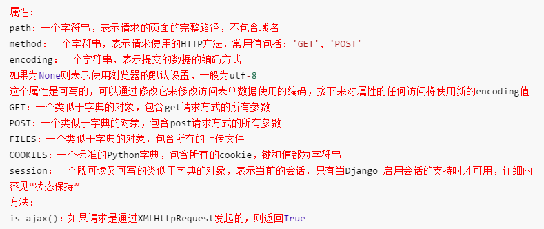
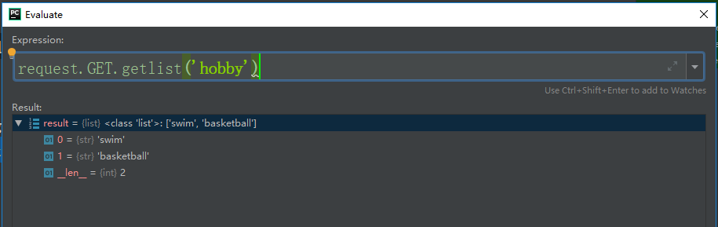
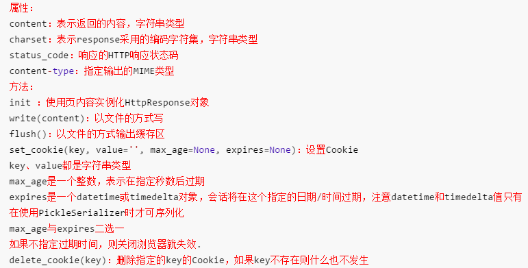

# Django——请求与响应

[TOC]

## 一、请求和响应流程

-   浏览器输入网址
-   经过TCP/IP协议创建连接
-   请求页面
-   通过路径找到对应的视图函数
-   django创建HttpRequest对象（该对象包含了关于请求的源数据）
-   后台处理
-   视图返回一个HttpResponse对象

## 二、HttpRequest对象

服务器接收到http协议的请求后，会根据报文创建HttpRequest对象视图函数的第一个参数是HttpRequest对象在django.http模块中定义了HttpRequest对象的API

### 1.属性



注：`is_agax`在3.1已经移除

### 2. debug查看

要在pycharm中查看对象，可以使用debug模式。



### 3. Form中的get和post

在HTML中,form表单的作用是收集标签中的内容,`<form>...</form>`中间可以由访问者添加类似于文本,选择,或者一些控制模块等等.然后这些内容将会被送到服务端。

一个表单必须指定两样东西：
1. form的method参数用于设置表单的提交方式,默认使用POST.
2. action用于设置表单的提交url,如果不写或者保持空字符串,那么将使用当前的URL.

#### 3-1 get

*Templates/Student/login.html*

```html
<!DOCTYPE html>
<html lang="en">
<head>
    <meta charset="UTF-8">
    <title>登录</title>
</head>
<body>
    <form action="" method="get">
        <p>username: <input type="text" name="username" placeholder="pleacs put username"></p>
        <p>password: <input type="password" name="password"  placeholder="pleacs put password"></p>
        <p><input type="submit" value="login"></p>
    </form>
</body>
</html>
```

*Student/views.py*

```python
from django.shortcuts import render
from django.http import HttpResponse

# Create your views here.


def login(request):
	return render(request, 'Student/login.html')
```

如果提交方式是get，那么：

1.get提交的参数会在url中显示.

2.可以通过request.GET.get的方法来获取提交的参数.

#### 3-2 post

```python
<!DOCTYPE html>
<html lang="en">
<head>
    <meta charset="UTF-8">
    <title>登录</title>
</head>
<body>
    <form action="" method="post">  {# 如果url不写默认原来的url，如果method不写默认post #}
        <p>username: <input type="text" name="username" placeholder="pleacs put username"></p>
        <p>password: <input type="password" name="password"  placeholder="pleacs put password"></p>
        <p><input type="submit" value="login"></p>
    </form>
</body>
</html>
```

注意：此时如果提交，会发生csrf报错

```
INFO basehttp 157 "GET /?username=summer&password=summer HTTP/1.1" 200 417
WARNING log 224 Forbidden (CSRF cookie not set.): /
WARNING basehttp 157 "POST / HTTP/1.1" 403 279
```

这是因为django中存在一个csrf中间件（``django.middleware.csrf.CsrfViewMiddleware`),CSRF 保护机制通过检查每一个 POST 请求中的密文来实现。这保证恶意用户不能“复现”一个表单并用 POST 提交到你的网页，并让一个已登录用户无意中提交该表单。恶意用户必须知道特定于用户的密文（使用 cookie）。使用方法也很简单：

```python
<!DOCTYPE html>
<html lang="en">
<head>
    <meta charset="UTF-8">
    <title>登录</title>
</head>
<body>
    <form action="" method="post">
        
        <p>username: <input type="text" name="username" placeholder="pleacs put username"></p>
        <p>password: <input type="password" name="password"  placeholder="pleacs put password"></p>
        <p><input type="submit" value="login"></p>
    </form>
</body>
</html>
```

而此时，网页中会出现下面一段(并不是固定，每次刷新页面都重新生成)：

```html
<input type="hidden" name="csrfmiddlewaretoken" value="oGY812yb59Wt2b0zwITYPKLohdNwH7jNboVhfZYadhAnZWNzIpYGTJrvDDDdmgLO">
```

django就是更具这个value进行验证。

如果是post提交，那么：

1.post的提交方式不会在url中显示参数

2.可以通过request.POST.get方式来获取提交的数据

### 4. getlist（）

request对象的属性GET、POST都是QueryDict类型的对象与python字典不同，QueryDict类型的对象用来处理同一个键带有多个值的情况：

方法get()：根据键获取值,只能获取键的一个值如果一个键同时拥有多个值，获取最后一值

方法getlist()：根据键获取值将键的值以列表返回可以获取一个键的多个值

### 5. request中的get和post

#### 5-1 GET

-   QueryDict类型的对象
-   包含get请求方式的所有参数
-   与url请求地址中的参数对应，位于?后面
- 参数的格式是键
-   值对，如key1=value1
- 多个参数之间，使用&连接，如key1=value1&key2=value2

#### 5-2 POST

-   QueryDict类型的对象
-   包含post请求方式的所有参数
-   与form表单中的控件对应
- 表单中控件要有name属性，则n
-   ame属性的值为键，value属性的值为值，构成键值对提交
- 对于checkbox控件，name属性一样为一组，当控件被选中后会被提交，存在一键多值的情况.

#### 5-3 升级登录函数

应为我们知道，我们访问一个页面是使用get方式，而提交数据是使用post方式，因此为了方便，我们可以在login函数中将两个方法都实现：

```python
from django.shortcuts import render
from django.http import HttpResponse

# Create your views here.


def login(request):
	if request.method == "POST":
		username = request.POST.get("username")
		password = request.POST.get("password")
		if username == "summer" and password == "summer":
			return HttpResponse("登陆成功")
	return render(request, 'Student/login.html')
```

### 6. 总结

1.  GET:GET如其名，是从服务器获取数据，不会更改服务器的状态和数据，在URL中携带参数发送给服务器。

2.  POST则是将一定量的数据发送给服务器，一般会更改服务器的数据。

3.  POST方法的参数不能在URL当中看到,他是通过body参数传递给服务器的,所以相对GET方法直接能在URL当中看到传递的参数,显得更加安全一些.当然,也不能简单的判定POST方法比GET方法更安全,要使网站保持安全,需要做更多的安全处理.

## 三、HttpResponse对象



### 1. 常用子类

-   render

>   ```
>   def render(request, template_name, context=None, content_type=None, status=None, using=None):
>       """
>       Return a HttpResponse whose content is filled with the result of calling
>       django.template.loader.render_to_string() with the passed arguments.
>       """
>       content = loader.render_to_string(template_name, context, request, using=using)
>       return HttpResponse(content, content_type, status)
>   ```

我们可以看到，render也是返回一个HttpResponse，只是他需要先获取模板，我们在看看`loader.render_to_string`函数

```python
def render_to_string(template_name, context=None, request=None, using=None):
    """
    Load a template and render it with a context. Return a string.

    template_name may be a string or a list of strings.
    """
    if isinstance(template_name, (list, tuple)):
        template = select_template(template_name, using=using)
    else:
        template = get_template(template_name, using=using)
    return template.render(context, request)
```

这就是一个加载模板并且渲染内容的函数，最终使用get_template函数渲染出页面然后返回，

```python
def get_template(template_name, using=None):
    """
    Load and return a template for the given name.
	
    Raise TemplateDoesNotExist if no such template exists.
    """
    chain = []
    engines = _engine_list(using)
    for engine in engines:
        try:
            return engine.get_template(template_name)
        except TemplateDoesNotExist as e:
            chain.append(e)

    raise TemplateDoesNotExist(template_name, chain=chain)
```

因此，从上面的代码可以看出，render就是一个经过HttpResponse加工的类，我们再来看看redirect

-   redirect

>   ```
>   def redirect(to, *args, permanent=False, **kwargs):
>       """
>       Return an HttpResponseRedirect to the appropriate URL for the arguments
>       passed.
>   
>       The arguments could be:
>   
>           * A model: the model's `get_absolute_url()` function will be called.
>   
>           * A view name, possibly with arguments: `urls.reverse()` will be used
>             to reverse-resolve the name.
>   
>           * A URL, which will be used as-is for the redirect location.
>   
>       Issues a temporary redirect by default; pass permanent=True to issue a
>       permanent redirect.
>       """
>       redirect_class = HttpResponsePermanentRedirect if permanent else HttpResponseRedirect
>       return redirect_class(resolve_url(to, *args, **kwargs))
>   ```

可以看出，我们的重定向可以输入三中url类型：一个绝对url(`/test/login`)，一个反向解析路径(``)，或者是一个url代码（`www.baidu.com`）。而通过permanent来设置redirect_class的一个状态码（永久重定向302或者临时重定向301），然后再经过一系列函数完成重定向。

### 2. cookie

在谈cookie之前，我们先了解一下**会话(session)**

>   在计算机术语中，会话是指一个终端用户与交互系统进行通讯的**过程**，比如从输入账户密码进入操作系统到退出操作系统就是一个会话过程。会话较多用于网络上，TCP的**三次握手就创建**了一个会话，TCP**四次挥手关闭**连接就是关闭会话。

这种在多次HTTP连接间维护用户与同一用户发出的不同请求之间关联的情况称为维护一个会话（session）。会话的特征：

-   会话能够把用户与同一用户发出的不同请求之间关联起来。不同用户的会话应当是相互独立的。
-   会话一旦建立就应当一直存在，直到用户空闲时间超过了某一个时间界限，容器才应当释放该会话资源。
-   在会话的存活期间，用户可能给服务器发送了很多请求，该用户的这些请求信息都可以存储在会话中。

因此，再回到cookie，应为http是一个无状态协议，因此它无法确定这次访问的和上次访问的对象是否是同一个人，因此引入了cookie，当浏览器访问服务器时，服务器会先检查请求头里面是否存在cookie，如果没有会在响应头部添加一个cookie，以后的每次访问，浏览器自动会在头部添加这个cookie。以后通过这个cookie就可以让服务器明白这个请求与上次的请求来子同一个（这个cookie是存储在客户端的）。

例：django中，表单提交时就必须使用cookie（csrf认证）。django已经将这个做的非常好了，如果想了解，可以访问官方。

### 3. 小实验：使用cookie记录第几次访问

*login.html*

```html
<!DOCTYPE html>
<html lang="en">
<head>
    <meta charset="UTF-8">
    <title>登录</title>
</head>
<body>
    <h2>第{{ num }}次访问</h2>
    <form action="" method="post">
        
        <p>username: <input type="text" name="username" placeholder="pleacs put username"></p>
        <p>password: <input type="password" name="password"  placeholder="pleacs put password"></p>
        <p><input type="submit" value="login"></p>
    </form>
</body>
</html>
```

*views.py*

```python
def login(request):
	num = request.COOKIES.get("num")  # 获取cookie值
	if num:
		num = int(num) + 1
	else:
		num = 1
	if request.method == "POST":
		username = request.POST.get("username")
		password = request.POST.get("password")
		if username == "summer" and password == "summer":
			return HttpResponse("登陆成功")
		
	response = render(request, 'Student/login.html', context={
		"num":num,
	})
	response.set_cookie("num", num)
	return response
```

当然更多的内容可以查看官网：

>   HttpResponse.set_cookie(*key*, *value=''*, *max_age=None*, *expires=None*, *path='/'*, *domain=None*, *secure=False*, *httponly=False*, *samesite=None*)
>
>   设置一个 cookie。参数与 Python 标准库中的 Morsel cookie 对象相同。
>
>   -   `max_age` 应该是一个秒数，**如果 cookie 只持续到客户的浏览器会话**，则 `None`（默认）。如果没有指定`expires`，则会计算。
>
>   -   `expires` 应是格式为 `"Wdy, DD-Mon-YY HH:MM:SS GMT"` 的字符串，或者是 UTC 的 `datetime.datetime` 对象。如果 `expires` 是一个 `datetime` 对象，将计算 `max_age`。
>
>   -   如果你想设置一个跨域的 cookie，请使用 `domain`。例如，`domain="example.com"` 将设置一个可被 www.example.com、blog.example.com 等域读取的 cookie。否则，一个 cookie 将只能被设置它的域读取。
>
>   -   如果你想让 cookie 只在使用 `https` 方案进行请求时才发送给服务器，请使用 `secure=True`。
>
>   -   如果你想防止客户端的 JavaScript 访问 cookie，请使用 `httponly=True`。HttpOnly是包含在 Set-Cookie HTTP 响应头中的一个标志。它是 [**RFC 6265**](https://tools.ietf.org/html/rfc6265.html#section-4.1.2.6) 标准中 Cookie 的一部分，可以作为一种有用的方式来降低客户端脚本访问受保护 Cookie 数据的风险。
>
>   -   使用 `samesite='Strict'` 或 `samesite='Lax'` 来告诉浏览器在执行跨源请求时不要发送这个 cookie。SameSite 并不是所有浏览器都支持，所以它并不能替代 Django 的 CSRF 保护，而是一种深度防御措施。
>
>        Djanfo3.1新增：使用samesite=''None'来明确说明这个 cookie 会随着所有的同站和跨站请求而发送。
>
>   <font style="color:red">警告</font>
>
>   [**RFC 6265**](https://tools.ietf.org/html/rfc6265.html#section-6.1) 规定，用户代理应支持至少 4096 字节的 cookies。对于很多浏览器来说，这也是最大的尺寸。如果试图存储一个超过 4096 字节的 cookie，Django 不会引发异常，但很多浏览器不会正确设置 cookie。