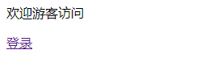
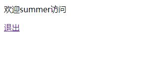

# Django——session技术

[TOC]

本文接上文，session在上篇简单介绍过，我们这次来详细说一下。

>   Django 是支持匿名会话的。会话框架允许您基于每个站点访问者存储和检索任意数据。它在服务器端存储数据并提供cookie的发送和接收。Cookie包含会话ID - 而不是数据本身（除非您使用基于cookie的后端）。Django会话框架完全是基于cookie的。

## 七、打开会话

会话通过配置一个**中间件**实现的，为了打开会话，需要做下面的操作

-   编辑设置中的 MIDDLEWARE，并确保他包含了 'django.contrib.sessions.middleware.SessionMiddleware'。通过 django-admin startproject 创建的默认 settings.py 文件是已经打开了 SessionMiddleware 这项设置的。

如果你不想使用会话功能，你可以从配置的 MIDDLEWARE 中删除 `SessionMiddleware，并且从 INSTALLED_APPS 中删除 'django.contrib.sessions'。它将会为您节省一点开销。

## 八、配置会话(session)引擎

默认情况下，Django 在数据库里存储会话（使用 `django.contrib.sessions.models.Session` ）。虽然这很方便，但在一些设置里，在其他地方存储会话数据速度更快，因此 Django 可以在文件系统或缓存中配置存储会话数据。

### 1. 使用数据库支持的会话(默认)

如果你想使用数据库支持的会话，你需要在`INSTALLED_APPS` 里添加 `'django.contrib.sessions'` 。

一旦在安装中配置，运行 `manage.py migrate` 来安装单个数据库表来存储会话数据。

### 2. 使用缓存会话

为了得到更好的性能，你可以使用基于缓存的会话后端。

使用 Django 的缓存系统来存储会话，你首先需要确保已经配置了缓存.

>   警告：如果你正在使用 Memcached 缓存后端，则应该只使用基于缓存的会话。本地内存缓存后端保留数据的时间不足以成为一个好的选择，直接使用文件或数据库会话而不是通过文件或数据库缓存后端发送所有内容会更快。另外，本地内存缓存后端并不安全，因此对生产环境来说或许不是一个好的选择。

如果你在`CACHES` 定义了多缓存，Django 会使用默认缓存。如果要使用其他缓存，请将`SESSION_CACHE_ALIAS`设置为该缓存名。

一旦配置好了缓存，你有两种办法在缓存中存储数据：

-   设置`SESSION_ENGINE`为 `"django.contrib.sessions.backends.cache"` 用于简单缓存会话存储。会话数据直接被存储在缓存里。然而，会话数据可能不是长久的：因为缓存满了或者缓存服务重启了，所以缓存数据会被收回。
-   为了持久化缓存数据，设置`SESSION_ENGINE`为 `"django.contrib.sessions.backends.cached_db"` 。这使用直写式缓存——每次写入缓存的数据也会被写入到数据库。如果数据不在缓存中，会话仅使用数据库进行读取。

这两中会话存储会非常快，但简单缓存会更快，因为它忽略了持久化。在大部分情况下，`cached_db` 后端将足够快，但如果你需要最后一点的性能，并且愿意不时地删除会话数据，那么 `cache` 后端适合你。

### 3. 使用基于文件的会话

要使用基于文件的会话，需要设置`SESSION_ENGINE`为 `"django.contrib.sessions.backends.file"` 

你可能想设置`SESSION_FILE_PATH`(默认从 `tempfile.gettempdir()` 输出，很可能是 `/tmp` ) 来控制 Django 存储会话文件的路径。要确保 Web 服务器有权限读取这个地址。

### 4. 使用基于cookie的会话

要使用基于cookies的会话，需要设置`SESSION_ENGINE`为 `"django.contrib.sessions.backends.signed_cookies"` 。这个会话数据将使用 Django 的加密工具(cryptographic signing) 和`SECRET_KEY`工具进行保存。

>   警告:
>
>   如果 SECRET_KEY 泄露了，并且你正在使用 `PickleSerializer`] ，这会导致任意远程代码执行。
>
>   拥有`SECRET_KEY`的攻击者不仅可以生成站点信任的伪造会话数据，也可以远程执行任意的代码，因为数据是使用 pickle 序列化的。
>
>   如果你使用基于 cookie 的会话，一定要注意对于任何可能远程访问的系统，密钥是完全保密的。
>
>   **会话数据已签名但未被加密**
>
>   当使用cookie后端时，会话数据可以被客户端读取。
>
>   MAC(消息验证代码) 被用来保护数据不被客户端修改，因此会话数据在被篡改时失效。如果存储cookie 的客户端 (比如浏览器) 不能存储所有会话数据并丢弃数据，则会同样发生失效。即使 Django 压缩数据，它仍然完全有可能每个 cookie 超过4096字节的通用限制。
>
>   **不保证新鲜度**
>
>   注意虽然 MAC 可以保证数据(通过站点生成，而不是其他人)真实性和数据完整(它是完整和正确的)，但它不能保证新鲜度，也就是说，您最后发送给客户端的东西会被退回。这意味着cookie后端为了使用一些会话数据，可能会面临重播攻击。与其他会话后端(每个会话保持服务端记录，并且当用户退出时使会话失效)不同，基于cookie的会话在用户退出的时候并不会让会话失效。因此攻击者窃取用户cookie，即使用户登出了，攻击者还可以使用cookie登录该用户。如果 Cookie 比`SESSION_COOKIE_AGE`设置的时间还旧时，则cookie会被检测为 '陈旧' 。
>
>   **性能**
>
>   最后，cookie的大小会影响网站的速度。

## 九、在视图中使用会话

当激活 `SessionMiddleware` 后，每个`HttpRequest`对象（任何 Django 视图函数的第一个参数） 将得到一个 `session` 属性，该属性是一个类字典对象。

你可以在视图中任意位置读取它并写入 `request.session` 。你可以多次编辑它。下面是他的全部方法：

-   `__getitem__`(*key*)

    比如：`fav_color = request.session['fav_color']`

-   `__setitem__`(*key*, *value*)

    比如：`request.session['fav_color'] = 'blue'`

-   `__delitem__`(*key*)

    比如：`del request.session['fav_color']` 。如果给定的 `key` 不在会话里，会引发 `KeyError` 。

-   `__contains__`(*key*)

    比如：`'fav_color' in request.session`

-   `get`(*key*, *default=None*)

    比如：`fav_color = request.session.get('fav_color', 'red')`

-   `pop`(*key*, *default=__not_given*)

    比如：`fav_color = request.session.pop('fav_color', 'blue')`

-   `keys`()

-   `items`()

-   `setdefault`()

-   `clear`()

它也有以下方法：

-   `flush`()

    删除当前会话和会话cookie。如果你想确保早先的会话数据不能被用户的浏览器再次访问时，可以使用这个方法（比如`django.contrib.auth.logout()` 函数调用它）。

-   `set_test_cookie`()

    设置一个测试cookie来确定用户的浏览器是否支持cookie。由于测试通过，你不需要在下一个页面请求时再次测试它。

-   `test_cookie_worked`()

    返回 `True` 或 `False` ，这取决于用户浏览器是否接受测试cookie。由于 cookie 的工作方式，你将必须在上一个独立的页面请求里调用 `set_test_cookie()` 。

-   `delete_test_cookie`()

    删除测试cookie。使用完测试cookie后用它来删除。

-   `get_session_cookie_age`()

    New in Django 3.0.返回 session cookies的失效时间，以秒为单位。默认`SESSION_COOKIE_AGE`。

-   `set_expiry`(*value*)

    为会话设置过期时间。你可以传递很多不同值：如果 `value` 是整型，会话将在闲置数秒后过期。比如，调用 `request.session.set_expiry(300)` 会使得会话在5分钟后过期。如果 `value` 是一个 `datetime` 或 `timedelta` 对象，会话将在指定的 date/time 过期。如果 `value` 是 `0` ，则当浏览器关闭后，用户会话 cookie 将过期。如果 `value` 是 `None` ，会话会恢复为全局会话过期策略。出于过期目的，读取会话不被视为活动。会话过期时间会在会话最后一次*修改*后开始计算。

-   `get_expiry_age`()

    返回该会话过期的秒数。对于没有自定义过期时间的会话（或者那些设置为浏览器关闭时过期的），这等同于`SESSION_COOKIE_AGE` 。这个函数接受两个可选的关键参数：`modification` ：会话的最后一次修改，当做一个`datetime`对象。默认是当前时间。`expiry` ：会话的过期信息，如一个`datetime`对象，整数（秒）或 `None`。默认为通过`set_expiry()` 存储在会话中的值，或 `None` 。

-   `get_expiry_date`()

    返回该会话的到期日期。对于没有自定义过期的会话(或那些设置为在浏览器关闭时过期的会话)，这将等于从现在开始的SESSION_COOKIE_AGE秒的日期。

-   `get_expire_at_browser_close`()

    返回 `True` 或 `False` ，取决于用户会话 cookie 是否在浏览器关闭的时候过期。

-   `clear_expired`()

    从会话存储中移除过期会话。

-   `cycle_key`()

    在保留当前会话的同时创建新的会话秘钥。

## 十、当保存会话时

默认情况下，Django 只在会话被修改后才会向会话数据库保存会话——也就是说，是否已经分配或删除了它的任何字典值：

```
# Session is modified.
request.session['foo'] = 'bar'

# Session is modified.
del request.session['foo']

# Session is modified.
request.session['foo'] = {}

# Gotcha: Session is NOT modified, because this alters
# request.session['foo'] instead of request.session.
request.session['foo']['bar'] = 'baz'
```

在上面例子的最后一个例子中，我们可以通过在会话对象上设置 `modified` 属性来明确地告诉会话对象它已经被修改：

```
request.session.modified = True
```

要想改变这个默认行为，可以设置`SESSION_SAVE_EVERY_REQUEST` 为 `True` 。当设置为 `True` 时，Django 会根据每个请求将会话保存到数据库中。

注意，仅在会话被创建或修改时发送会话 cookie 。如果 [`SESSION_SAVE_EVERY_REQUEST`](https://docs.djangoproject.com/zh-hans/3.1/ref/settings/#std:setting-SESSION_SAVE_EVERY_REQUEST) 为 `True` ，则会话cookie将在每次请求时发送。

同样地，每次发送会话 cookie 时都会更新会话 cookie 的 `expires` 部分。

如果响应状态代码为 500，会话不会被保存。

## 十一、Browser-length 会话 vs 持久会话

你可以通过设置`SESSION_EXPIRE_AT_BROWSER_CLOSE`来控制会话框架是使用 browser-length 会话还是持久会话。

默认情况下，`SESSION_EXPIRE_AT_BROWSER_CLOSE`为 `False` ，这意味着会话 cookies 将保存在用户浏览器中持续`SESSION_COOKIE_AGE`的时间。如果你不想用户每次打开浏览器时必须登录，就用这个。

如果`SESSION_EXPIRE_AT_BROWSER_CLOSE` 为 `True`，Django 将使用 browser-length cookies —— cookies 在用户关闭浏览器时过期。如果你想让用户每次打开浏览器时必须登录，就用这个。

这个设置是全局默认的，并且可以通过显式调用 `request.session` 的`set_expiry()`在每个会话级别上覆盖，和之前的using sessions in views里描述的一样。

## 十二、清除会话存储

当用户创建了新会话，会话数据会累积在会话存储中。如果你正在使用数据库后端，`django_session` 数据库表会增加。如果你使用的是文件后端，临时目录会包含新增加的文件。

为了理解这个问题，要考虑数据库后端会发生什么。当用户登录时，Django 在 `django_session` 增加了一行。每次会话更改时，Django 会更新该行。如果用户手动退出，Django 会删除该行。但如果用户不退出，该行就不会被删除。文件后端也是类似的处理。

Django 没有提供过期会话自动清除的功能。因此，你需要定期清除过期会话。Django 提供了一个清除管理命令：`clearsessions`。推荐在定期清除时使用该命令，例如在日常的定时任务中。

注意缓存后端不受此问题的影响，因为缓存会自动删除过期数据。cookie 后端也一样，因为会话数据通过浏览器存储。

## 十三、小案例（用户登录）

要完成这个案例，我们就需要写两个页面，一个登录页面和一个主页。用户从登录页面开始，输入用户名和密码，然后重定向到主页，此时，如果有用户登录的情况下就显示用户名，如果没有则显示游客， 并且设置一个a标签用来控制退出和登录。

*login.html*

```html
<!DOCTYPE html>
<html lang="en">
<head>
    <meta charset="UTF-8">
    <title>登录</title>
</head>
<body>
    <form method="post" action="">
        
        <p>useranme:<input type="text" name="name"></p>
        <p>password:<input type="password" name="password"></p>
        <input type="submit" value="提交">
    </form>
</body>
</html>
```

*index.html*

```html
<!DOCTYPE html>
<html lang="en">
<head>
    <meta charset="UTF-8">
    <title>首页</title>
</head>
<body>
    欢迎{{ name }}访问
    
        <p><a href="">退出</a></p>
    
        <p><a href="">登录</a></p>
    
</body>
</html>
```

*urls.py*

```python
# -*- coding: utf-8 -*-
# @Author  : summer
from django.urls import path
from . import views

app_name = "students"

urlpatterns = [
	path("students_list", views.studets_list, name="students_list"),
	path("student_detail/<pk>", views.student_detail, name="student_detail"),
	path("student_add", views.student_add, name="student_add"),
	path("student_delete/<pk>", views.student_delete, name="student_delete"),
	path("student_edit/<pk>", views.student_edit, name="student_edit"),
	path("login", views.login, name="login"),
	path("index", views.index, name="index"),
	path("logout", views.logout, name="logout"),
]
```

*views,py*

```python
# 测试session
def login(request):
	if request.method == "POST":
		name = request.POST["name"]
		password = request.POST["password"]
		if name == "summer" and password == "summer":
			# 将用户名存储到session中，
			request.session["name"] = name
			request.session.set_expiry(10)  # 设置过期时间，如果不设置默认关闭页面时清空
			return redirect("students:index")
	return render(request, "Students/login.html")


def index(request):
	name = request.session.get("name", "游客")  # 获取name的值，如果没有则默认为空
	return render(request, "Students/index.html", context={
		"name": name,
	})


def logout(request):
	request.session.flush()
	return redirect("students:index")
```

上面的login通过request获取用户名，和密码，如果密码正确则将这个用户名存储到session中，并且重定向到index页，在这里会显示用户名然后有一个退出键，点击退出，session和cookie会刷新，此时就是用户退出的功能。而这个时候退出键就会自动变成登录键。

*页面展示*



